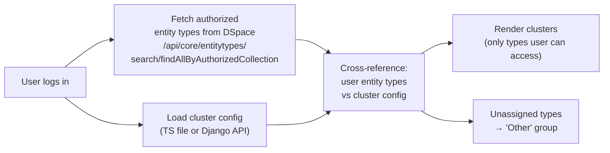
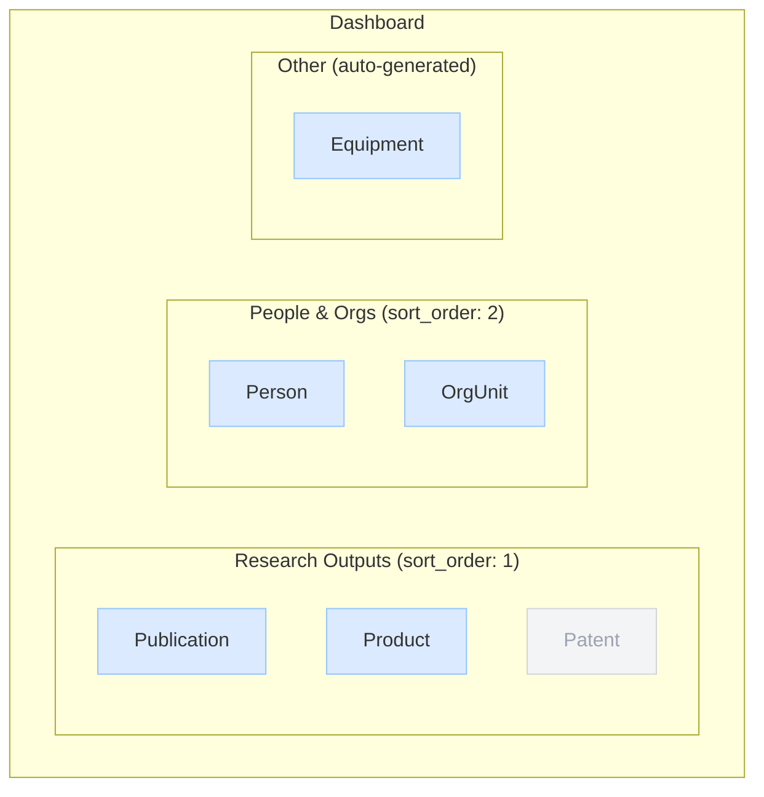

# Dashboard Clusters


The Dashboard displays entity types grouped into named **clusters** — sections that each contain one or more entity types. A "Research Outputs" cluster might contain Publication, Product, and Patent.

<div class="callout callout-warn">
<span class="callout-title">Django mode required</span>
Cluster management via the UI requires <code>VITE_CLUSTER_CONFIG_SOURCE=django</code>. In <code>ts</code> mode, edit <code>src/config/entity-clusters.ts</code> and redeploy.
</div>

## How Clusters Are Resolved



Only entity types the user has submit permission for appear as active buttons. Types they can't access are shown dimmed or hidden.

| Mode | How to change clusters | Requires redeploy? |
|---|---|---|
| `ts` | Edit `src/config/entity-clusters.ts` | ✅ Yes |
| `django` | Admin Settings → Dashboard Clusters | ❌ Immediate |

---

## Creating a Cluster

Navigate to **Admin Settings → Dashboard Clusters** (`#/admin/settings`) or directly to `#/admin/clusters`.

<ol class="steps">
<li>
<div><strong>Enter a cluster label</strong><br>
Type a descriptive name. A URL-safe key is auto-generated (e.g. "Research Outputs" → <code>research-outputs</code>).</div>
</li>
<li>
<div><strong>Add an optional description</strong><br>
The description appears as a subtitle under the cluster heading on the dashboard.</div>
</li>
<li>
<div><strong>Click "Create cluster"</strong><br>
The cluster is saved immediately to the Django database and appears in the list with no entity types assigned yet.</div>
</li>
<li>
<div><strong>Assign entity types</strong><br>
An empty cluster does not appear on the dashboard. Add at least one entity type (see below).</div>
</li>
</ol>

---

## Editing a Cluster

All fields on existing cluster cards are **inline-editable**. Click into any field, make your change, then click outside (blur) — changes save automatically with no explicit Save button.

| Field | Editable inline? | Notes |
|---|---|---|
| Label | ✅ | Auto-generates new key on save |
| Sort Order | ✅ | Controls card position on Dashboard |
| Description | ✅ | Optional subtitle |

### Enabling / Disabling

Use the **Active** toggle on each cluster card to soft-disable without deleting. Disabled clusters are hidden from the Dashboard but remain in the database.

### Deleting a Cluster

Click **Delete** → confirm in the browser dialog. Deletion is **permanent and cascades** to all entity type entries in that cluster.

<div class="callout callout-danger">
<span class="callout-title">Deletion is permanent</span>
There is no undo. If you may want the cluster again, use the Active toggle to disable it instead.
</div>

---

## Assigning Entity Types

<ol class="steps">
<li>
<div><strong>Find the cluster card</strong><br>
Scroll to the cluster on the Admin Clusters page. Current assignments show as removable pills.</div>
</li>
<li>
<div><strong>Choose from the dropdown</strong><br>
The "Add entity type…" dropdown lists only entity types not yet assigned to this cluster. Options come from DSpace's <code>/api/core/entitytypes</code>.</div>
</li>
<li>
<div><strong>Click "Assign"</strong><br>
The entity type pill appears immediately. The dashboard reflects this on the user's next load.</div>
</li>
</ol>

### Removing an Entity Type

Click **×** on any entity type pill. Removal is immediate and does not affect the entity type in DSpace.

### Sort Order Within a Cluster

Entity types are displayed in `sort_order` ascending order. Initial order follows assignment order. To reorder, use the API directly:

```bash
PATCH /api/dspace-config/entity-types/:id/
Content-Type: application/json
Authorization: Bearer <jwt>

{"sort_order": 2}
```

In-UI drag-to-reorder is not yet supported.

---

## Dashboard Appearance



Blue buttons = user has submit permission. Grey = no submit permission. The "Patent" button is greyed out because this user lacks submit access to a Patent collection.

<div class="page-nav">
  <a href="{{ '/admin/flags/' | relative_url }}">← Feature Flags</a>
  <a href="{{ '/admin/quicklinks/' | relative_url }}">Quicklinks →</a>
</div>
