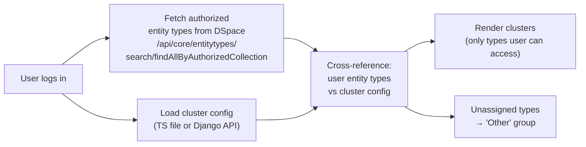
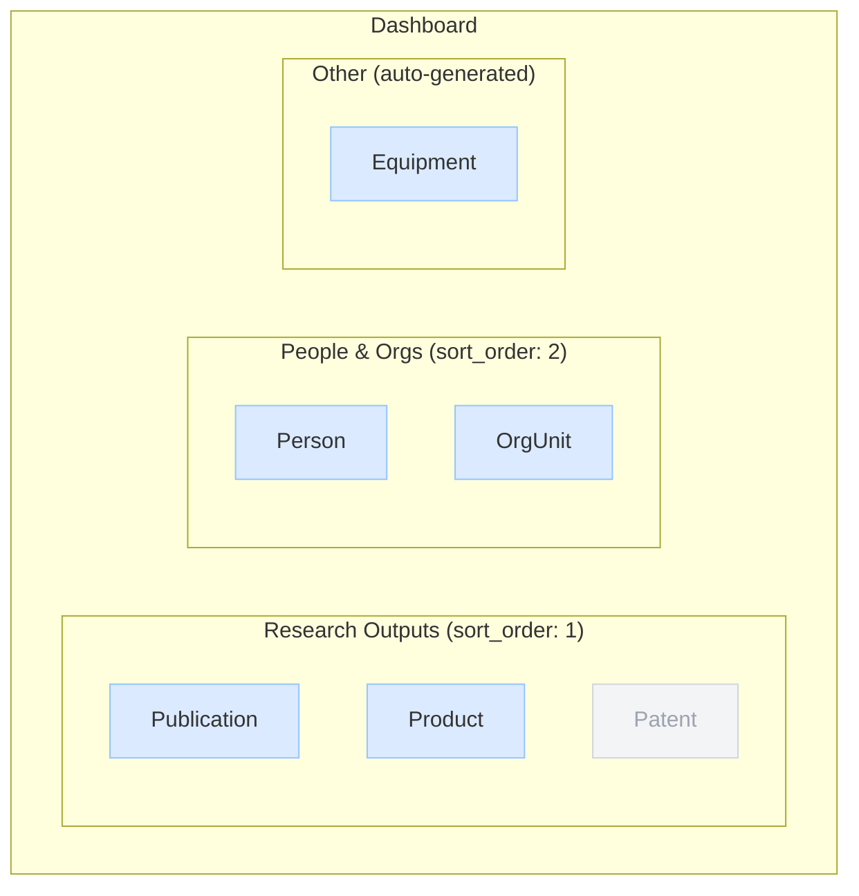

# Dashboard Clusters


The Dashboard displays entity types grouped into named **clusters** — sections that each contain one or more entity types. A "Research Outputs" cluster might contain Publication, Product, and Patent.

<div class="callout callout-info">
<span class="callout-title">Manage clusters in the Config Cockpit</span>
Navigate to <strong>Config Cockpit → Entity Clusters</strong> (<code>http://localhost:5174</code>) to create, edit, and delete clusters. The admin pages in the main Cockpit are transitioning to read-only overviews.
</div>

<div class="callout callout-warn">
<span class="callout-title">Main Cockpit cluster management is deprecated</span>
The <strong>Admin Settings → Dashboard Clusters</strong> page (<code>#/admin/clusters</code>) in the main Cockpit will become read-only in a future release. All write operations should use the Config Cockpit.
</div>

## How Clusters Are Resolved



Only entity types the user has submit permission for appear as active buttons. Types they can't access are shown dimmed or hidden.

| Mode | How to change clusters | Requires redeploy? |
|---|---|---|
| `ts` | Edit `src/config/entity-clusters.ts` | ✅ Yes |
| `django` | **Config Cockpit → Entity Clusters** | ❌ Immediate |

---

## Creating a Cluster

Navigate to **Config Cockpit → Entity Clusters** (`http://localhost:5174`).

<ol class="steps">
<li>
<div><strong>Click "+ New Cluster"</strong><br>
Opens the create modal. Enter a key (unique slug), label, optional description, sort order, and enabled state.</div>
</li>
<li>
<div><strong>Save the cluster</strong><br>
The cluster is saved immediately to the Django database and appears in the table with no entity types assigned yet.</div>
</li>
<li>
<div><strong>Assign entity types</strong><br>
Expand the cluster row with <strong>▼ Types</strong>. Type a label in the inline input and press Enter or click "+ Add". An empty cluster does not appear on the dashboard.</div>
</li>
</ol>

---

## Editing a Cluster

Click **Edit** on a cluster row to open the edit modal. All fields (key, label, description, sort order, enabled) are editable.

### Enabling / Disabling

Toggle the **Enabled** checkbox in the edit modal. Disabled clusters are hidden from the Dashboard but remain in the database.

### Deleting a Cluster

Click **Delete** on the cluster row → confirm in the browser dialog. Deletion is **permanent and cascades** to all entity type entries in that cluster.

<div class="callout callout-danger">
<span class="callout-title">Deletion is permanent</span>
There is no undo. If you may want the cluster again, disable it instead of deleting.
</div>

---

## Managing Entity Types

In the Config Cockpit, expand a cluster row with **▼ Types** to see the inline entity type editor.

- **Add** — type a label and press Enter or click "+ Add". The label must match the entity type name as used in DSpace (e.g. `Publication`, `OrgUnit`).
- **Remove** — click **✕** on any entity type pill. Removal is immediate and does not affect the entity type in DSpace.

### Sort Order Within a Cluster

Entity types display in `sort_order` ascending order. To reorder, use the API directly:

```bash
PATCH /api/dspace-config/entity-types/:id/
Content-Type: application/json
Authorization: Bearer <jwt>

{"sort_order": 2}
```

---

## Dashboard Appearance



Blue buttons = user has submit permission. Grey = no submit permission. The "Patent" button is greyed out because this user lacks submit access to a Patent collection.

<div class="page-nav">
  <a href="{{ '/admin/flags/' | relative_url }}">← Feature Flags</a>
  <a href="{{ '/admin/quicklinks/' | relative_url }}">Quicklinks →</a>
</div>
