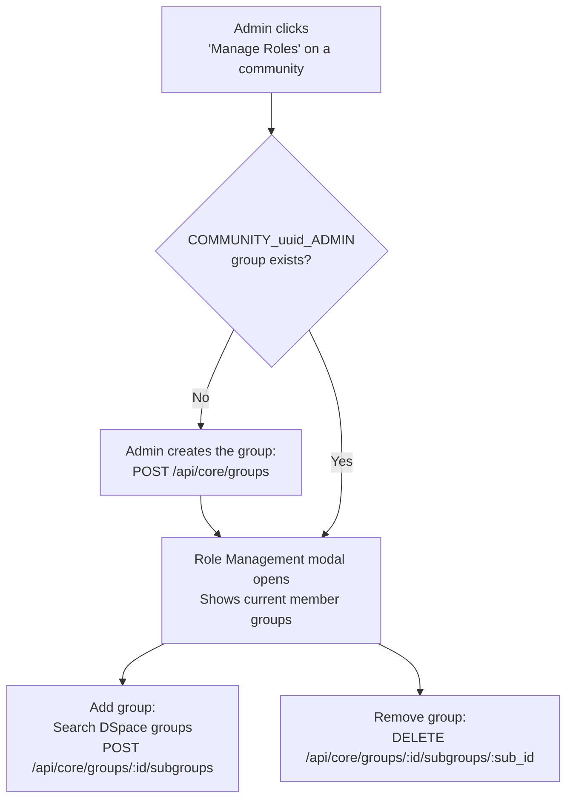

# Communities & Collections

The Communities page (`#/communities`) shows the full repository hierarchy. Administrators and Community Admins see additional action buttons that regular users do not.

Community & collection management stays in the main Cockpit
Unlike clusters, quicklinks, and form layouts — which have moved to the Config Cockpit — community and collection creation and role management remain in the main Cockpit at <code>:4000</code>. These operations call the DSpace REST API directly and require a DSpace Administrator JWT, which the Config Cockpit does not use.

## Creating a Community

**Requires:** `Administrator` role + `VITE_COMMUNITIES_CREATION_ENABLED=true`

<ol class="steps">
<li>

<strong>Navigate to Communities</strong> 
Click <strong>Communities</strong> in the main navigation. Admins see a "+ Create Community" button at the top of the page.

</li>
<li>

<strong>Open the Create Community modal</strong> 
Click <strong>+ Create Community</strong>. The modal opens with metadata fields.

</li>
<li>

<strong>Enter details and submit</strong> 
Fill in at minimum the <strong>Name</strong> (required — stored as <code>dc.title</code>). Optional: introductory text, short description, copyright text, sidebar text.

</li>
<li>

<strong>Community appears in the tree</strong> 
Created via <code>POST /api/core/communities</code>. The page refreshes automatically.

</li>
</ol>

Sub-communities
To create a sub-community, expand the parent community in the tree first, then use the community-level create action. The parent UUID is passed as <code>POST /api/core/communities?parent=&lt;uuid&gt;</code>.

---

## Creating a Collection

**Requires:** `Administrator` (or Community Admin for own community) + `VITE_COLLECTIONS_CREATION_ENABLED=true`

<ol class="steps">
<li>

<strong>Navigate to the parent community</strong> 
Expand the community tree to find the community you want the collection under.

</li>
<li>

<strong>Click "+ Collection"</strong> 
This action appears next to each community for users with the required permissions.

</li>
<li>

<strong>Fill in collection details</strong> 
Enter the <strong>Name</strong> (required). Optional: abstract, short description, copyright text, provenance, sidebar text.

</li>
<li>

<strong>Submit</strong> 
Created via <code>POST /api/core/collections?parent=&lt;community-uuid&gt;</code> and appears nested under the parent.

</li>
</ol>

---

## Role Management

Each community can have an admin group named `COMMUNITY_<uuid>_ADMIN`. Members get Community Admin privileges in the Cockpit.

**Requires:** `Administrator` role + `VITE_COMMUNITIES_ROLE_MANAGEMENT_ENABLED=true`

### Steps

<ol class="steps">
<li>

<strong>Open the Role Management modal</strong> 
Find the community in the tree and click <strong>⚙ Manage Roles</strong>.

</li>
<li>

<strong>Create the admin group (if it doesn't exist)</strong> 
Click <strong>Create admin group</strong> to create <code>COMMUNITY_&lt;uuid&gt;_ADMIN</code> via the DSpace API.

</li>
<li>

<strong>Add groups to the admin group</strong> 
Search for existing DSpace groups. Results show only groups not yet members (using DSpace's <code>isNotMemberOf</code> query). Results are paginated.

</li>
<li>

<strong>Remove groups</strong> 
Each current member group has a <strong>Remove</strong> button. Removal immediately revokes community-admin access for all members of that group.

</li>
</ol>

Changes are immediate
Role assignments call the DSpace REST API directly. There is no staging — changes take effect immediately for all members of the affected groups.

---

## Collection Permissions

The **Manage Permissions** modal (⚙ icon on a collection row) allows viewing and managing the default read group and submitters group via DSpace's `resourcepolicies` API.

| Group | Purpose |
|---|---|
| `COLLECTION_<uuid>_SUBMIT` | Users who can submit items to this collection |
| `COLLECTION_<uuid>_ADMIN` | Admins with full control over this collection |
| `COLLECTION_<uuid>_WORKFLOW_STEP_1/2/3` | Reviewers in the DSpace workflow |

---

## Troubleshooting

**"Create Community" button missing**
- Confirm you are a DSpace Administrator
- Check `VITE_COMMUNITIES_CREATION_ENABLED=true` (and runtime DB toggle if in django mode)

**"Create Collection" button missing inside a community**
- Check `VITE_COLLECTIONS_CREATION_ENABLED=true`
- Community Admins can only create collections in their own communities

**"Manage Roles" button missing**
- Check `VITE_COMMUNITIES_ROLE_MANAGEMENT_ENABLED=true`
- Only global Administrators can manage community role groups

**End-user agreement modal keeps reappearing after accepting**
- Check browser console for a failed PATCH to `/api/eperson/epersons/:id`
- Verify the user has EPerson edit permission in DSpace

  <a href="{{ '/admin/formbuilder/' | relative_url }}">← Form Builder</a>
  <a href="{{ '/ops/' | relative_url }}">Operations Guide →</a>

