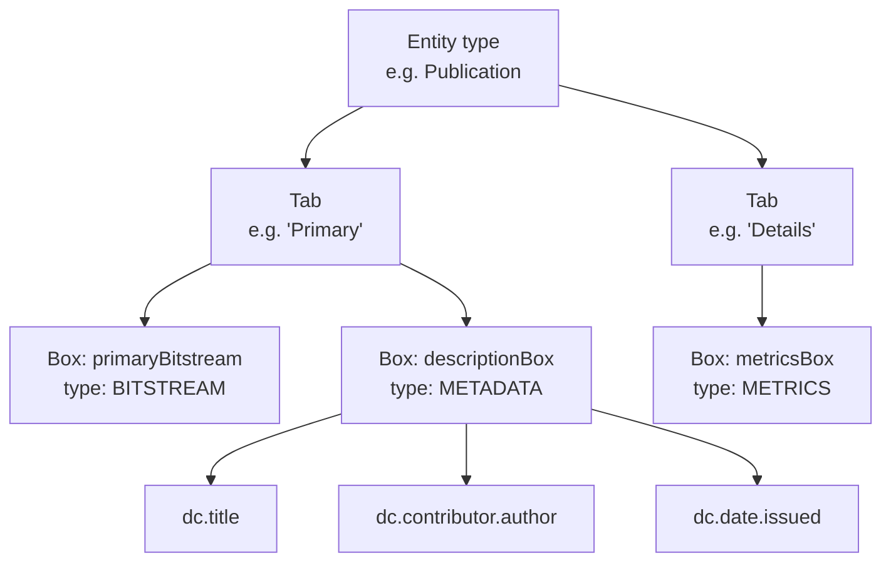

# CRIS Layout Configuration


The CRIS Layout controls how entity detail pages render in DSpace CRIS — which tabs appear, which boxes sit on each tab, and which metadata fields appear in each box. Layout data is imported from the `cris-layout-configuration.xls` file and then managed through the Config Cockpit.

---

## Concepts



| Concept | Description |
|---|---|
| **Tab** | Top-level navigation tab on the entity detail page. Has a shortname, label, priority (display order), and security level. |
| **Tab → Box mapping** | Defines which boxes appear on a tab and in what row arrangement. |
| **Box** | A visual panel within a tab. Types: `METADATA`, `RELATION`, `METRICS`, `IIIFVIEWER`, `NETWORKLAB`, `BITSTREAM`. |
| **Box field** | A metadata field entry within a box, with row/cell position, rendering type, and label. |
| **Metadata Group** | A parent field that groups child fields (e.g. author + affiliation displayed together). |
| **Tab/Box Policy** | Access control rules restricting visibility to specific DSpace groups. |

---

## Initial Import

Before editing in the Config Cockpit, import the existing layout from the DSpace CRIS XLS configuration file:

```bash
# Import all entities
docker compose -f docker-compose_2024.yml exec django \
  python manage.py import_cris_layout /path/to/cris-layout-configuration.xls

# Wipe and reimport a specific entity
docker compose -f docker-compose_2024.yml exec django \
  python manage.py import_cris_layout /path/to/file.xls \
  --clear --entity Publication
```

After import, the entity list in the Config Cockpit CRIS Layout page populates automatically.

---

## Editing Layouts

Navigate to **Config Cockpit → CRIS Layout** (`http://localhost:5174`).

### Entity selector

Click an entity button at the top to load its complete layout. The button row is populated from imported data — if it is empty, run `import_cris_layout` first.

### Tabs

The tab pill bar shows all tabs sorted by priority. The leading (default) tab is marked with ★.

- **Edit tab** — click **Edit Tab** in the tab header bar to change label, shortname, priority, security, and leading status.
- **New tab** — click **+ New Tab** in the page header.
- **Delete tab** — click **Delete Tab** in the tab header bar. Deleting a tab does not delete the boxes — they remain but become unassigned.

### Boxes

Each box is a collapsible card within the active tab. Box types are colour-coded:

| Type | Colour | Purpose |
|---|---|---|
| `METADATA` | Blue | Displays metadata fields |
| `RELATION` | Green | Displays related entity links |
| `METRICS` | Amber | Displays altmetric/bibliometric data |
| `IIIFVIEWER` | Purple | Embeds an IIIF image viewer |
| `NETWORKLAB` | Pink | Displays a co-authorship network |
| `BITSTREAM` | Grey | Displays file attachments |

- **Edit box** — click **Edit** on the box header to change shortname, type, label, security, collapsed/container/minor flags, and CSS style.
- **Add box** — click **+ Add Box to Tab** at the bottom of the tab panel.
- **Delete box** — click **Delete** on the box header.

### Metadata fields (within a box)

Expand a box to see its field table. Fields display row/cell position, field type, metadata field name, label, and rendering type.

- **Add field** — click **+ Add Field**. The field modal includes a **metadata field typeahead** — start typing a field name (e.g. `dc.title`) to see autocomplete suggestions from the metadata registry.
- **Edit field** — click **Edit** on any field row.
- **Delete field** — click **✕** on any field row.
- **Reorder fields** — drag rows by the ⠿ handle to reorder. Row numbers are updated automatically.

### Metadata groups

The **Metadata Groups** card below the tab/box editor lists all metadata group definitions for the entity. Groups define how child fields are displayed inside a parent field (e.g. author name + affiliation shown together).

- **Add group** — click **+ Add Group**. The parent and child metadata fields both support typeahead.
- **Edit/Delete group** — use the **Edit** and **✕** buttons on each row.

---

## Security Levels

Both tabs and boxes support the following security levels, controlling which users can see them on the entity detail page:

| Level | Visible to |
|---|---|
| `PUBLIC` | Everyone including anonymous users |
| `ADMINISTRATOR` | DSpace Administrators only |
| `OWNER ONLY` | The item's submitter |
| `OWNER & ADMINISTRATOR` | Submitter or Administrators |
| `CUSTOM DATA` | Users with access to specific metadata |
| `CUSTOM DATA & ADMINISTRATOR` | Custom data users or Administrators |

---

## Exporting

Click **⬇ Download XLS** to export the current layout for the selected entity as an `.xlsx` file. The exported file matches the original `cris-layout-configuration.xls` format exactly, including all i18n key sheets, and can be re-imported into DSpace CRIS.

To export all entities at once from the command line:

```bash
docker compose -f docker-compose_2024.yml exec django \
  python manage.py export_cris_layout /tmp/cris-layout-export.xlsx
```

---

## API Reference

All endpoints under `/api/cris-layout/`. See the [Backend reference]({{ '/dev/backend/' | relative_url }}#api-reference--cris_layout-app) for the full endpoint list.

<div class="page-nav">
  <a href="{{ '/admin/formbuilder/' | relative_url }}">← Form Builder</a>
  <a href="{{ '/admin/communities/' | relative_url }}">Communities →</a>
</div>
