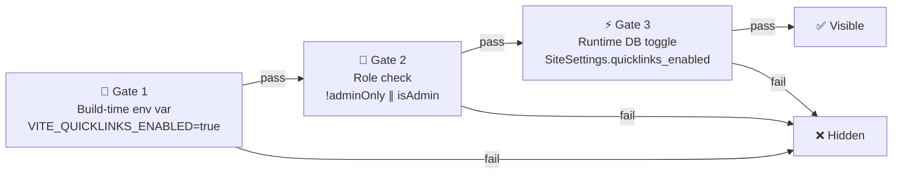
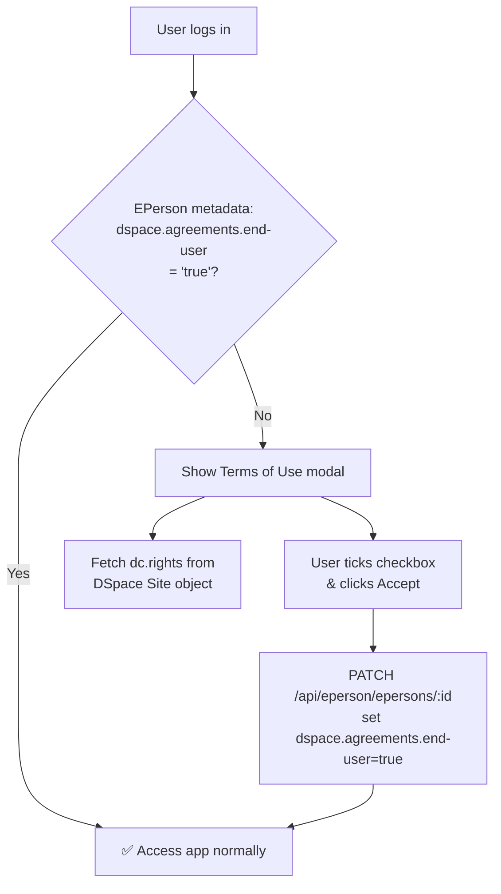

# Feature Flags

The Cockpit uses a **multi-gate system** for every feature. A feature is visible only when all applicable gates pass. Navigate to **Admin Settings → General** (`#/admin/settings`) to view and manage runtime flags.

## The Three-Gate System



| Gate | Controlled by | Changeable without redeploy? |
|---|---|---|
| Build-time env var | `.env` at build time | ❌ requires rebuild |
| Role check | Hardcoded in React | ❌ never |
| Runtime DB toggle | Admin Settings UI / `PATCH /site-settings/` | ✅ immediate |

<div class="callout callout-warn">
<span class="callout-title">Runtime toggles need Django mode</span>
Gate 3 (runtime DB toggle) only works when the relevant config source is set to <code>django</code>. In <code>ts</code> mode, the toggle is displayed but disabled — change the env var and redeploy instead.
</div>

---

## Quicklinks Feature

The Quicklinks tab is hidden from all users by default.

### Gate 1 — Build-time master switch

```bash
VITE_QUICKLINKS_ENABLED=false   # default — hidden for everyone
VITE_QUICKLINKS_ENABLED=true    # active; audience set by Gate 2
```

### Gate 2 — Audience gate

```bash
VITE_QUICKLINKS_ADMIN_ONLY=true    # default — admins only
VITE_QUICKLINKS_ADMIN_ONLY=false   # all authenticated users
```

### Gate 3 — Runtime toggle (Django mode)

When `VITE_QUICKLINKS_CONFIG_SOURCE=django`, the *Quicklinks enabled* toggle in **Admin Settings → General** writes directly to `SiteSettings.quicklinks_enabled` in the Django DB and takes effect immediately.

<div class="callout callout-success">
<span class="callout-title">Recommended setup</span>
Set <code>VITE_QUICKLINKS_ENABLED=true</code> and <code>VITE_QUICKLINKS_ADMIN_ONLY=true</code> at deployment. Use the runtime toggle to enable/disable for admins without redeploying. When ready to open to all users, change <code>VITE_QUICKLINKS_ADMIN_ONLY=false</code> and redeploy.
</div>

---

## Communities & Collections Flags

Three independent flags control community/collection management. All are admin-only regardless of the flag value.

| Feature | Build Env Var | DB Field | Controls |
|---|---|---|---|
| Community creation | `VITE_COMMUNITIES_CREATION_ENABLED` | `communities_creation_enabled` | "Create Community" button |
| Role management | `VITE_COMMUNITIES_ROLE_MANAGEMENT_ENABLED` | `communities_role_management_enabled` | "Manage Roles" button |
| Collection creation | `VITE_COLLECTIONS_CREATION_ENABLED` | `collections_creation_enabled` | "Create Collection" button |

---

## End-User Agreement

A mandatory Terms of Use gate that users must accept before accessing the application. Disabled by default.

```bash
VITE_ENABLE_END_USER_AGREEMENT=true   # enable the ToU gate
VITE_ENABLE_PRIVACY_STATEMENT=true    # optional privacy notice in the modal
```

When enabled:



The ToU text is read from the DSpace Site object's `dc.rights` metadata field. Set this text in the DSpace admin interface. If the field is empty, a fallback message is shown.

---

## Full Flag Reference

| Flag | Build Env Var | DB Field | Default | Scope |
|---|---|---|---|---|
| Quicklinks enabled | `VITE_QUICKLINKS_ENABLED` | `quicklinks_enabled` | `false` | Admin or all users |
| Quicklinks admin-only | `VITE_QUICKLINKS_ADMIN_ONLY` | — | `true` | — |
| Quicklinks config source | `VITE_QUICKLINKS_CONFIG_SOURCE` | — | `ts` | — |
| Community creation | `VITE_COMMUNITIES_CREATION_ENABLED` | `communities_creation_enabled` | `true` | Admin only |
| Role management | `VITE_COMMUNITIES_ROLE_MANAGEMENT_ENABLED` | `communities_role_management_enabled` | `true` | Admin only |
| Collection creation | `VITE_COLLECTIONS_CREATION_ENABLED` | `collections_creation_enabled` | `true` | Admin only |
| Cluster config source | `VITE_CLUSTER_CONFIG_SOURCE` | — | `ts` | — |
| Cluster fallback | `VITE_CLUSTER_CONFIG_FALLBACK` | — | `true` | — |
| End-user agreement | `VITE_ENABLE_END_USER_AGREEMENT` | — | `false` | All users |
| Privacy statement | `VITE_ENABLE_PRIVACY_STATEMENT` | — | `false` | All users |

---

## Troubleshooting

**Toggles are greyed out** — You must be an Administrator and the config source must be `django`. In `ts` mode toggles are display-only.

**Quicklinks tab not visible after enabling** — Check all three gates in order: (1) `VITE_QUICKLINKS_ENABLED=true`, (2) you meet the audience gate, (3) `SiteSettings.quicklinks_enabled=true`.

**End-user agreement modal keeps reappearing** — The PATCH to set `dspace.agreements.end-user=true` is failing. Check the browser console for a failed PATCH to `/api/eperson/epersons/:id`.

<div class="page-nav">
  <a href="{{ '/admin/roles/' | relative_url }}">← Roles & Permissions</a>
  <a href="{{ '/admin/clusters/' | relative_url }}">Dashboard Clusters →</a>
</div>
