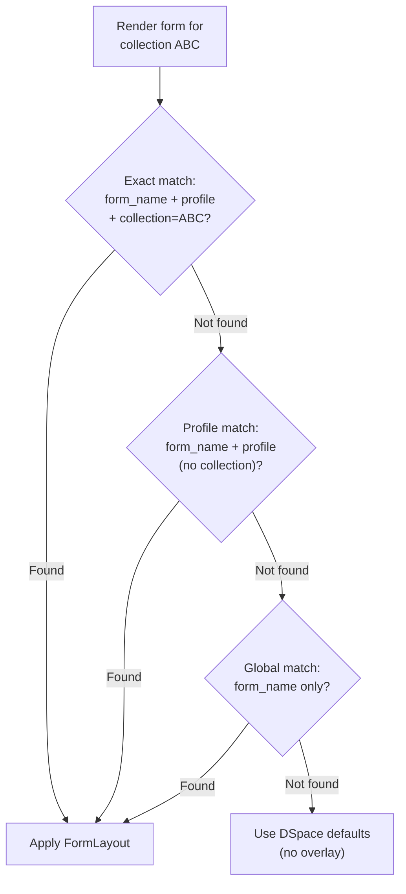

# Form Builder


The Form Builder allows administrators to customise DSpace submission form appearance without modifying the underlying `input-forms.xml`. Changes are stored in Django and applied as display overlays at render time.

<div class="callout callout-info">
<span class="callout-title">What the Form Builder does NOT do</span>
The Form Builder creates <strong>display overlays</strong> only — it changes labels, hints, grouping, and visibility in the Cockpit UI. It does not modify DSpace's actual submission form definitions, validation rules, or required fields enforced by DSpace.
</div>

---

## Setup Prerequisites

A developer must run these import commands once before the Form Builder can be used:

<ol class="steps">
<li>
<div><strong>Import DSpace input-forms.xml</strong>
<pre><code>python manage.py import_plain_config /path/to/input-forms.xml</code></pre>
Parses the XML and populates <code>SubmissionForm</code> and <code>SubmissionFormField</code> models in Django.
</div>
</li>
<li>
<div><strong>Import the metadata registry</strong> (optional, enables field autocomplete)
<pre><code>python manage.py import_plain_config --metadata /path/to/registries/</code></pre>
Populates <code>MetadataSchema</code> and <code>MetadataField</code> — enables scope notes and autocomplete in the Form Builder UI.
</div>
</li>
</ol>

---

## Layout Targeting

A **FormLayout** is an overlay applied to a specific combination of `form_name` + `profile` + optional `collection` UUID.



The **most specific** match wins.

| Specificity | `form_name` | `profile` | `collection` | Applies to |
|---|---|---|---|---|
| Most specific | `traditionalpageone` | `plain` | `abc-123-...` | Only that collection |
| Profile-wide | `traditionalpageone` | `plain` | _(empty)_ | All collections with this profile |
| Global | `traditionalpageone` | _(empty)_ | _(empty)_ | All layouts of this form |

---

## FormSection

Sections group related fields into collapsible cards within the form.

| Property | Description |
|---|---|
| `key` | Internal identifier, unique within the layout |
| `label` | Section heading shown to users |
| `sort_order` | Display order of this section |
| `collapsed_by_default` | If `true`, section starts collapsed |
| `helper_text_above` | Instructional text rendered above the section |
| `helper_text_below` | Instructional text rendered below the section |

---

## FormFieldOverride

Override per-field display properties within a section.

| Property | Description |
|---|---|
| `field_name` | Dotted field name — e.g. `dc.title`, `dc.contributor.author` |
| `label_override` | Replacement label (empty = use original DSpace label) |
| `hint_override` | Replacement hint/description text |
| `hidden` | If `true`, hides this field in the Cockpit UI (DSpace still processes it) |
| `sort_order` | Position within the section |

---

## FormConditionalBlock

Shows fields or sections only when another field has a specific value.

| Property | Description |
|---|---|
| `trigger_field` | Field name to watch (e.g. `dc.type`) |
| `trigger_value` | Value that activates the block (e.g. `Book chapter`) |
| `revealed_fields` | JSON array of field names to show (e.g. `["dc.relation.ispartof"]`) |
| `revealed_section` | Section key to reveal when triggered (optional) |

**Example** — show "Part of journal" field only when `dc.type = Journal Article`:

```json
{
  "trigger_field": "dc.type",
  "trigger_value": "Journal Article",
  "revealed_fields": ["dc.relation.ispartof"],
  "revealed_section": ""
}
```

---

## API — Create a FormLayout

```bash
POST /api/dspace-config/form-layouts/
Authorization: Bearer <jwt>
Content-Type: application/json

{
  "form_name": "traditionalpageone",
  "profile": "plain",
  "collection": null,
  "label": "Standard publication form",
  "sections": [
    {
      "key": "basic",
      "label": "Basic Information",
      "sort_order": 1,
      "collapsed_by_default": false,
      "helper_text_above": "Enter the core metadata for this publication.",
      "field_overrides": [
        {
          "field_name": "dc.title",
          "label_override": "Publication Title",
          "hint_override": "Enter the full title as it appears in the publication.",
          "hidden": false,
          "sort_order": 1
        }
      ]
    }
  ],
  "conditional_blocks": [
    {
      "trigger_field": "dc.type",
      "trigger_value": "Book chapter",
      "revealed_fields": ["dc.relation.ispartof"],
      "revealed_section": ""
    }
  ]
}
```

<div class="page-nav">
  <a href="{{ '/admin/quicklinks/' | relative_url }}">← Quicklinks</a>
  <a href="{{ '/admin/communities/' | relative_url }}">Communities →</a>
</div>
