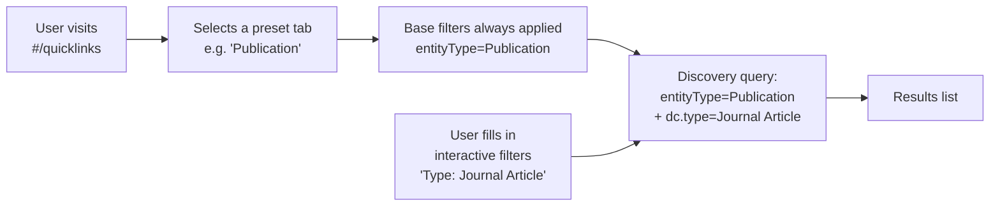

# Quicklinks Presets


Quicklinks are pre-configured faceted searches at `#/quicklinks`. Each **preset** targets one entity type and exposes **interactive filters** users can apply without typing a query.

<div class="callout callout-warn">
<span class="callout-title">Django mode required</span>
Preset management via the UI requires <code>VITE_QUICKLINKS_CONFIG_SOURCE=django</code>. In <code>ts</code> mode, edit <code>src/config/quicklinks-config.ts</code> and redeploy.
</div>

## Concepts

| Concept | Description | Example |
|---|---|---|
| **Preset** | One tab in the Quicklinks page. Always applies base filters. | "Publication" tab |
| **Base Filters** | DSpace facet filters always merged into the query, invisible to the user. | `{"entityType": ["Publication"]}` |
| **Interactive Filter** | A facet input shown to the user. Can be `text` or `date` kind. | "Author" → facet `dc.contributor.author` |



---

## Creating a Preset

Navigate to **Admin Settings → Quicklinks Presets**.

<ol class="steps">
<li>
<div><strong>Enter a label and key</strong><br>
The Label is the tab name. The key is auto-generated but can be customised. Keys must be unique (e.g. <code>publication</code>, <code>my-entity</code>).</div>
</li>
<li>
<div><strong>Set the Base Filters JSON</strong><br>
Enter a JSON object of always-applied DSpace Discovery facet filters:

<pre><code>{"entityType": ["Publication"]}</code></pre>

Multiple filters can be combined:

<pre><code>{"entityType": ["Project"], "oairecerif.project.status": ["finished"]}</code></pre>

Click <strong>Save</strong> next to the JSON field — base filters require an explicit save for validation.
</div>
</li>
<li>
<div><strong>Set sort order and enable</strong><br>
The sort order controls the tab position. Toggle <strong>Active</strong> to show/hide the preset without deleting it.</div>
</li>
<li>
<div><strong>Add interactive filters</strong><br>
See the next section.</div>
</li>
</ol>

### Editing a Preset

Preset fields (label, description, sort order) auto-save on blur. The **Base filters** JSON field requires clicking the explicit **Save** button for validation before saving.

### Deleting a Preset

Click **Delete** on the preset card. This also deletes all filters belonging to that preset. **This cannot be undone.**

---

## Managing Filters

Interactive filters appear as search inputs in the Quicklinks page, allowing users to narrow results within a preset.

### Filter Fields

| Field | Required | Description |
|---|---|---|
| **Key** | ✅ | Unique within the preset, e.g. `dc.type`. Used internally. |
| **Label** | ✅ | Display label shown to the user, e.g. "Publication Type". |
| **Facet Name** | ✅ | The DSpace Discovery facet field. Must match `discovery.xml`. |
| **Kind** | ❌ | `text` (default) — free-text facet. `date` — year/date range picker. |
| **Placeholder** | ❌ | Hint text shown in the input when empty. |

<div class="callout callout-warn">
<span class="callout-title">Facet name must match discovery.xml</span>
The Facet Name must exactly match a Discovery facet configured in DSpace's <code>discovery.xml</code>. Common values:

<ul>
<li><code>dc.type</code></li>
<li><code>dc.date.issued</code></li>
<li><code>dc.contributor.author</code></li>
<li><code>dc.publisher</code></li>
<li><code>itemtype</code></li>
<li><code>entityType</code></li>
<li>CRIS fields: <code>crispj.investigator</code>, <code>person.affiliation.name</code>, <code>oairecerif.funder</code></li>
</ul>

Verify available facets at: <code>GET /server/api/discover/facets</code>
</div>

### Adding a Filter

In the preset card, scroll to the "Add filter" form. Fill in all required fields, then click **Add filter**. The filter appears immediately above.

### Removing a Filter

Click **×** on any filter row. Removal is immediate and cannot be undone via the UI.

---

## Default Presets (TS mode)

These presets are included in `quicklinks-config.ts` as the static defaults:

| Preset | Key | Base Filter | Filters |
|---|---|---|---|
| Publication | `publication` | `entityType=Publication` | dc.type, dc.date.issued, dc.contributor.author |
| Project | `project` | `entityType=Project` | investigator, coordinator, status, startDate, endDate |
| Funding | `funding` | `entityType=Funding` | itemtype, funder |
| Person | `person` | `entityType=Person` | affiliation |
| OrgUnit | `orgunit` | `entityType=OrgUnit` | dc.type, country |
| Equipment | `equipment` | `entityType=Equipment` | itemtype |
| Event | `event` | `entityType=Event` | itemtype, startDate, endDate |
| Product | `product` | `entityType=Product` | dc.type, dc.contributor.author |
| Patent | `patent` | `entityType=Patent` | dc.contributor.author |
| Journal | `journal` | `entityType=Journal` | dc.publisher |

---

## Adding a Custom Preset (TS mode)

Edit `src/config/quicklinks-config.ts` and add to `QUICKLINKS_CRIS_PRESETS`:

```typescript
{
  key: "my-entity",
  label: "My Entity",
  description: "Browse My Entity records.",
  baseFilters: { entityType: ["MyEntity"] },
  filters: [
    { key: "dc.type",    label: "Type",   facetName: "dc.type" },
    { key: "dc.date.issued", label: "Year", facetName: "dc.date.issued", kind: "date" },
  ],
  sort_order: 11,
  enabled: true,
}
```

<div class="page-nav">
  <a href="{{ '/admin/clusters/' | relative_url }}">← Dashboard Clusters</a>
  <a href="{{ '/admin/formbuilder/' | relative_url }}">Form Builder →</a>
</div>
