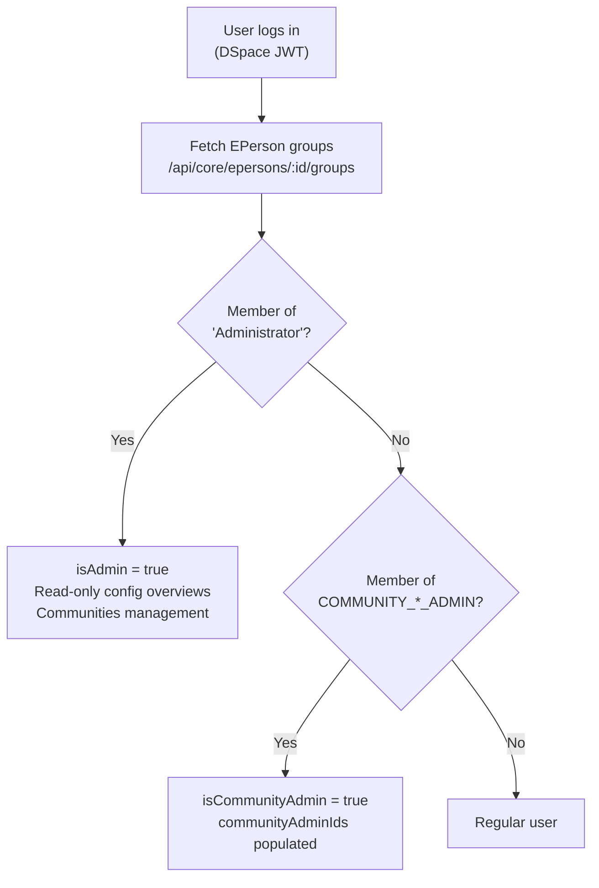

# Roles & Permissions

Administration is split across two independent interfaces with separate auth models and separate role systems.

## Admin Surfaces

| Surface | URL | Auth model | Who can log in |
|---|---|---|---|
| **Config Cockpit** | `:5174` | Django session (username + password) | Django staff / superusers |
| **Main Cockpit** | `:4000` | DSpace JWT | Any DSpace EPerson |

These surfaces are independent. Being a DSpace Administrator does not grant Config Cockpit access, and being a Django staff user does not grant DSpace admin rights.

## Roles — Main Cockpit (`:4000`)

The main Cockpit derives all roles directly from **DSpace group memberships** — there is no separate role database.

| Role | DSpace Group | How Detected |
|---|---|---|
| Administrator | `Administrator` (permanent group) | `groups.some(g => g.name === "Administrator")` |
| Community Admin | `COMMUNITY_<uuid>_ADMIN` | regex `/^COMMUNITY_([0-9a-f-]+)_ADMIN$/i` |
| Regular User | Any authenticated EPerson | — |



## Roles — Config Cockpit (`:5174`)

The Config Cockpit uses Django's own user system. All logged-in users must have `is_staff = True`. Superusers (`is_superuser = True`) are shown with an amber "superuser" badge in the header.

```bash
# Create a Django staff account
docker compose -f docker-compose_2024.yml exec django \
  python manage.py createsuperuser
```

## Permission Matrix

| Feature | DSpace Administrator | Community Admin | Regular User | Django Staff |
|---|---|---|---|---|
| **Config Cockpit — full CRUD** | | | | |
| Site settings (feature flags) | — | — | — | ✅ |
| Entity clusters CRUD | — | — | — | ✅ |
| Collection mappings CRUD | — | — | — | ✅ |
| Quicklink presets CRUD | — | — | — | ✅ |
| Form layouts CRUD | — | — | — | ✅ |
| CRIS layout editor | — | — | — | ✅ |
| **Main Cockpit** | | | | |
| Read-only cluster overview | ✅ | ❌ | ❌ | — |
| Read-only quicklinks overview | ✅ | ❌ | ❌ | — |
| Create community | ✅ | ❌ | ❌ | — |
| Create collection | ✅ | Own communities | ❌ | — |
| Manage community role groups | ✅ | Own communities | ❌ | — |
| View quicklinks tab | ✅ | If not admin-only | If not admin-only | — |
| Access workspace | ✅ | ✅ | ✅ | — |
| Search & browse | ✅ | ✅ | ✅ | — |

<div class="callout callout-warn">
<span class="callout-title">Role sync — requires re-login (main Cockpit)</span>
Role changes made in DSpace take effect in the main Cockpit only after the user's next login. Groups are fetched once at login and cached for the session.
</div>

## Admin Pages — Main Cockpit

<div class="callout callout-warn">
<span class="callout-title">Admin pages moving to Config Cockpit</span>
The admin settings pages in the main Cockpit (<code>#/admin/settings</code>, <code>#/admin/clusters</code>, <code>#/admin/form-builder</code>) are being replaced by read-only overviews. All write operations have moved to the Config Cockpit at <code>:5174</code>. The pages below marked ⚠️ will become read-only in a future release.
</div>

| Page | URL | Status | Purpose |
|---|---|---|---|
| Admin Settings | `#/admin/settings` | ⚠️ Transitioning to read-only | Feature flags, clusters, quicklinks overviews |
| Manage Clusters | `#/admin/clusters` | ⚠️ Transitioning to read-only | Cluster overview |
| Form Builder | `#/admin/form-builder` | ⚠️ Transitioning to read-only | Form layout overview |
| Communities | `#/communities` | ✅ Active | Community/collection creation and role management |
| **Config Cockpit** | `http://localhost:5174` | ✅ Primary admin tool | Full CRUD for all runtime config |

## Checking Your Role

Navigate to **Profile** (`#/profile`) in the main Cockpit to see your current DSpace group memberships and role badges.

| Badge | Colour | Meaning |
|---|---|---|
| `Administrator` | Indigo | DSpace admin — community/collection management |
| `Community Admin` | Teal | Community-level admin access |
| _(none)_ | — | Standard user |

<div class="page-nav">
  <a href="{{ '/admin/' | relative_url }}">← Admin Guide</a>
  <a href="{{ '/admin/flags/' | relative_url }}">Feature Flags →</a>
</div>
