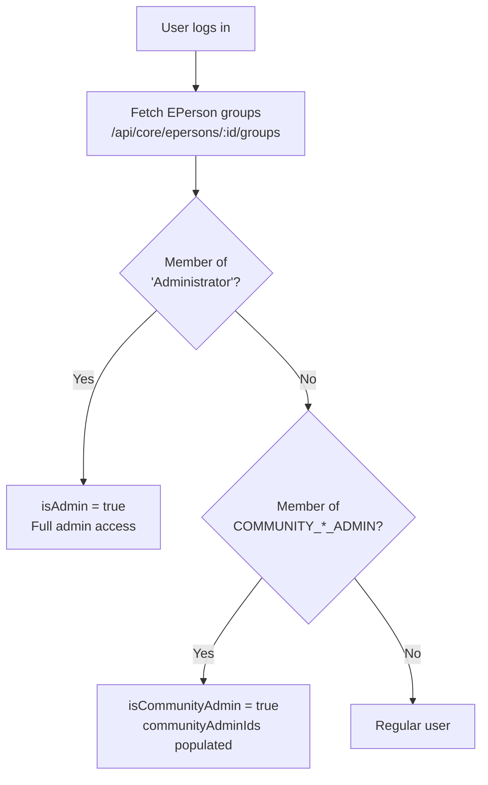

# Roles & Permissions

The Cockpit derives all roles directly from **DSpace group memberships** — there is no separate admin database. Every feature is gated by at least one role check at the React layer.

## Role Definitions

| Role | DSpace Group | How Detected |
|---|---|---|
| Administrator | `Administrator` (permanent group) | `groups.some(g => g.name === "Administrator")` |
| Community Admin | `COMMUNITY_<uuid>_ADMIN` | regex `/^COMMUNITY_([0-9a-f-]+)_ADMIN$/i` |
| Regular User | Any authenticated EPerson | — |

## Permission Matrix

| Feature | Administrator | Community Admin | Regular User |
|---|---|---|---|
| Admin Settings page | ✅ | ❌ | ❌ |
| Toggle feature flags | ✅ | ❌ | ❌ |
| Manage dashboard clusters | ✅ | ❌ | ❌ |
| Manage quicklinks presets | ✅ | ❌ | ❌ |
| Create community | ✅ | ❌ | ❌ |
| Create collection | ✅ | Own communities only | ❌ |
| Manage community role groups | ✅ | Own communities only | ❌ |
| View quicklinks tab | ✅ | If not admin-only | If not admin-only |
| Access workspace | ✅ | ✅ | ✅ |
| Search & browse | ✅ | ✅ | ✅ |

Role sync — requires re-login
Role changes made in DSpace take effect in the Cockpit only after the user's next login. Groups are fetched once at login and cached for the session. Ask users to log out and back in after any group changes.

## Admin Pages

| Page | URL | Purpose |
|---|---|---|
| Admin Settings | `#/admin/settings` | Feature flags, clusters, and quicklinks presets (3 tabs) |
| Manage Clusters | `#/admin/clusters` | Dedicated cluster management page |
| Form Builder | `#/admin/form-builder` | Submission form layout customisation |

Admin nav items are only shown when `isAdmin = true` — non-admin users do not see these navigation items.

## Checking Your Role

Navigate to **Profile** (`#/profile`) to see your current group memberships and role badges.

A coloured badge appears next to your name:

| Badge | Colour | Meaning |
|---|---|---|
| `Administrator` | Indigo | Full admin access to all features |
| `Community Admin` | Teal | Community-level admin access |
| _(none)_ | — | Standard user |

  <a href="{{ '/admin/' | relative_url }}">← Admin Guide</a>
  <a href="{{ '/admin/flags/' | relative_url }}">Feature Flags →</a>

