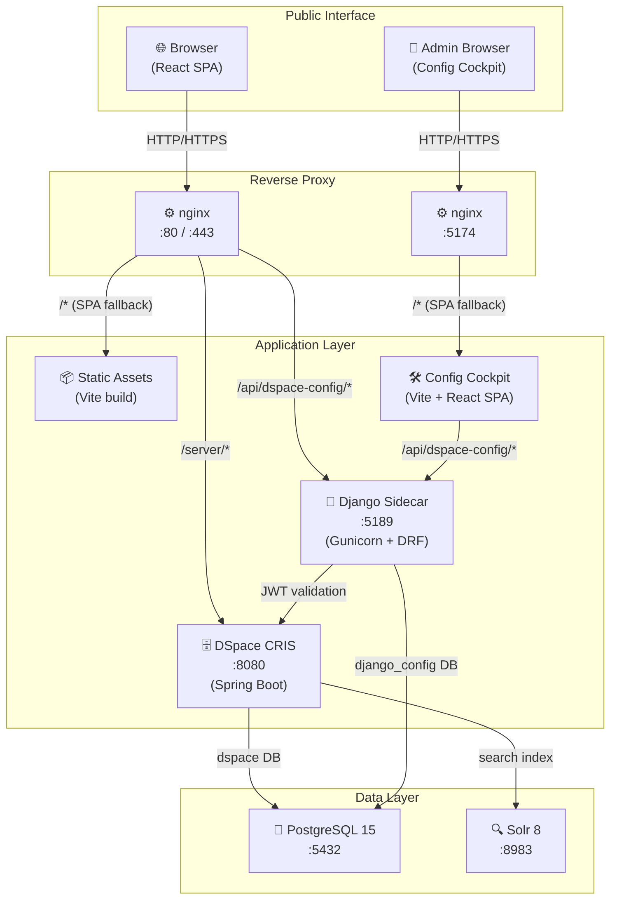
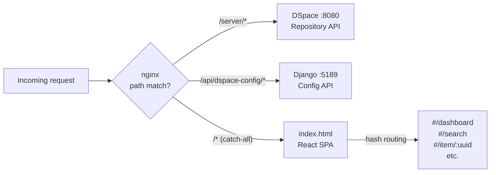
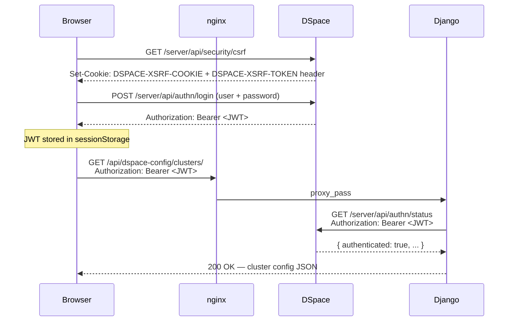
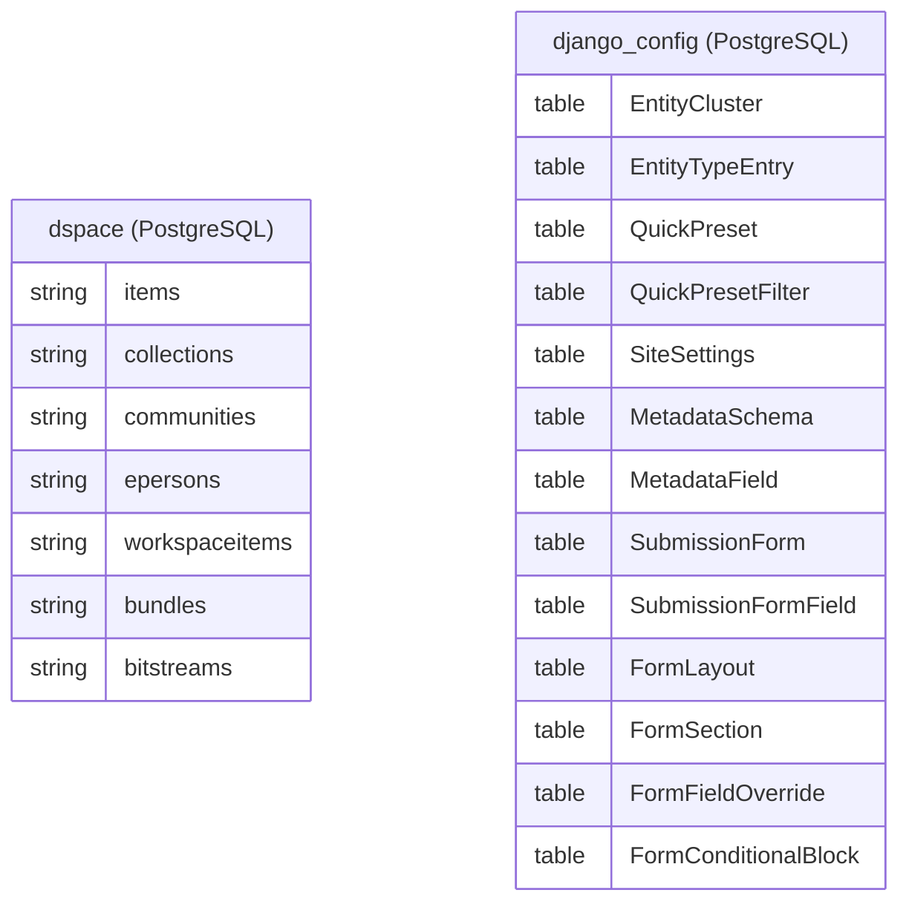

# Architecture

All services run inside Docker. Nginx acts as the public reverse proxy and routes traffic to the appropriate upstream based on path prefix.

## System Overview

## Request Path Routing

## Component Responsibilities

| Component | Technology | Port | Responsibility |
|---|---|---|---|
| React SPA | React 18 + TypeScript + Vite | — | UI shell — all data from DSpace REST or Django API |
| Config Cockpit | React 18 + TypeScript + Vite | 5174 | Standalone admin SPA for Django config API — uses Django session auth |
| DSpace 7/CRIS | Java / Spring Boot | 8080 | Repository backend — auth, item CRUD, workspace, bitstreams |
| Django Sidecar | Django 4.2 + DRF | 5189 | Runtime config — clusters, presets, site settings, form layouts |
| Nginx (frontend) | nginx:alpine | 80 | Reverse proxy, static file serving, SPA fallback |
| Nginx (cockpit) | nginx:alpine | 5174 | Static file serving for Config Cockpit SPA |
| PostgreSQL | PostgreSQL 15 | 5432 | Two databases: `dspace` and `django_config` |
| Solr | Apache Solr 8 | 8983 | Full-text + faceted search index (Discovery API) |

## Authentication Flow

Django validates every request
Django has no user database — it forwards the JWT to DSpace's <code>/api/authn/status</code> endpoint to verify each request. This means Django is always in sync with DSpace's auth state, but adds one extra HTTP hop per API call.

Config Cockpit uses a separate auth model
The Config Cockpit (<code>:5174</code>) authenticates with Django's own session auth (username + password for Django staff users), not the DSpace JWT flow. This makes it independently accessible without a running DSpace instance.

## Database Layout

  <a href="{{ '/dev/' | relative_url }}">← Developer Guide</a>
  <a href="{{ '/dev/quickstart/' | relative_url }}">Quick Start →</a>

