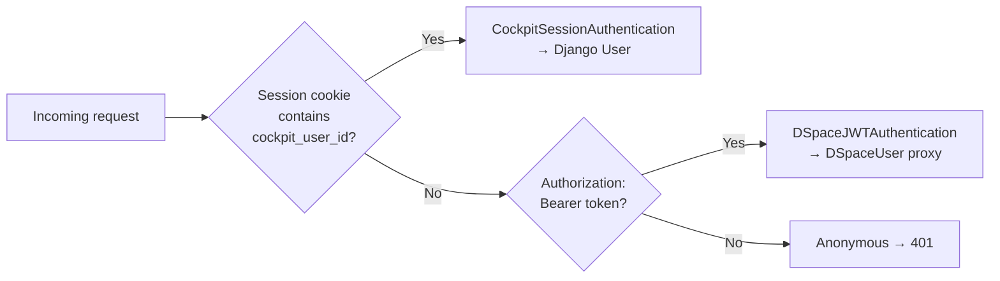
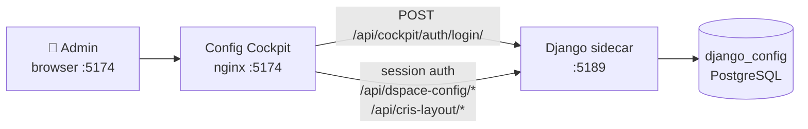
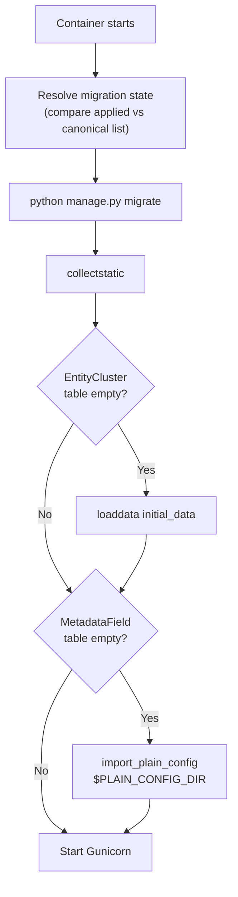
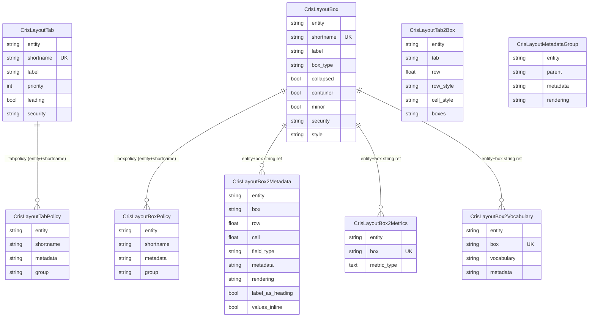

# Backend — Django Sidecar


The Django sidecar is a **Django REST Framework** application serving runtime-configurable settings for the Cockpit. It consists of three Django apps with distinct responsibilities.

## Django Apps

| App | Mount prefix | Auth | Purpose |
|---|---|---|---|
| `api` | `/api/dspace-config/` | DSpace JWT | Core config API — clusters, quicklinks, forms, submission, collection mappings, metadata |
| `cockpit` | `/api/cockpit/auth/` | Django session | Session auth endpoints for the Config Cockpit SPA |
| `cris_layout` | `/api/cris-layout/` | DSpace JWT | CRIS entity layout — tabs, boxes, metadata fields, policies |

## Tech Stack

| Package | Version | Purpose |
|---|---|---|
| Django | ≥4.2, <5.0 | Web framework |
| djangorestframework | ≥3.14 | REST API layer |
| django-cors-headers | ≥4.3 | CORS for React dev server |
| psycopg2-binary | ≥2.9 | PostgreSQL driver |
| gunicorn | ≥21.2 | Production WSGI server |
| drf-spectacular | ≥0.27 | OpenAPI schema generation (`/api/schema/swagger/`) |
| whitenoise | ≥6.6 | Static file serving |
| requests | ≥2.31 | JWT validation proxy to DSpace |
| xlrd | ≥2.0 | `.xls` import for CRIS layout |
| openpyxl | ≥3.1 | `.xlsx` import/export for CRIS layout |

---

## Authentication

The sidecar has **two independent auth backends**, tried in order per request:



### DSpaceJWTAuthentication (`api` / `cris_layout` apps)

Validates every Bearer-token request against DSpace's `/api/authn/status` endpoint. Django has no user table for these sessions — a lightweight `DSpaceUser` proxy object is returned instead.

```python
class DSpaceUser:
    @property
    def is_admin(self):
        return "Administrator" in self.groups  # DSpace special groups
```

<div class="callout callout-warn">
<span class="callout-title">One extra HTTP hop per request</span>
Every JWT-authenticated request makes one outbound call to DSpace. Consider caching the validation result per-token with a short TTL if API latency matters.
</div>

### CockpitSessionAuthentication (`cockpit` app)

Reads `request.session["cockpit_user_id"]` and returns the Django `User` object. Used exclusively by the Config Cockpit SPA at `:5174`. Completely independent of DSpace — no DSpace instance is required.

### Debug Endpoint

`GET /api/dspace-config/debug/auth/` — public, shows connectivity status:

```json
{
  "django_reachable": true,
  "dspace_base_url": "http://dspace:8080/server",
  "dspace_reachable": true,
  "dspace_authenticated": true,
  "jwt_received": true,
  "jwt_preview": "eyJhbGciOi…",
  "settings_module": "dspace_config.settings.local"
}
```

---

## Config Cockpit (`cockpit` app)

The **Config Cockpit** is a standalone Vite + React admin SPA served at `:5174` (`django-frontend` service). It authenticates with Django session auth and provides a graphical interface to the full Django config API without requiring a DSpace login.



### Session auth endpoints

All under `/api/cockpit/auth/`. These use Django session auth only — no DSpace JWT involved.

| Method | Path | Auth | Description |
|---|---|---|---|
| `GET` | `/api/cockpit/auth/csrf/` | Public | Seeds the CSRF cookie; returns `{ csrfToken }` |
| `POST` | `/api/cockpit/auth/login/` | Public (CSRF-exempt) | `{ username, password }` → session cookie + user payload |
| `POST` | `/api/cockpit/auth/logout/` | Session | Flushes the session |
| `GET` | `/api/cockpit/auth/me/` | Session | Returns `{ id, username, email, is_staff, is_superuser }` |

The login endpoint is CSRF-exempt because the SPA calls it before it has a CSRF cookie. After a successful login the SPA fetches `/csrf/` to seed the cookie for subsequent write requests.

### Creating a Django staff account

```bash
docker compose -f docker-compose_2024.yml exec django \
  python manage.py createsuperuser
```

Then open `http://localhost:5174` and log in with those credentials.

<div class="callout callout-warn">
<span class="callout-title">Separate from DSpace admin access</span>
Being a Django staff user does not grant DSpace Administrator rights, and vice versa. Admin actions on the main Cockpit (<code>:4000</code>) still require DSpace group membership. The Config Cockpit at <code>:5174</code> is a separate admin surface backed entirely by Django.
</div>

---

## Startup & Auto-Seeding (`entrypoint.sh`)

The Django container entrypoint runs a smart migration resolver before starting Gunicorn, avoiding re-running DDL when tables already exist from a previous migration state.



`PLAIN_CONFIG_DIR` (default: `/app/frontend-config`) is where `import_plain_config` looks for `input-forms.xml`, submission process XML, and metadata registry files.

---

## API Reference — `api` app

All endpoints under prefix `/api/dspace-config/`.
All require `Authorization: Bearer <JWT>` except `/debug/auth/`.
Write endpoints require DSpace `Administrator` group membership.

### Auth & Diagnostics

| Method | Path | Auth | Description |
|---|---|---|---|
| `GET` | `/debug/auth/` | Public | Connectivity probe |

### Dashboard Clusters

| Method | Path | Auth | Description |
|---|---|---|---|
| `GET` | `/dashboard-config/` | User | Enabled clusters with entity types |
| `GET` | `/clusters/` | User | All clusters including disabled |
| `POST` | `/clusters/` | **Admin** | Create cluster |
| `GET` | `/clusters/:id/` | User | Single cluster |
| `PATCH` | `/clusters/:id/` | **Admin** | Update cluster (partial) |
| `DELETE` | `/clusters/:id/` | **Admin** | Delete cluster + entries |
| `POST` | `/clusters/:id/entity-types/` | **Admin** | Add entity type to cluster |
| `PATCH` | `/entity-types/:id/` | **Admin** | Update entity type label/order |
| `DELETE` | `/entity-types/:id/` | **Admin** | Remove entity type |

### Site Settings

| Method | Path | Auth | Description |
|---|---|---|---|
| `GET` | `/site-settings/` | User | Singleton settings row |
| `PATCH` | `/site-settings/` | **Admin** | Toggle feature flags |

### Collection Mappings

Maps entity types to specific DSpace collection UUIDs. Optional conditions target the correct collection based on item metadata (e.g. different collections for different funding types).

| Method | Path | Auth | Description |
|---|---|---|---|
| `GET` | `/collection-mappings/` | User | All mappings; filterable by `?entity_type=` |
| `POST` | `/collection-mappings/` | **Admin** | Create mapping |
| `GET` | `/collection-mappings/:id/` | User | Single mapping |
| `PATCH` | `/collection-mappings/:id/` | **Admin** | Update mapping |
| `DELETE` | `/collection-mappings/:id/` | **Admin** | Delete mapping |

Condition fields — leave both empty to match all items of that entity type:

```json
{
  "entity_type": "Funding",
  "collection_id": "abc-123-...",
  "label": "EC Grants",
  "conditions": {
    "dcTypeIncludes": ["Grant"],
    "risfundingStatusIn": ["approved"]
  },
  "sort_order": 1
}
```

### Quicklinks

| Method | Path | Auth | Description |
|---|---|---|---|
| `GET` | `/quicklinks/` | User | Enabled presets with filters |
| `GET` | `/quickpresets/` | User | All presets |
| `POST` | `/quickpresets/` | **Admin** | Create preset |
| `PATCH` | `/quickpresets/:id/` | **Admin** | Update preset |
| `DELETE` | `/quickpresets/:id/` | **Admin** | Delete preset + filters |
| `POST` | `/quickpresets/:id/filters/` | **Admin** | Add filter to preset |
| `PATCH` | `/quickpreset-filters/:id/` | **Admin** | Update filter |
| `DELETE` | `/quickpreset-filters/:id/` | **Admin** | Remove filter |

### Submission Forms

| Method | Path | Auth | Description |
|---|---|---|---|
| `GET` | `/submission-forms/` | User | List all imported forms |
| `GET` | `/submission-forms/:id/` | User | Full form with fields |
| `GET` | `/submission-forms/:id/fields/` | User | Fields + metadata registry annotation |
| `GET` | `/submission-forms/export/` | User | Download all forms as JSON |
| `PATCH` | `/submission-forms/fields/:id/` | **Admin** | Update a form field |

### Submission Processes

| Method | Path | Auth | Description |
|---|---|---|---|
| `GET` | `/submission-processes/` | User | List all imported processes |
| `GET` | `/submission-processes/:id/` | User | Process with all steps and resolved definitions |
| `GET` | `/submission-processes/export/` | User | Download all processes as JSON |
| `GET` | `/submission-step-definitions/` | User | All step definitions |
| `GET` | `/submission-step-definitions/:id/` | User | Single step definition |
| `PATCH` | `/submission-process-steps/:id/` | **Admin** | Reorder or update a step |

### Form Layouts

| Method | Path | Auth | Description |
|---|---|---|---|
| `GET` | `/form-layouts/` | User | Layouts; filterable by `form_name`, `profile`, `collection` |
| `POST` | `/form-layouts/` | **Admin** | Create layout |
| `PATCH` | `/form-layouts/:id/` | **Admin** | Update layout |
| `DELETE` | `/form-layouts/:id/` | **Admin** | Delete layout |

### Metadata Registry

| Method | Path | Auth | Description |
|---|---|---|---|
| `GET` | `/metadata-schemas/` | User | All schemas; searchable with `?q=` |
| `GET` | `/metadata-schemas/:id/` | User | Schema with all fields |
| `GET` | `/metadata-fields/` | User | Field autocomplete `?q=dc.title&schema=dc` (max 100) |

### Audit

| Method | Path | Auth | Description |
|---|---|---|---|
| `GET` | `/audit/field-usage/` | User | Form fields vs metadata registry — flags unknowns |
| `GET` | `/audit/forms-summary/` | User | Form count, field count, required flags |

---

## API Reference — `cris_layout` app

All endpoints under prefix `/api/cris-layout/`.
All require `Authorization: Bearer <JWT>`.
Write endpoints require DSpace `Administrator` group membership.

The CRIS layout configuration controls how entity detail pages render in DSpace CRIS — which tabs appear, which boxes sit on each tab, and which metadata fields appear in each box. Data is imported from the `cris-layout-configuration.xls` file and managed here.

### Entity Overview

| Method | Path | Auth | Description |
|---|---|---|---|
| `GET` | `/entities/` | User | List of distinct entity types that have layout data |
| `GET` | `/entities/:entity/` | User | Full assembled layout for one entity |

The entity detail endpoint returns the complete layout in a single response with inline box data:

```json
{
  "entity": "Publication",
  "tabs": [...],
  "tab2box": [...],
  "boxes": [
    {
      "shortname": "primaryBitstream",
      "box_type": "BITSTREAM",
      "fields_data": [...],
      "metrics": null,
      "policies": [...]
    }
  ],
  "metadata_groups": [...],
  "tab_policies": [...]
}
```

### Tabs

| Method | Path | Auth | Description |
|---|---|---|---|
| `GET` | `/tabs/` | User | All tabs; filterable by `?entity=` |
| `POST` | `/tabs/` | **Admin** | Create tab |
| `GET` | `/tabs/:id/` | User | Single tab |
| `PATCH` | `/tabs/:id/` | **Admin** | Update tab |
| `DELETE` | `/tabs/:id/` | **Admin** | Delete tab |

### Tab → Box Mappings

| Method | Path | Auth | Description |
|---|---|---|---|
| `GET` | `/tab2box/` | User | All mappings; filterable by `?entity=` |
| `POST` | `/tab2box/` | **Admin** | Create mapping |
| `PATCH` | `/tab2box/:id/` | **Admin** | Update mapping |
| `DELETE` | `/tab2box/:id/` | **Admin** | Delete mapping |

### Boxes

| Method | Path | Auth | Description |
|---|---|---|---|
| `GET` | `/boxes/` | User | All boxes; filterable by `?entity=` |
| `POST` | `/boxes/` | **Admin** | Create box |
| `GET` | `/boxes/:id/` | User | Single box |
| `PATCH` | `/boxes/:id/` | **Admin** | Update box |
| `DELETE` | `/boxes/:id/` | **Admin** | Delete box |

### Box → Metadata Fields

| Method | Path | Auth | Description |
|---|---|---|---|
| `GET` | `/box-fields/` | User | All fields; filterable by `?entity=&box=` |
| `POST` | `/box-fields/` | **Admin** | Add field to box |
| `PATCH` | `/box-fields/:id/` | **Admin** | Update field |
| `DELETE` | `/box-fields/:id/` | **Admin** | Remove field |

### Metadata Groups

| Method | Path | Auth | Description |
|---|---|---|---|
| `GET` | `/metadata-groups/` | User | All groups; filterable by `?entity=&parent=` |
| `POST` | `/metadata-groups/` | **Admin** | Create group |
| `PATCH` | `/metadata-groups/:id/` | **Admin** | Update group |
| `DELETE` | `/metadata-groups/:id/` | **Admin** | Delete group |

### XLS Export

| Method | Path | Auth | Description |
|---|---|---|---|
| `GET` | `/export/` | User | Download current layout as `.xlsx`; optional `?entity=` filter |

The exported file matches the original `cris-layout-configuration.xls` format exactly, including i18n key sheets (`tab_i18n`, `box_i18n`, `metadata_i18n`, `metadatagroup_i18n`).

---

## Management Commands

### `import_plain_config`

Imports DSpace `input-forms.xml`, metadata registry XMLs, and submission process XML into the Django database. Run once after initial deployment or when DSpace forms change. This is called automatically by `entrypoint.sh` when `MetadataField` table is empty.

```bash
# Import everything from a config directory
docker compose -f docker-compose_2024.yml exec django \
  python manage.py import_plain_config --config-dir /app/frontend-config

# Import metadata registry only
docker compose -f docker-compose_2024.yml exec django \
  python manage.py import_plain_config --metadata /path/to/registries/
```

### `import_cris_layout`

Parses a `cris-layout-configuration.xls` or `.xlsx` file and populates the `cris_layout` database tables. Supports both `.xls` (via `xlrd`) and `.xlsx` (via `openpyxl`). Entire import runs inside a single database transaction.

```bash
# Import all entities
docker compose -f docker-compose_2024.yml exec django \
  python manage.py import_cris_layout /path/to/cris-layout-configuration.xls

# Wipe all existing layout data before importing
docker compose -f docker-compose_2024.yml exec django \
  python manage.py import_cris_layout /path/to/file.xls --clear

# Import specific entities only (leaves others untouched)
docker compose -f docker-compose_2024.yml exec django \
  python manage.py import_cris_layout /path/to/file.xls --entity Person,Publication
```

**Sheets processed and their upsert strategy:**

| Sheet | Model | Strategy |
|---|---|---|
| `tab` | `CrisLayoutTab` | `update_or_create` on `(entity, shortname)` |
| `tab2box` | `CrisLayoutTab2Box` | Delete + re-insert scoped to entity |
| `box` | `CrisLayoutBox` | `update_or_create` on `(entity, shortname)` |
| `box2metadata` | `CrisLayoutBox2Metadata` | Delete + re-insert scoped to entity |
| `box2metrics` | `CrisLayoutBox2Metrics` | `update_or_create` on `(entity, box)` |
| `box2hierarchicalvocabulary` | `CrisLayoutBox2Vocabulary` | `update_or_create` on `(entity, box)` |
| `metadatagroups` | `CrisLayoutMetadataGroup` | Delete + re-insert scoped to entity |
| `tabpolicy` | `CrisLayoutTabPolicy` | `get_or_create` on `(entity, shortname, metadata)` |
| `boxpolicy` | `CrisLayoutBoxPolicy` | `get_or_create` on `(entity, shortname, metadata)` |

### `export_cris_layout`

Exports the current `cris_layout` database contents back to an `.xlsx` file matching the original format exactly, including auto-generated i18n key sheets.

```bash
# Export all entities
docker compose -f docker-compose_2024.yml exec django \
  python manage.py export_cris_layout /tmp/cris-layout-export.xlsx

# Export specific entities only
docker compose -f docker-compose_2024.yml exec django \
  python manage.py export_cris_layout /tmp/export.xlsx --entity Person,Publication
```

This command is also called programmatically by the `GET /api/cris-layout/export/` endpoint to generate the download response.

---

## Data Models

### `api` app

```mermaid
erDiagram
    EntityCluster ||--o{ EntityTypeEntry : "entity_types"
    QuickPreset   ||--o{ QuickPresetFilter : "filters"
    FormLayout    ||--o{ FormSection : "sections"
    FormSection   ||--o{ FormFieldOverride : "field_overrides"
    FormLayout    ||--o{ FormConditionalBlock : "conditional_blocks"
    SubmissionForm ||--o{ SubmissionFormField : "fields"
    SubmissionProcess ||--o{ SubmissionProcessStep : "steps"
    SubmissionProcessStep }o--|| SubmissionStepDefinition : "definition"
    MetadataSchema ||--o{ MetadataField : "fields"

    EntityCluster {
        string key UK
        string label
        text description
        int sort_order
        bool enabled
    }
    EntityTypeEntry {
        fk cluster_id
        string entity_type_label
        int sort_order
    }
    QuickPreset {
        string key UK
        string label
        json base_filters
        int sort_order
        bool enabled
    }
    QuickPresetFilter {
        fk preset_id
        string key
        string label
        string facet_name
        string kind
        string placeholder
        int sort_order
    }
    SiteSettings {
        bool quicklinks_enabled
        bool communities_creation_enabled
        bool communities_role_management_enabled
        bool collections_creation_enabled
    }
    CollectionMapping {
        string entity_type
        string collection_id
        string label
        json dc_type_includes
        json risfunding_status_in
        int sort_order
    }
    SubmissionForm {
        string name UK
        bool contains_required
        datetime imported_at
    }
    SubmissionFormField {
        fk form_id
        int row
        int col
        string field
        string input_type
        bool is_required
        bool repeatable
        string vocabulary
    }
    SubmissionStepDefinition {
        string step_id UK
        string type
        bool mandatory
        string scope
        string heading
        string processing_class
    }
    SubmissionProcess {
        string name UK
        datetime imported_at
    }
    SubmissionProcessStep {
        fk process_id
        fk definition_id
        string step_id
        int sort_order
    }
    FormLayout {
        string form_name
        string profile
        uuid collection
        string label
    }
    FormSection {
        fk layout_id
        string key
        string label
        int sort_order
        bool collapsed_by_default
        text helper_text_above
        text helper_text_below
    }
    FormFieldOverride {
        fk section_id
        string field_name
        string label_override
        text hint_override
        bool hidden
        int sort_order
    }
    FormConditionalBlock {
        fk layout_id
        int sort_order
        string trigger_field
        string trigger_value
        json revealed_fields
        string revealed_section
    }
```

### `cris_layout` app



<div class="callout callout-info">
<span class="callout-title">cris_layout uses string references, not foreign keys</span>
The CRIS layout models link boxes to tabs and fields to boxes via plain <code>CharField</code> references (<code>entity</code> + <code>shortname</code>), matching the original XLS format. The <code>/entities/:entity/</code> endpoint assembles the full nested structure at query time.
</div>

---

## OpenAPI Schema

The full OpenAPI schema is available at:

- `/api/schema/swagger/` — Swagger UI (interactive)
- `/api/schema/redoc/` — ReDoc

The schema covers all three apps and uses `BearerAuth` (JWT) for `api` and `cris_layout` endpoints.

<div class="page-nav">
  <a href="{{ '/dev/frontend/' | relative_url }}">← Frontend</a>
  <a href="{{ '/dev/dspace/' | relative_url }}">DSpace Integration →</a>
</div>
