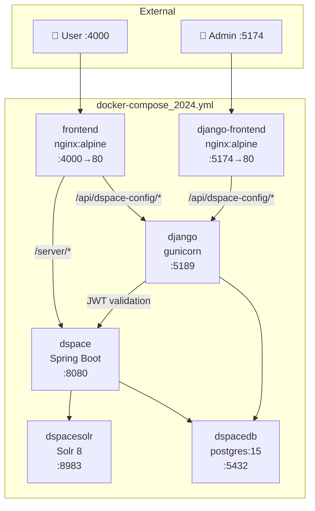

# Deployment


## Docker Compose Stack



### Service Definitions

| Service | Image | Port | Volumes | Notes |
|---|---|---|---|---|
| `dspacedb` | `postgres:15-alpine` | 5432 | `pgdata:/var/lib/postgresql/data` | Creates `dspace` + `django_config` DBs |
| `dspacesolr` | Built from source | 8983 | `solr_data:/var/solr/data` | 8 cores: authority, oai, search, statistics, qaevent, suggestion, dedup, audit |
| `dspace` | Built from source | 8080, 8000 | `assetstore`, config files | DSpace CRIS 2024.02.04 |
| `django` | `./django/Dockerfile` | 5189 | `./django:/app` | Gunicorn on 0.0.0.0:5189 |
| `frontend` | `./frontend/Dockerfile` | 4000→80 | — | Nginx serving Vite build |
| `django-frontend` | `./django-frontend/Dockerfile` | 5174→80 | — | Config Cockpit — standalone admin SPA for the Django config API; uses Django session auth |

### Healthchecks

All services use Docker healthchecks. `depends_on: service_healthy` ensures correct startup order.

| Service | Healthcheck |
|---|---|
| dspacedb | `pg_isready -U dspace -d dspace` |
| dspacesolr | `curl .../solr/search/admin/ping` |
| dspace | `curl .../server/api` greps `dspaceVersion` — 180s start_period |
| django | `curl .../debug/auth/` |
| django-frontend | HTTP check on nginx `:80` — depends on `django: service_healthy` |

---

## Environment Variables

### Frontend (`frontend/.env`)

{:.env-table}
| Variable | Default | Description |
|---|---|---|
| `VITE_API_BASE_URL` | `/server` | DSpace REST base URL |
| `VITE_DJANGO_CONFIG_API_BASE_URL` | _(empty)_ | Django sidecar URL |
| `VITE_CLUSTER_CONFIG_SOURCE` | `ts` | `ts` or `django` |
| `VITE_CLUSTER_CONFIG_FALLBACK` | `true` | Fall back to TS if Django fails |
| `VITE_QUICKLINKS_ENABLED` | `false` | Master quicklinks on/off |
| `VITE_QUICKLINKS_ADMIN_ONLY` | `true` | Restrict to admins only |
| `VITE_QUICKLINKS_CONFIG_SOURCE` | `ts` | `ts` or `django` |
| `VITE_QUICKLINKS_CONFIG_FALLBACK` | `true` | Fall back to TS if Django fails |
| `VITE_COMMUNITIES_CREATION_ENABLED` | `true` | Community creation button |
| `VITE_COMMUNITIES_ROLE_MANAGEMENT_ENABLED` | `true` | Role management UI |
| `VITE_COLLECTIONS_CREATION_ENABLED` | `true` | Collection creation button |
| `VITE_ENABLE_END_USER_AGREEMENT` | `false` | ToU gate on first login |
| `VITE_ENABLE_PRIVACY_STATEMENT` | `false` | Privacy notice in ToU modal |

<div class="callout callout-info">
<span class="callout-title">NODE_OPTIONS for large builds</span>
The Vite build can exhaust memory on machines with limited RAM. Add to the frontend <code>Dockerfile</code>:
<pre><code>ENV NODE_OPTIONS="--max-old-space-size=4096"</code></pre>
</div>

### Django Sidecar

{:.env-table}
| Variable | Default | Description |
|---|---|---|
| `DJANGO_SECRET_KEY` | _(must set)_ | **Required in production** |
| `DJANGO_SETTINGS_MODULE` | `dspace_config.settings.local` | Settings module |
| `DEBUG` | `false` | Enable Django debug mode |
| `DSPACE_BASE_URL` | `http://localhost:8080/server` | Internal URL for JWT validation |
| `DB_HOST` | `localhost` | PostgreSQL host |
| `DB_NAME` | `django_config` | Database name |
| `DB_USER` | `dspace` | Database user |
| `DB_PASSWORD` | `dspace` | Database password |
| `DB_PORT` | `5432` | Database port |
| `CORS_ALLOWED_ORIGINS` | `http://localhost:4000` | Comma-separated allowed origins |
| `ALLOWED_HOSTS` | `localhost,127.0.0.1,django` | Comma-separated Django hosts |
| `GUNICORN_BIND` | `0.0.0.0:5189` | Gunicorn bind address |
| `GUNICORN_WORKERS` | `2` | Gunicorn worker processes |

---

## Nginx Configuration

```nginx
# /etc/nginx/conf.d/default.conf

# DSpace REST API
location /server/ {
    proxy_pass http://dspace:8080/server/;
    proxy_set_header Host              $host;
    proxy_set_header X-Real-IP         $remote_addr;
    proxy_set_header X-Forwarded-For   $proxy_add_x_forwarded_for;
    proxy_set_header X-Forwarded-Proto $scheme;
    proxy_cookie_path / "/; SameSite=Lax";
}

# Django config API
location /api/dspace-config/ {
    proxy_pass http://django:5189/api/dspace-config/;
    proxy_set_header Host              $host;
    proxy_set_header X-Forwarded-For   $proxy_add_x_forwarded_for;
    proxy_set_header Authorization     $http_authorization;
}

# React SPA — all unmatched routes serve index.html
location / {
    root /usr/share/nginx/html;
    try_files $uri $uri/ /index.html;
}
```

<div class="callout callout-warn">
<span class="callout-title">Trusted proxy ranges</span>
In <code>local.cfg</code>, set <code>proxies.trusted.ipranges</code> to include your Docker subnet. The compose file uses <code>172.23.0.0/16</code>. Without this, DSpace rejects proxied requests or logs incorrect client IPs:

<pre><code>proxies.trusted.ipranges = 172.23.0, 172.23.1, ...</code></pre>
</div>

---

## DSpace local.cfg Key Settings

```properties
# Public URLs
dspace.server.url = http://localhost:8080/server
dspace.ui.url     = http://localhost:4000

# CORS
rest.cors.allowed-origins  = http://localhost:4000
rest.cors.allow-credentials = true

# Development HTTP only (never production!)
rest.cors.cookie.secure = false

# Trusted proxy subnet (must match Docker network)
proxies.trusted.ipranges = 172.23.0, 172.23.1, ...
```

<div class="page-nav">
  <a href="{{ '/dev/dspace/' | relative_url }}">← DSpace Integration</a>
  <a href="{{ '/ops/' | relative_url }}">Operations Guide →</a>
</div>
