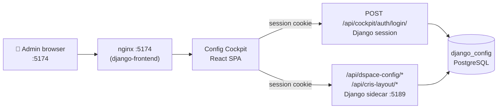
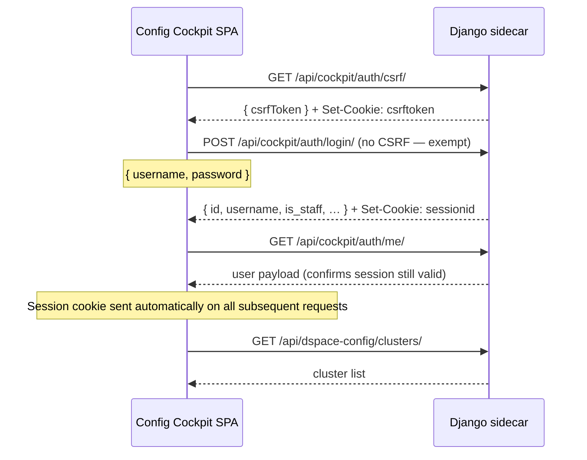
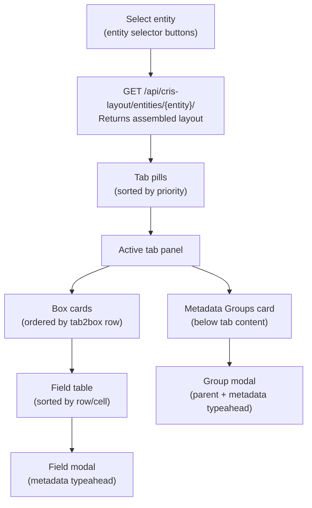

# Config Cockpit — `django-frontend`


The Config Cockpit is a standalone Vite + React admin SPA served at `:5174` by the `django-frontend` Docker service. It provides a graphical interface to the full Django config API — clusters, quicklinks, submission forms, CRIS layout, and more — using **Django session auth** rather than the DSpace JWT used by the main Cockpit.

<div class="callout callout-info">
<span class="callout-title">Independent of DSpace</span>
The Config Cockpit does not require a running DSpace instance. It talks directly to the Django sidecar API at <code>:5189</code>. Login uses a Django staff username and password.
</div>

---

## Architecture



---

## Project Structure

```
django-frontend/src/
├── api/
│   └── client.ts           # apiFetch wrapper + all typed API helpers + domain types
├── auth/
│   └── AuthContext.tsx     # React context: login/logout/me, CSRF seeding
├── components/
│   ├── Shell.tsx           # App shell — header, sidebar, footer
│   └── shared.tsx          # Reusable UI: Alert, Modal, Spinner, PageHeader, etc.
├── pages/
│   ├── LoginPage.tsx
│   ├── DashboardPage.tsx
│   ├── SiteSettingsPage.tsx
│   ├── ClustersPage.tsx
│   ├── CollectionMappingsPage.tsx
│   ├── QuicklinksPage.tsx
│   ├── SubmissionFormsPage.tsx
│   ├── SubmissionProcessesPage.tsx
│   ├── FormLayoutsPage.tsx
│   ├── CrisLayoutPage.tsx
│   ├── MetadataPage.tsx
│   └── AuditPage.tsx
├── App.tsx                 # Root component and page router
└── main.tsx
```

---

## Auth Flow



On mount, `AuthContext` calls `/csrf/` then `/me/` to restore an existing session. If `/me/` returns 401, the user sees the login page. After login, `/csrf/` is called again to seed the CSRF cookie for subsequent write requests.

---

## Navigation & Pages

The app uses in-memory page state (no URL hash routing). Navigation is managed via `useState<PageKey>` in `App.tsx`, with `Shell` rendering the active sidebar item.

### Sidebar sections and pages

| Section | Page | `PageKey` | Description |
|---|---|---|---|
| General | Overview | `dashboard` | Stats dashboard + API endpoint reference |
| General | Site Settings | `settings` | Feature flag toggles |
| Dashboard | Entity Clusters | `clusters` | Create/edit/delete clusters and assign entity types |
| Submission | Collection Mappings | `mappings` | Entity type → collection UUID routing rules |
| Navigation | Quicklink Presets | `quicklinks` | Presets and their facet filters |
| Submission | Submission Forms | `sub-forms` | Read-only view of imported DSpace forms |
| Submission | Submission Processes | `sub-processes` | Read-only view of imported submission processes |
| Submission | Form Layouts | `form-layouts` | Section/field override layouts |
| Layout | CRIS Layout | `cris-layout` | Visual editor for entity tabs, boxes, and fields |
| Data | Metadata Registry | `metadata` | Schema browser + field search |
| Data | Audit | `audit` | Forms summary + field usage reports |

### Cross-page navigation

`SubmissionProcessesPage` contains clickable step IDs for `submission-form` type steps. Clicking one navigates to `SubmissionFormsPage` with `initialFormName` set, which auto-selects and loads that form. This is the only cross-page navigation in the app.

---

## Page Reference

### Login

Django staff username + password form. Errors from `/api/cockpit/auth/login/` are shown inline. The login endpoint is CSRF-exempt so it works before the CSRF cookie has been seeded.

### Dashboard (Overview)

Loads counts from six API endpoints in parallel (`clusters`, `collection-mappings`, `quicklinks/presets`, `submission-forms`, `submission-processes`, `form-layouts`) and displays them as stat cards. Also shows the architecture summary and a quick API endpoint reference table.

### Site Settings

Loads the singleton `SiteSettings` object and presents the four feature flags as labelled toggle rows. Changes are staged locally and saved in a single `PATCH /site-settings/` call. The last-saved timestamp is shown below the flags.

| Flag | Effect on main Cockpit |
|---|---|
| Quicklinks tab | Shows/hides the Quicklinks navigation item |
| Community creation | Shows/hides "+ Create community" button |
| Role management | Shows/hides "👥 Admins" button on community tree nodes |
| Collection creation | Shows/hides "+ collection" button |

### Entity Clusters

Full CRUD for dashboard clusters. The page shows a sortable table with inline entity type pill management. Expanding a row with **▼ Types** reveals an inline editor where entity type labels can be added (Enter key or button) and removed (✕ on each pill). Creating or editing a cluster opens a modal with key, label, description, sort order, and enabled toggle.

### Collection Mappings

Full CRUD for entity-type-to-collection routing rules. The table shows sort order, entity type chip, truncated collection UUID, label, and any conditions as amber chips. The edit modal includes an optional conditions section: `dc.type includes` and `risfunding status in` fields accept comma-separated values which are serialised to JSON arrays before sending.

### Quicklink Presets

Two-panel layout: left panel lists all presets (sorted by `sort_order`), right panel shows the filter editor for the selected preset. Preset CRUD uses a modal. Filter CRUD is inline in the right panel — adding, editing, and deleting filters does not open a separate modal page.

### Submission Forms

Read-only. Left panel lists all imported forms with field count and a "has required" amber chip. Selecting a form loads its full detail and shows a field table with row, col, field name, label, input type, required flag, and repeatable flag. Populated by `import_plain_config`.

### Submission Processes

Read-only. Left panel lists imported processes. Selecting one shows a step table. Steps of type `submission-form` render the `step_id` as a clickable link that navigates to the Submission Forms page and pre-selects that form. Populated by `import_plain_config`.

### Form Layouts

Two-panel layout: left panel lists all layouts with form name, profile chip, collection UUID (or "all collections"), section count, and conditional count. Selecting a layout shows its sections table and conditional blocks table in the right panel. Creating/editing a layout opens a modal with `form_name`, `profile`, optional `collection` UUID, and `label`. Sections and field overrides are managed via the API directly (not through this page's UI).

### CRIS Layout

The most feature-rich page. A visual editor for DSpace CRIS entity detail page layouts, backed by the `cris_layout` API.

**Entity selector** — button row at the top populated from `GET /api/cris-layout/entities/`. Selecting an entity loads the full assembled layout.

**Tab pills** — horizontal pill bar showing all tabs sorted by `priority`. The leading tab is marked with ★.

**Tab panel** — shows the tab header bar (leading indicator, priority, security chip, Edit/Delete buttons) and all boxes assigned to this tab in row order. Boxes not assigned to the active tab are hidden.

**Box cards** — each box is a collapsible card showing the box type chip (colour-coded by type), shortname, label, security chip, collapsed/minor flags, and field count. Expanding a box reveals:

- A metrics bar (amber, shown only for METRICS boxes) listing metric type identifiers
- A drag-and-drop field table with row/cell position, field type, metadata field name, label, and rendering
- An "Add Field" button

**Field modal** — wide modal for creating or editing a `CrisLayoutBox2Metadata` record. Includes a **metadata field typeahead** input that queries `GET /api/dspace-config/metadata-fields/?q=` with a 220ms debounce and shows up to 12 autocomplete suggestions from the metadata registry.

**Metadata Groups** — card below the tab/box editor listing all `CrisLayoutMetadataGroup` records for the entity. Full CRUD with a dedicated modal that also uses the metadata field typeahead for both the `parent` and `metadata` fields.

**XLS export** — "⬇ Download XLS" button calls `GET /api/cris-layout/export/?entity=<entity>` and triggers a browser download of the xlsx file.



### Metadata Registry

Two-view page with a toggle between **Schemas** and **Field Search**.

**Schemas view** — table of all schemas with filterable header. Clicking a row expands an inline drill-down panel showing all fields for that schema with a scrollable sub-table. A "🔍 Search in lookup" button in the drill-down panel switches to the Field Search view with that schema name pre-filled.

**Field Search view** — text input that searches `GET /api/dspace-config/metadata-fields/?q=<query>` on demand (Enter or button). Returns up to 100 results. Schema chips in the results are clickable — clicking one switches back to the Schemas view and expands that schema's drill-down. A stats bar at the top shows total schema count, total field count, and current search result count.

### Audit

Two sections: **Forms Summary** (loaded automatically on mount from `GET /audit/forms-summary/`) and **Field Usage** (loaded on demand via a "Load Report" button from `GET /audit/field-usage/`). Both display raw JSON in a scrollable `<pre>` block. The Field Usage report is lazy-loaded because it can be slow on large installations.

---

## API Client (`api/client.ts`)

The `apiFetch` wrapper handles all HTTP communication:

- Reads the CSRF token from the `csrftoken` cookie and sets `X-CSRFToken` on all write requests (`POST`, `PUT`, `PATCH`, `DELETE`)
- Sends `credentials: "include"` on every request so the session cookie is attached
- Throws a typed `ApiError` on non-2xx responses with `{ status, detail, body }`
- Returns `undefined` for `204 No Content` responses

The `api` object exports typed helpers for every endpoint. All config API calls go to `/api/dspace-config/` and cockpit auth calls go to `/api/cockpit/auth/`.

---

## Dev Server Setup

```bash
# 1. Start the Django sidecar (only service needed for Config Cockpit dev)
docker compose -f docker-compose_2024.yml up -d dspacedb dspace django

# 2. Install dependencies
cd django-frontend && npm install

# 3. Start the Vite dev server
npm run dev
# → http://localhost:5174 (hot-reload)
```

<div class="callout callout-info">
<span class="callout-title">No DSpace needed for most pages</span>
Because the Config Cockpit authenticates with Django sessions, you can develop all pages except the CRIS Layout metadata typeahead (which queries <code>/api/dspace-config/metadata-fields/</code>) without a running DSpace instance. Start just <code>dspacedb</code> and <code>django</code> for the fastest dev loop.
</div>

---

## Adding a New Page

The process to add a new page follows the same pattern throughout the codebase:

**1. Add the API helper to `client.ts`**

```typescript
myResource: () => apiFetch<MyResource[]>(`${BASE}/my-resource/`),
createMyResource: (data: unknown) => apiFetch<MyResource>(`${BASE}/my-resource/`, { method: "POST", body: data }),
```

**2. Add the `PageKey` to `Shell.tsx`**

```typescript
export type PageKey = ... | "my-resource";

const NAV: NavEntry[] = [
  ...
  { key: "my-resource", label: "My Resource", icon: "🔧", section: "General" },
];
```

**3. Create the page component in `pages/MyResourcePage.tsx`**

```tsx
export function MyResourcePage() {
  return (
    <div>
      <PageHeader title="My Resource" desc="…" />
      {/* page content */}
    </div>
  );
}
```

**4. Wire it into `App.tsx`**

```tsx
import { MyResourcePage } from "./pages/MyResourcePage";

// In PageRouter:
case "my-resource": return <MyResourcePage />;
```

<div class="page-nav">
  <a href="{{ '/dev/backend/' | relative_url }}">← Backend (Django)</a>
  <a href="{{ '/dev/dspace/' | relative_url }}">DSpace Integration →</a>
</div>
