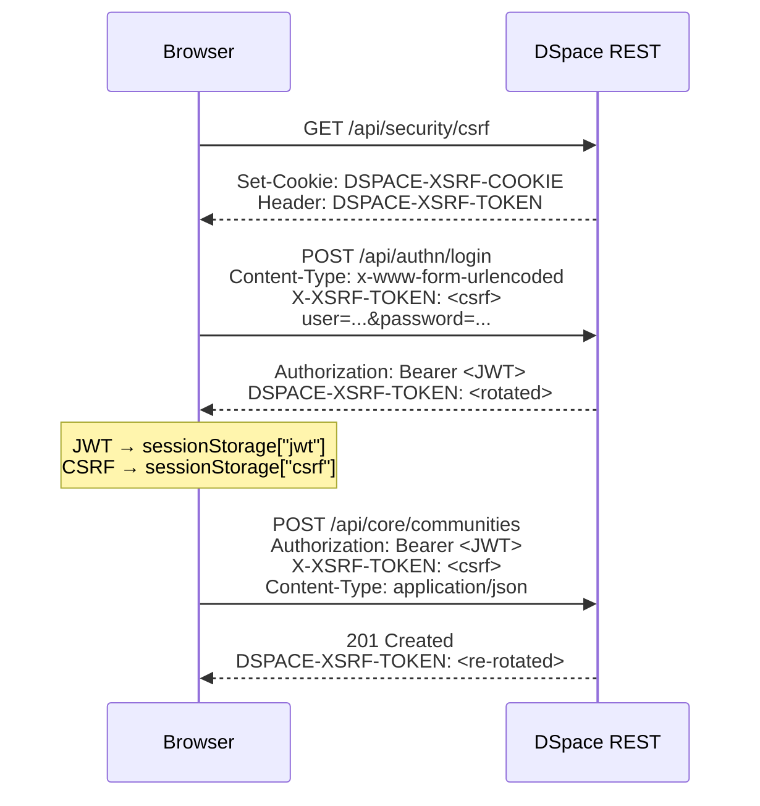

# DSpace Integration

## Key REST Endpoints Used

| Endpoint | Used For |
|---|---|
| `GET /api/authn/status` | Session validation, eperson href retrieval |
| `POST /api/authn/login` | Username/password → JWT |
| `POST /api/authn/logout` | Session invalidation |
| `GET /api/core/epersons/:id` | Full EPerson profile |
| `GET /api/core/epersons/:id/groups` | Group memberships (role detection) |
| `GET /api/core/entitytypes` | Accessible entity types |
| `GET /api/core/entitytypes/search/findAllByAuthorizedCollection` | `canCreate()` gate |
| `GET /api/discover/search/objects` | Full-text + faceted Discovery search |
| `GET /api/core/communities` | Community list |
| `POST /api/core/communities` | Community creation |
| `GET /api/core/collections` | Collection list |
| `POST /api/core/collections` | Collection creation |
| `GET /api/submission/workspaceitems` | Workspace item list |
| `GET /api/core/items/:uuid` | Published item detail |
| `POST /api/core/bundles/:id/bitstreams` | Bitstream upload |
| `DELETE /api/core/bitstreams/:id` | Bitstream delete |

## JWT + CSRF Auth Flow

DSpace 7 uses **stateless JWT auth** combined with a **CSRF cookie** for write protection.

CSRF rotation
DSpace rotates the CSRF token on every successful mutation. The client reads the new value from the <code>DSPACE-XSRF-TOKEN</code> response header and updates sessionStorage via <code>setStoredCsrfToken()</code> automatically.

Development CSRF cookie
Set <code>rest.cors.cookie.secure = false</code> in <code>local.cfg</code> for plain HTTP development. <strong>Never use in production</strong> — require HTTPS instead.

## Entity Types

| Entity Type | Quicklink Preset | Default Filters |
|---|---|---|
| Publication | ✓ | dc.type, dc.date.issued, dc.contributor.author |
| Project | ✓ | investigator, coordinator, status, start/end date |
| Funding | ✓ | itemtype, funder |
| Person | ✓ | affiliation |
| OrgUnit | ✓ | dc.type, country |
| Equipment | ✓ | itemtype |
| Event | ✓ | itemtype, start/end date |
| Product | ✓ | dc.type, dc.contributor.author |
| Patent | ✓ | dc.contributor.author (Inventor) |
| Journal | ✓ | dc.publisher |
| Place, ConceptScheme, Concept, ArchivalResource | Institution-specific | Separate API modules |

## Submission API Modules

| Entity Type | API Module | Notes |
|---|---|---|
| Publication / generic | DSpace `/submission/workspaceitems` | Standard workflow |
| OrgUnit | `orgunit-creation-api.ts` | Direct creation |
| Person | `person-api.ts` | Workspace or import |
| Funding | `funding-creation-api.ts` | Includes `funding-programme-api.ts` |
| Equipment | `equipment-creation-api.ts` | Direct creation |
| Place | `place-creation-api.ts` / `place-import-api.ts` | Manual or Geonames import |
| SKOS Concept/Scheme | `skos-creation-api.ts` / `skos-edit-api.ts` | Controlled vocabulary |
| Archival Resource | `archival-resource-api.ts` | Archival metadata |
| OrgUnit (batch) | `orgunit-import-api.ts` | Batch import |

Adding a new entity type
Create <code>my-entity-creation-api.ts</code> in <code>src/api/</code>, a modal in <code>src/components/</code>, add to the entity-clusters config or Django DB, and wire the <code>canCreate("MyEntity")</code> gate from <code>useAuth()</code>.

  <a href="{{ '/dev/backend/' | relative_url }}">← Backend</a>
  <a href="{{ '/dev/deployment/' | relative_url }}">Deployment →</a>

