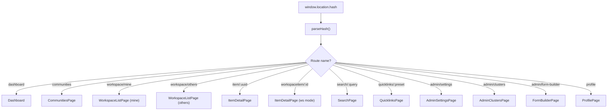
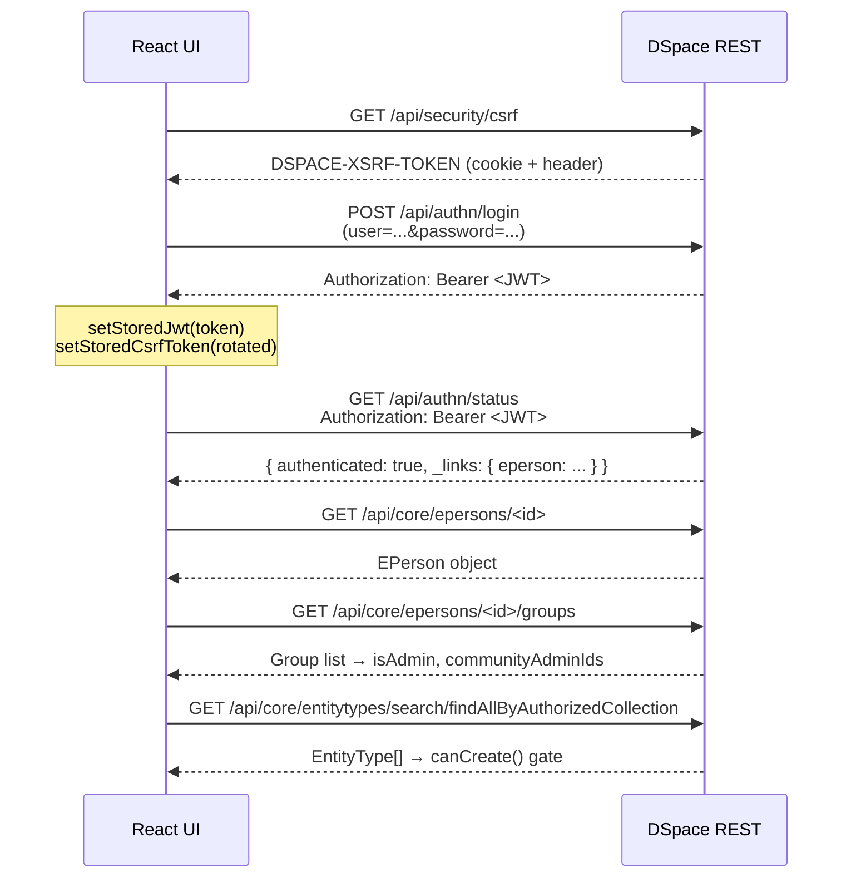
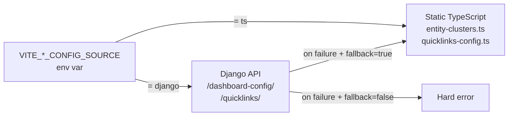
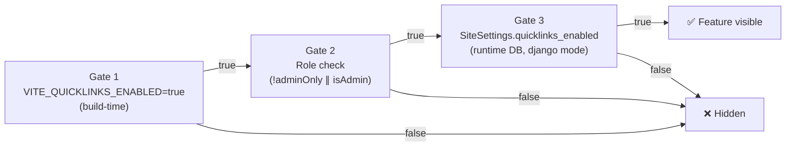

# Frontend


## Project Structure

```
src/
├── api/                    # DSpace + Django API client modules
│   ├── client.ts           # Base fetch wrapper (CSRF + JWT headers)
│   ├── apiClient.ts        # Typed DSpace REST helpers
│   ├── django-client.ts    # Django config API (djangoGet/Post/Patch/Delete)
│   ├── person-api.ts       # /api/core/epersons + auth/status
│   ├── bitstream-api.ts    # Bitstream upload/delete
│   ├── community-api.ts    # Community list + create
│   ├── collection-api.ts   # Collection list + items
│   └── dspace.ts           # Discovery search / item detail
│
├── auth/
│   ├── AuthContext.tsx     # React context: login/logout/groups/roles
│   ├── client.ts           # JWT + CSRF sessionStorage helpers
│   └── storage.ts          # sessionStorage key constants
│
├── config/                 # Feature configuration modules
│   ├── dashboard-config.ts # Cluster loading: TS or Django mode
│   ├── quicklinks-config.ts# Quicklinks presets + feature flags
│   ├── communities-config.ts
│   ├── entity-clusters.ts  # Static cluster definitions
│   └── entities-config.ts  # Entity type → UI mapping
│
├── navigation/
│   └── hash.ts             # Hash-based router (parseHash + routes)
│
├── pages/                  # Top-level page components
│   ├── dashboard.tsx
│   ├── communities.tsx
│   ├── workspace-list.tsx
│   ├── item-list.tsx
│   ├── item-detail.tsx
│   ├── search-page.tsx
│   ├── quicklinks-page.tsx
│   ├── admin-clusters.tsx
│   ├── admin-settings.tsx
│   └── form-builder.tsx
│
├── components/             # Shared UI components & modals
└── styles/                 # Global CSS (theme, nav, app-shell)
```

---

## Routing

The SPA uses **hash-based routing** — `window.location.hash` drives all navigation. No server-side route config is needed.



### Route Reference

| Hash Pattern | Route Name | Page Component |
|---|---|---|
| `#/dashboard` | dashboard | Dashboard |
| `#/communities` | communities | CommunitiesPage |
| `#/collection/:id` | collection | ItemListPage |
| `#/workspace/mine` | workspace (mine) | WorkspaceListPage |
| `#/workspace/others` | workspace (others) | WorkspaceListPage |
| `#/item/:uuid` | item | ItemDetailPage |
| `#/workspaceitem/:id` | workspaceitem | ItemDetailPage (ws) |
| `#/search/:query` | search | SearchPage |
| `#/quicklinks/:preset` | quicklinks | QuicklinksPage |
| `#/profile` | profile | ProfilePage |
| `#/admin/settings` | adminSettings | AdminSettingsPage |
| `#/admin/clusters` | adminClusters | AdminClustersPage |
| `#/admin/form-builder/:proc` | formBuilder | FormBuilderPage |

### Navigation Helpers

Use the typed `routes` object from `navigation/hash.ts`:

```typescript
import { routes } from "../navigation/hash";

// Static routes
window.location.hash = routes.dashboard;       // "#/dashboard"
window.location.hash = routes.communities;     // "#/communities"

// Dynamic routes
window.location.hash = routes.item(uuid);      // "#/item/<uuid>"
window.location.hash = routes.collection(id);  // "#/collection/<id>"
window.location.hash = routes.searchQuery(q);  // "#/search/<encoded>"
window.location.hash = routes.quicklinksPreset("publication");
```

---

## Auth & Context

Authentication state is managed via React Context in `auth/AuthContext.tsx`.

### useAuth() API

```typescript
const {
  isAuthenticated,      // boolean — true after successful DSpace login
  isLoading,            // boolean — true while restoring from sessionStorage
  isAdmin,              // boolean — member of DSpace "Administrator" group
  isCommunityAdmin,     // boolean — member of any COMMUNITY_<uuid>_ADMIN group
  communityAdminIds,    // ReadonlySet<string> — UUIDs user admins
  isCommunityAdminOf,   // (id: string) => boolean
  canCreate,            // (entityType: string) => boolean
  eperson,              // EPerson | null
  groups,               // Group[]
  entityTypes,          // EntityType[] — from external auth source
  collectionEntityTypes,// EntityType[] — with submit permission
  login,                // (username, password) => Promise<void>
  logout,               // () => Promise<void>
  refreshUser,          // () => Promise<void>
} = useAuth();
```

### Login Flow



### Role Detection

```typescript
// isAdmin — direct group name match
const isAdmin = groups.some(g => g.name === "Administrator");

// isCommunityAdmin — regex match on group names
const COMMUNITY_ADMIN_RE = /^COMMUNITY_([0-9a-f-]+)_ADMIN$/i;
// Populates communityAdminIds Set<string>
```

<div class="callout callout-warn">
<span class="callout-title">Session storage</span>
The JWT is stored in <code>sessionStorage</code> (key: <code>jwt</code>). Closing the browser tab clears the session — users must log in again on the next visit.
</div>

---

## Configuration System

Several features support two sources: **static TypeScript** (zero runtime deps) or **Django database** (runtime-editable). Select the source per-feature via env var.



| Feature | Env Var | TS Source | Django Endpoint |
|---|---|---|---|
| Dashboard Clusters | `VITE_CLUSTER_CONFIG_SOURCE` | `entity-clusters.ts` | `/dashboard-config/` |
| Quicklinks Presets | `VITE_QUICKLINKS_CONFIG_SOURCE` | `quicklinks-config.ts` | `/quicklinks/` |

### Runtime Window Injection

The Django base URL can be set at container start time — no rebuild needed:

```html
<script>
  window.__DJANGO_CONFIG_API_BASE_URL__ = "/api/dspace-config";
  window.__CLUSTER_CONFIG_SOURCE__ = "django";
</script>
```

This takes priority over `VITE_*` build-time variables.

---

## Feature Flags

All three gates must be `true` for a feature to be visible:



| Feature | Build Env Var | DB Field | Scope |
|---|---|---|---|
| Quicklinks tab | `VITE_QUICKLINKS_ENABLED` | `quicklinks_enabled` | Admin-only or all users |
| Community creation | `VITE_COMMUNITIES_CREATION_ENABLED` | `communities_creation_enabled` | Admin only |
| Role management | `VITE_COMMUNITIES_ROLE_MANAGEMENT_ENABLED` | `communities_role_management_enabled` | Admin only |
| Collection creation | `VITE_COLLECTIONS_CREATION_ENABLED` | `collections_creation_enabled` | Admin only |
| End-user agreement | `VITE_ENABLE_END_USER_AGREEMENT` | n/a | All users |

<div class="page-nav">
  <a href="{{ '/dev/quickstart/' | relative_url }}">← Quick Start</a>
  <a href="{{ '/dev/backend/' | relative_url }}">Backend (Django) →</a>
</div>
