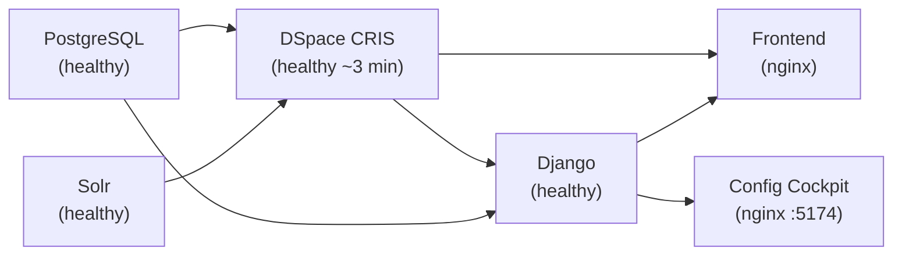

# Quick Start


## Prerequisites

| Tool | Minimum Version | Notes |
|---|---|---|
| Docker Desktop | 24+ | Required for the full stack |
| Node.js | 18 LTS | Frontend dev server |
| Python | 3.11 | Django sidecar (optional) |
| Git | any | Clone DSpace source |

## 1 — Clone DSpace source (one-time)

DSpace builds from source. Clone the pinned 2024 branch into a sibling directory:

```bash
git clone --branch dspace-cris-2024.02.04 --depth 1 \
    https://github.com/4Science/DSpace.git dspace-src-2024
```

<div class="callout callout-warn">
<span class="callout-title">Build time</span>
The first Docker build takes <strong>10–20 minutes</strong> — DSpace is a full Java Maven build. Subsequent starts are fast because the image is cached.
</div>

## 2 — Configure environment variables

Create a `.env` file in the frontend directory:

```bash
# Required
VITE_API_BASE_URL=http://localhost:8080/server

# Config source — use 'ts' for static config, 'django' for DB-backed
VITE_CLUSTER_CONFIG_SOURCE=ts
VITE_QUICKLINKS_CONFIG_SOURCE=ts

# Quicklinks feature
VITE_QUICKLINKS_ENABLED=true
VITE_QUICKLINKS_ADMIN_ONLY=true

# Optional Django URL (only when CLUSTER/QUICKLINKS_CONFIG_SOURCE=django)
# VITE_DJANGO_CONFIG_API_BASE_URL=/api/dspace-config
```

## 3 — Start the full stack

```bash
docker compose -f docker-compose_2024.yml up -d --build

# Watch DSpace startup (wait for "Started Application" in logs):
docker compose -f docker-compose_2024.yml logs -f dspace
```

Services started:

<div class="service-grid">
  <div class="service-card">
    <h4>DSpace CRIS</h4>
    <p>Repository backend</p>
    <span class="port">:8080</span>
  </div>
  <div class="service-card">
    <h4>Solr</h4>
    <p>Search index</p>
    <span class="port">:8983</span>
  </div>
  <div class="service-card">
    <h4>PostgreSQL</h4>
    <p>dspace + django_config</p>
    <span class="port">:5432</span>
  </div>
  <div class="service-card">
    <h4>Django</h4>
    <p>Config API sidecar</p>
    <span class="port">:5189</span>
  </div>
  <div class="service-card">
    <h4>Frontend (nginx)</h4>
    <p>React SPA</p>
    <span class="port">:4000</span>
  </div>
  <div class="service-card">
    <h4>Config Cockpit (nginx)</h4>
    <p>Django admin SPA</p>
    <span class="port">:5174</span>
  </div>
</div>

Default credentials: **admin@localhost / admin**

<div class="callout callout-info">
<span class="callout-title">Config Cockpit at :5174</span>
A second admin interface is available at <code>http://localhost:5174</code> — the <strong>Config Cockpit</strong>, a standalone React SPA that talks directly to the Django config API. It uses Django's own session auth (username + password for Django staff users), independent of the DSpace JWT. Create a Django staff account with <code>python manage.py createsuperuser</code> to log in.
</div>

## 4 — Start the frontend dev server (optional)

For hot-reload development without rebuilding the Docker image:

```bash
npm install
npm run dev
# → http://localhost:5173
```

<div class="callout callout-info">
<span class="callout-title">Memory allocation for the frontend build</span>
The Vite build can run out of memory on machines with < 4 GB RAM. Add this to the frontend <code>Dockerfile</code> or your shell before building:
<pre><code>ENV NODE_OPTIONS="--max-old-space-size=4096"</code></pre>
</div>

## 5 — Initialize Django sidecar (optional)

Only needed when using `VITE_*_CONFIG_SOURCE=django`. Migrations, seed data, and plain config import run automatically via `entrypoint.sh` when the container starts — these manual steps are for re-import or override scenarios.

```bash
# Run migrations (normally auto-runs on container start)
docker compose -f docker-compose_2024.yml exec django \
  python manage.py migrate

# Create a Django staff account for the Config Cockpit at :5174
docker compose -f docker-compose_2024.yml exec django \
  python manage.py createsuperuser

# Re-import DSpace input-forms.xml + metadata registry + submission processes
docker compose -f docker-compose_2024.yml exec django \
  python manage.py import_plain_config --config-dir /app/frontend-config

# Reload seed data (clusters, quicklinks presets)
docker compose -f docker-compose_2024.yml exec django \
  python manage.py loaddata initial_data.json
```

## 6 — Import CRIS layout (optional)

Only needed when using the CRIS entity detail page layout management features. Requires the `cris-layout-configuration.xls` file from your DSpace CRIS configuration.

```bash
# Import all entity layouts from XLS
docker compose -f docker-compose_2024.yml exec django \
  python manage.py import_cris_layout /path/to/cris-layout-configuration.xls

# Import with --clear to wipe existing data first (safe for fresh imports)
docker compose -f docker-compose_2024.yml exec django \
  python manage.py import_cris_layout /path/to/file.xls --clear

# Import specific entities only
docker compose -f docker-compose_2024.yml exec django \
  python manage.py import_cris_layout /path/to/file.xls --entity Person,Publication

# Verify: list imported entity types
curl -s -H "Authorization: Bearer <jwt>" \
  http://localhost:5189/api/cris-layout/entities/ | python3 -m json.tool
```

## Service Startup Order



All `depends_on` conditions use `service_healthy` — Docker waits for the healthcheck to pass before starting dependents. Django's entrypoint also auto-runs migrations, seeds initial cluster/quicklinks data, and imports `input-forms.xml` on first start.

## Verify Everything is Running

```bash
# Check all containers are healthy
docker compose -f docker-compose_2024.yml ps

# DSpace API
curl http://localhost:8080/server/api | grep dspaceVersion

# Django debug endpoint (no auth needed)
curl http://localhost:5189/api/dspace-config/debug/auth/

# Solr search core
curl http://localhost:8983/solr/search/admin/ping
```

<div class="page-nav">
  <a href="{{ '/dev/architecture/' | relative_url }}">← Architecture</a>
  <a href="{{ '/dev/frontend/' | relative_url }}">Frontend →</a>
</div>

---

<div class="callout callout-tip">
<span class="callout-title">Looking for copy-paste shortcuts?</span>
The <a href="{{ '/quick-launch/' | relative_url }}">Quick Launch page</a> has all modes (evaluation, hot-reload dev, full dev, monitoring) plus a full command cheatsheet for logs, exec, database dumps, and common troubleshooting.
</div>
