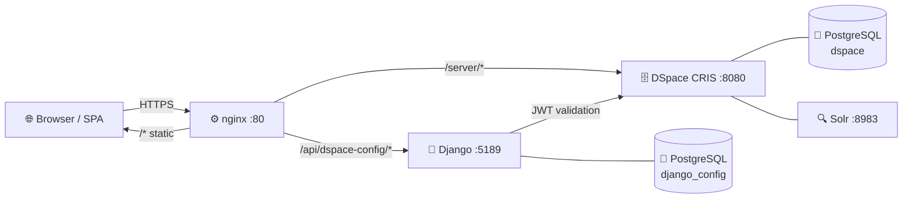

# DSpace CRIS Cockpit Documentation

A single-page React application layered on top of **DSpace 7 / DSpace CRIS** providing an enhanced submission workspace, discoverable entity browsing, admin configuration, and an optional Django sidecar for runtime-configurable features.

---

## Documentation Guides

  

    <h4>🛠 Developer Guide</h4>
    
Architecture, project structure, routing, auth, config system, API reference, deployment.

     <a href="{{ '/dev/' | relative_url }}">Read →</a>
  

  

    <h4>⚙️ Admin Guide</h4>
    
Feature flags, dashboard clusters, quicklinks presets, form builder, community management.

     <a href="{{ '/admin/' | relative_url }}">Read →</a>
  

  

    <h4>👤 User Guide</h4>
    
Logging in, dashboard, workspace, search, quicklinks, communities, profile, FAQ.

     <a href="{{ '/user/' | relative_url }}">Read →</a>
  

  

    <h4>📊 Operations Guide</h4>
    
Docker Compose stacks, monitoring with Prometheus + Loki + Grafana, alerting setup.

     <a href="{{ '/ops/' | relative_url }}">Read →</a>
  

---

## Architecture at a Glance

---

## Quick Links

| I want to… | Go to |
|---|---|
| Run the full stack locally | [Quick Start](/dev/quickstart/) |
| Understand the system design | [Architecture](/dev/architecture/) |
| Configure environment variables | [Deployment](/dev/deployment/) |
| Set up monitoring & alerts | [Monitoring](/ops/monitoring/) |
| Manage dashboard clusters | [Admin → Clusters](/admin/clusters/) |
| Manage quicklinks presets | [Admin → Quicklinks](/admin/quicklinks/) |
| Customise submission forms | [Admin → Form Builder](/admin/formbuilder/) |
| Log in and get started | [User → Getting Started](/user/getting-started/) |
| Find my draft submissions | [User → Workspace](/user/workspace/) |
| Search the repository | [User → Search](/user/search/) |
| Understand a term or badge | [User → FAQ & Glossary](/user/faq/) |
