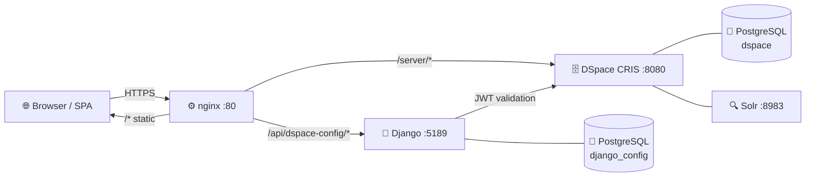

# DSpace CRIS Cockpit Documentation


A single-page React application layered on top of **DSpace CRIS 2024+** providing an enhanced submission workspace, discoverable entity browsing, admin configuration, and an optional Django sidecar for runtime-configurable features.

---

## Get Running in 3 Commands

```bash
# Clone DSpace source (one-time — first build takes 10–20 min)
git clone --branch dspace-cris-2024.02.04 --depth 1 \
    https://github.com/4Science/DSpace.git dspace-src-2024

# Start the full stack
docker compose -f docker-compose_2024.yml up -d --build

# Open the Cockpit  →  admin@localhost / admin
open http://localhost:4000
```

More launch modes — evaluation, hot-reload dev, monitoring: **[Quick Launch →]({{ '/quick-launch/' | relative_url }})**

---

## Documentation Guides

<div class="service-grid">
  <div class="service-card">
    <h4>🚀 Quick Launch</h4>
    <p>Evaluation, frontend dev, full dev, and monitoring modes — with copy-paste commands and a cheatsheet.</p>
    <br><a href="{{ '/quick-launch/' | relative_url }}">Launch →</a>
  </div>
  <div class="service-card">
    <h4>🛠 Developer Guide</h4>
    <p>Architecture, project structure, routing, auth, config system, API reference, deployment.</p>
    <br><a href="{{ '/dev/' | relative_url }}">Read →</a>
  </div>
  <div class="service-card">
    <h4>⚙️ Admin Guide</h4>
    <p>Feature flags, dashboard clusters, quicklinks presets, form builder, community management.</p>
    <br><a href="{{ '/admin/' | relative_url }}">Read →</a>
  </div>
  <div class="service-card">
    <h4>👤 User Guide</h4>
    <p>Logging in, dashboard, workspace, search, quicklinks, communities, profile, FAQ.</p>
    <br><a href="{{ '/user/' | relative_url }}">Read →</a>
  </div>
  <div class="service-card">
    <h4>📊 Operations Guide</h4>
    <p>Docker Compose stacks, monitoring with Prometheus + Loki + Grafana, alerting setup.</p>
    <br><a href="{{ '/ops/' | relative_url }}">Read →</a>
  </div>
</div>

---

## Architecture at a Glance



---

## Quick Links

| I want to… | Go to |
|---|---|
| **Run the Cockpit right now** | [Quick Launch — Evaluation Mode]({{ '/quick-launch/#evaluation-mode' | relative_url }}) |
| Develop the frontend with hot-reload | [Quick Launch — Frontend Dev Mode]({{ '/quick-launch/#frontend-dev-mode' | relative_url }}) |
| Work on Django + full stack | [Quick Launch — Full Dev Mode]({{ '/quick-launch/#full-dev-mode' | relative_url }}) |
| Add Grafana monitoring | [Quick Launch — Monitoring Mode]({{ '/quick-launch/#monitoring-mode' | relative_url }}) |
| See all docker shortcuts | [Quick Launch — Cheatsheet]({{ '/quick-launch/#cheatsheet' | relative_url }}) |
| Understand the system design | [Architecture]({{ '/dev/architecture/' | relative_url }}) |
| Configure environment variables | [Deployment]({{ '/dev/deployment/' | relative_url }}) |
| Manage dashboard clusters | [Admin → Clusters]({{ '/admin/clusters/' | relative_url }}) |
| Manage quicklinks presets | [Admin → Quicklinks]({{ '/admin/quicklinks/' | relative_url }}) |
| Customise submission forms | [Admin → Form Builder]({{ '/admin/formbuilder/' | relative_url }}) |
| Log in and get started | [User → Getting Started]({{ '/user/getting-started/' | relative_url }}) |
| Find my draft submissions | [User → Workspace]({{ '/user/workspace/' | relative_url }}) |
