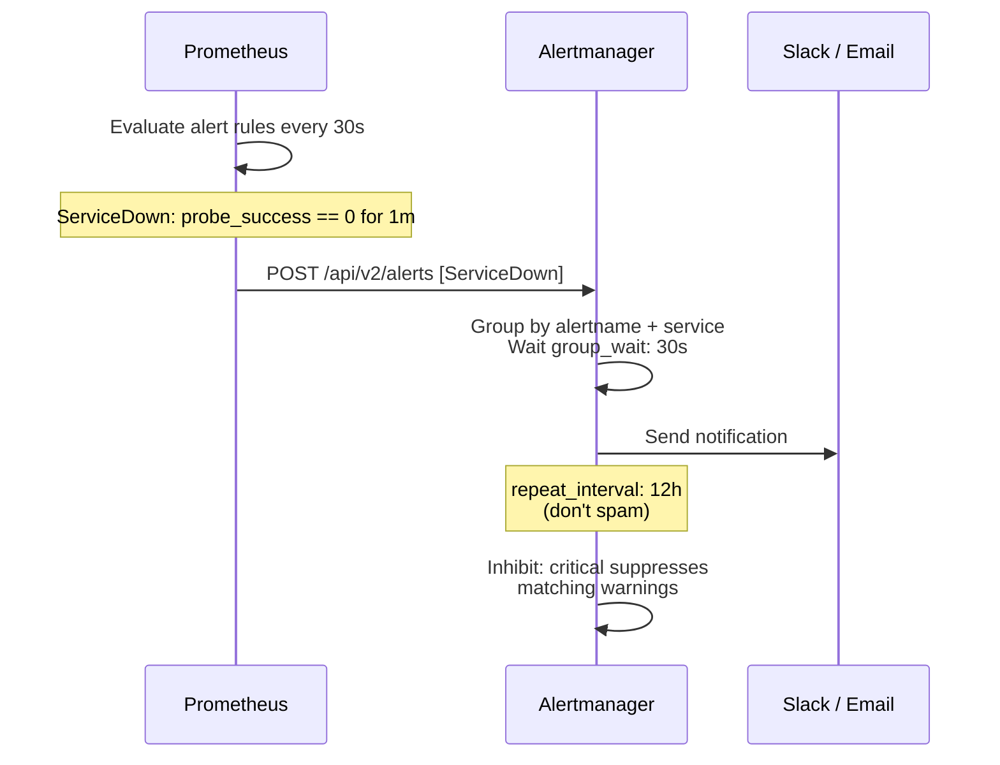
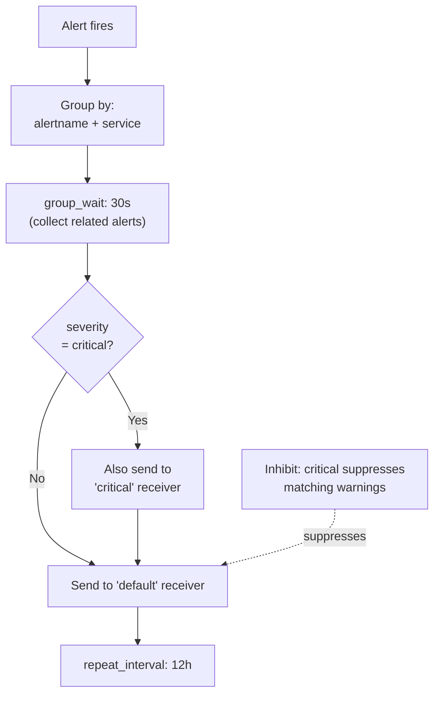

# Alerting


Alerting uses **Prometheus alert rules** to detect problems and **Alertmanager** to route notifications to Slack, email, or any webhook.

## Alert Flow



---

## Prometheus Alert Rules

Rules live in `monitoring/prometheus/alerts.yml`.

### Availability Alerts

| Alert | Expression | For | Severity |
|---|---|---|---|
| `ServiceDown` | `probe_success == 0` | 1m | critical |
| `SolrCoreDown` | `probe_success{job="solr_health"} == 0` | 1m | critical |
| `PostgresDown` | `pg_up == 0` | 30s | critical |
| `ConfigCockpitDown` | `probe_success{job="django_frontend_health"} == 0` | 1m | warning |

### Resource Alerts

| Alert | Expression | For | Severity |
|---|---|---|---|
| `ContainerHighMemory` | Container memory > 85% of limit | 5m | warning |
| `ContainerHighCPU` | Container CPU rate > 90% | 10m | warning |
| `DiskSpaceLow` | Root filesystem < 15% free | 5m | warning |

### Full Rules Reference


```yaml
groups:
  - name: dspace-cris-availability
    interval: 30s
    rules:
      - alert: ServiceDown
        expr: probe_success == 0
        for: 1m
        labels:
          severity: critical
        annotations:
          summary: "{{ $labels.instance }} is DOWN"
          description: "Health probe failing for more than 1 minute."

      - alert: ConfigCockpitDown
        expr: probe_success{job="django_frontend_health"} == 0
        for: 1m
        labels:
          severity: warning
        annotations:
          summary: "Config Cockpit (:5174) is not responding"
          description: "The django-frontend admin SPA has been unreachable for more than 1 minute."

      - alert: SolrCoreDown
        expr: probe_success{job="solr_health"} == 0
        for: 1m
        labels:
          severity: critical
        annotations:
          summary: "Solr core {{ $labels.instance }} is not responding"

      - alert: PostgresDown
        expr: pg_up == 0
        for: 30s
        labels:
          severity: critical
        annotations:
          summary: "PostgreSQL is unreachable"

  - name: dspace-cris-resources
    rules:
      - alert: ContainerHighMemory
        expr: |
          (container_memory_usage_bytes{name=~"dspace|django|django-frontend|dspacesolr"}
           / container_spec_memory_limit_bytes{name=~"dspace|django|django-frontend|dspacesolr"}) > 0.85
        for: 5m
        labels:
          severity: warning
        annotations:
          summary: "Container {{ $labels.name }} memory > 85%"

      - alert: ContainerHighCPU
        expr: |
          rate(container_cpu_usage_seconds_total
               {name=~"dspace|django|django-frontend|dspacesolr"}[5m]) > 0.9
        for: 10m
        labels:
          severity: warning
        annotations:
          summary: "Container {{ $labels.name }} CPU > 90% for 10 min"

      - alert: DiskSpaceLow
        expr: |
          (node_filesystem_avail_bytes{mountpoint="/"}
           / node_filesystem_size_bytes{mountpoint="/"}) < 0.15
        for: 5m
        labels:
          severity: warning
        annotations:
          summary: "Disk space below 15% on /"
```


---

## Alertmanager Configuration

The routing config lives in `monitoring/alertmanager/alertmanager.yml`.

### Routing Logic



### Adding Slack Notifications

Edit `monitoring/alertmanager/alertmanager.yml`:


```yaml
receivers:
  - name: 'critical'
    slack_configs:
      - api_url: 'https://hooks.slack.com/services/YOUR/SLACK/WEBHOOK'
        channel: '#ops-alerts'
        title: '🔴 CRITICAL: {{ .CommonAnnotations.summary }}'
        text: '{{ range .Alerts }}{{ .Annotations.description }}{{ end }}'
        send_resolved: true

  - name: 'default'
    slack_configs:
      - api_url: 'https://hooks.slack.com/services/YOUR/SLACK/WEBHOOK'
        channel: '#ops-warnings'
        title: '⚠️ {{ .CommonAnnotations.summary }}'
        send_resolved: true
```


### Adding Email Notifications

```yaml
receivers:
  - name: 'default'
    email_configs:
      - to: 'ops@yourorg.com'
        from: 'alerts@yourorg.com'
        smarthost: 'smtp.yourorg.com:587'
        auth_username: 'alerts@yourorg.com'
        auth_password: 'yourpassword'
        require_tls: true
        send_resolved: true
```

### Adding a Generic Webhook

```yaml
receivers:
  - name: 'default'
    webhook_configs:
      - url: 'http://your-webhook-endpoint/alerts'
        send_resolved: true
```

After editing, restart Alertmanager:

```bash
docker compose -f docker-compose_2024-monitoring.yml restart alertmanager
```

---

## Testing Alerts

### Manually fire a test alert

```bash
# POST a test alert directly to Alertmanager
curl -X POST http://localhost:9093/api/v2/alerts \
  -H 'Content-Type: application/json' \
  -d '[{
    "labels": {
      "alertname": "TestAlert",
      "severity": "warning",
      "service": "dspace"
    },
    "annotations": {
      "summary": "This is a test alert"
    },
    "startsAt": "'$(date -u +%Y-%m-%dT%H:%M:%SZ)'"
  }]'
```

### Check Alertmanager status

```bash
# View current alerts
curl http://localhost:9093/api/v2/alerts | jq

# View silences
curl http://localhost:9093/api/v2/silences | jq

# View receivers
curl http://localhost:9093/api/v2/receivers | jq
```

### Check Prometheus rule state

Open **Prometheus UI → Alerts** (`http://localhost:9090/alerts`) to see the current state of all alert rules.

---

## Silencing Alerts (Planned Maintenance)

Use the Alertmanager UI (`http://localhost:9093`) to create a silence during planned maintenance:

<ol class="steps">
<li><div>Open Alertmanager → <strong>Silences → New Silence</strong></div></li>
<li><div>Set the matchers — e.g. <code>service="dspace"</code> to silence all DSpace alerts</div></li>
<li><div>Set the start and end time for the maintenance window</div></li>
<li><div>Add a comment (e.g. "DSpace upgrade — 2024-04-15 02:00-04:00 UTC")</div></li>
<li><div>Click <strong>Create</strong> — no alerts will fire during this window</div></li>
</ol>

Or via the API:

```bash
curl -X POST http://localhost:9093/api/v2/silences \
  -H 'Content-Type: application/json' \
  -d '{
    "matchers": [{"name": "service", "value": "dspace", "isRegex": false}],
    "startsAt": "2024-04-15T02:00:00Z",
    "endsAt": "2024-04-15T04:00:00Z",
    "createdBy": "ops-team",
    "comment": "DSpace upgrade maintenance window"
  }'
```

---

## Inhibition Rules

Critical alerts suppress matching warnings to reduce noise:

```yaml
inhibit_rules:
  - source_match:
      severity: critical
    target_match:
      severity: warning
    equal: ['alertname', 'service']
```

When `ServiceDown` (critical) fires for a service, `ContainerHighMemory` (warning) for the same service is suppressed — the service is already down, so resource warnings are irrelevant.

<div class="page-nav">
  <a href="{{ '/ops/monitoring/' | relative_url }}">← Monitoring</a>
  <a href="{{ '/ops/database-logging/' | relative_url }}">Database Change Logging →</a>
</div>
