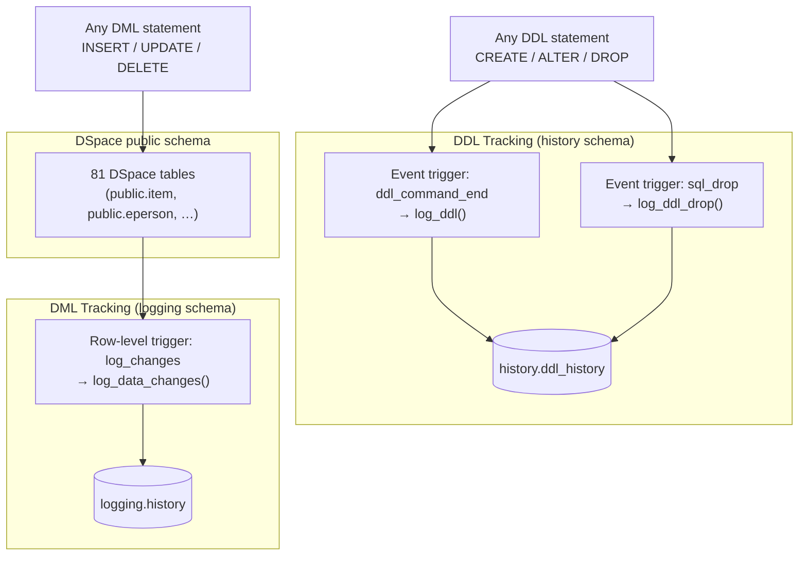

# Database Change Logging


The DSpace production database `dspace` uses two complementary logging schemas to track all structural and data changes over time — `history` for DDL (schema changes) and `logging` for DML (row-level data changes). Together they provide a full audit trail for compliance, debugging, and rollback analysis.

<div class="callout callout-info">
<span class="callout-title">Production database context</span>
This setup targets the existing production database <code>dspace</code> on tablespace <code>dspace</code>, owned by the <code>dspace</code> role. The local development stack uses a plain <code>dspace</code> database without this logging infrastructure.
</div>

---

## Overview



| Schema | Tracks | Trigger type | Table |
|---|---|---|---|
| `history` | DDL changes — CREATE, ALTER, DROP | Event trigger (database-level) | `history.ddl_history` |
| `logging` | DML changes — INSERT, UPDATE, DELETE | Row trigger (per-table) | `logging.history` |

---

## Part 1 — DDL Tracking (`history` schema)

### Setup

```sql
-- 1. Create the schema
CREATE SCHEMA history
  AUTHORIZATION dspace;

-- 2. Create the audit table
CREATE TABLE history.ddl_history
(
  id        serial PRIMARY KEY,
  ddl_date  timestamptz,
  ddl_tag   text,
  object_name text
)
TABLESPACE dspace;

ALTER TABLE history.ddl_history
  OWNER TO dspace;
```

### Functions

Two functions are needed because PostgreSQL event triggers fire on different events. `log_ddl` captures everything except DROP; `log_ddl_drop` specifically captures DROP TABLE using the `pg_event_trigger_ddl_commands()` function, which is available on both `ddl_command_end` and `sql_drop` events.

```sql
-- Handles CREATE / ALTER and all non-DROP DDL
CREATE OR REPLACE FUNCTION public.log_ddl()
  RETURNS event_trigger AS $$
DECLARE
  r RECORD;
BEGIN
  IF tg_tag <> 'DROP TABLE' THEN
    FOR r IN SELECT * FROM pg_event_trigger_ddl_commands()
    LOOP
      INSERT INTO history.ddl_history (ddl_date, ddl_tag, object_name)
      VALUES (statement_timestamp(), tg_tag, r.object_identity);
    END LOOP;
  END IF;
END;
$$ LANGUAGE plpgsql;

-- Handles DROP TABLE specifically
CREATE OR REPLACE FUNCTION public.log_ddl_drop()
  RETURNS event_trigger AS $$
DECLARE
  r RECORD;
BEGIN
  IF tg_tag = 'DROP TABLE' THEN
    FOR r IN SELECT * FROM pg_event_trigger_ddl_commands()
    LOOP
      INSERT INTO history.ddl_history (ddl_date, ddl_tag, object_name)
      VALUES (statement_timestamp(), tg_tag, r.object_identity);
    END LOOP;
  END IF;
END;
$$ LANGUAGE plpgsql;
```

### Event Triggers

Event triggers are database-level (not schema- or table-level) and fire on every DDL statement regardless of which schema is affected.

```sql
CREATE EVENT TRIGGER log_ddl_info
  ON ddl_command_end
  EXECUTE PROCEDURE public.log_ddl();

CREATE EVENT TRIGGER log_ddl_drop_info
  ON sql_drop
  EXECUTE PROCEDURE public.log_ddl_drop();
```

<div class="callout callout-warn">
<span class="callout-title">Event triggers require superuser</span>
Creating event triggers requires <code>SUPERUSER</code> privilege. The <code>dspace</code> role must be superuser or the event triggers must be created by a superuser and ownership transferred. See the <a href="https://www.postgresql.org/docs/current/sql-createeventtrigger.html" target="_blank">PostgreSQL event trigger docs</a> for details.
</div>

### Querying DDL History

```sql
-- All DDL changes in the last 7 days
SELECT ddl_date, ddl_tag, object_name
FROM history.ddl_history
WHERE ddl_date > now() - interval '7 days'
ORDER BY ddl_date DESC;

-- Only table-level changes
SELECT ddl_date, ddl_tag, object_name
FROM history.ddl_history
WHERE object_name LIKE 'public.%'
ORDER BY ddl_date DESC;

-- Changes on a specific object
SELECT ddl_date, ddl_tag
FROM history.ddl_history
WHERE object_name = 'public.item'
ORDER BY ddl_date;

-- Count of DDL operations by type
SELECT ddl_tag, count(*) AS operations
FROM history.ddl_history
GROUP BY ddl_tag
ORDER BY operations DESC;
```

---

## Part 2 — DML Tracking (`logging` schema)

### Setup

```sql
-- 1. Create the schema
CREATE SCHEMA logging
  AUTHORIZATION dspace;

-- 2. Create the history table
CREATE TABLE logging.history
(
  id         serial,
  tstamp     timestamp DEFAULT now(),
  schemaname text,
  tabname    text,
  operation  text,
  who        text DEFAULT current_user,
  new_val    json,
  old_val    json
);
```

### Trigger Function

The function uses `SECURITY DEFINER` so it runs with the privileges of the function owner (typically `dspace`) rather than the calling user, ensuring it can always write to `logging.history` regardless of who triggers the DML.

```sql
CREATE OR REPLACE FUNCTION public.log_data_changes()
RETURNS trigger AS $$
BEGIN
  IF TG_OP = 'INSERT' THEN
    INSERT INTO logging.history (tabname, schemaname, operation, new_val)
    VALUES (TG_RELNAME, TG_TABLE_SCHEMA, TG_OP, row_to_json(NEW));
    RETURN NEW;
  ELSIF TG_OP = 'UPDATE' THEN
    INSERT INTO logging.history (tabname, schemaname, operation, new_val, old_val)
    VALUES (TG_RELNAME, TG_TABLE_SCHEMA, TG_OP, row_to_json(NEW), row_to_json(OLD));
    RETURN NEW;
  ELSIF TG_OP = 'DELETE' THEN
    INSERT INTO logging.history (tabname, schemaname, operation, old_val)
    VALUES (TG_RELNAME, TG_TABLE_SCHEMA, TG_OP, row_to_json(OLD));
    RETURN OLD;
  END IF;
END;
$$ LANGUAGE plpgsql SECURITY DEFINER;
```

### Attaching Triggers to Tables

Triggers must be attached to each table individually. A helper query generates all `CREATE TRIGGER` statements automatically:

```sql
-- Generate CREATE TRIGGER statements for all tables in public schema
SELECT
  'CREATE TRIGGER log_changes BEFORE INSERT OR UPDATE OR DELETE ON public.'
  || table_name
  || ' FOR EACH ROW EXECUTE PROCEDURE public.log_data_changes();'
FROM information_schema.tables
WHERE table_schema = 'public'
  AND table_type   = 'BASE TABLE'
ORDER BY table_name;
```

The production database has **81 tables** in the `public` schema with this trigger applied, covering the full DSpace CRIS data model:

<details>
<summary>View all 81 trigger statements</summary>

```sql
CREATE TRIGGER log_changes BEFORE INSERT OR UPDATE OR DELETE ON public.bitstream FOR EACH ROW EXECUTE PROCEDURE public.log_data_changes();
CREATE TRIGGER log_changes BEFORE INSERT OR UPDATE OR DELETE ON public.bitstreamformatregistry FOR EACH ROW EXECUTE PROCEDURE public.log_data_changes();
CREATE TRIGGER log_changes BEFORE INSERT OR UPDATE OR DELETE ON public.bkp_schema_version FOR EACH ROW EXECUTE PROCEDURE public.log_data_changes();
CREATE TRIGGER log_changes BEFORE INSERT OR UPDATE OR DELETE ON public.bundle FOR EACH ROW EXECUTE PROCEDURE public.log_data_changes();
CREATE TRIGGER log_changes BEFORE INSERT OR UPDATE OR DELETE ON public.bundle2bitstream FOR EACH ROW EXECUTE PROCEDURE public.log_data_changes();
CREATE TRIGGER log_changes BEFORE INSERT OR UPDATE OR DELETE ON public.checksum_history FOR EACH ROW EXECUTE PROCEDURE public.log_data_changes();
CREATE TRIGGER log_changes BEFORE INSERT OR UPDATE OR DELETE ON public.checksum_results FOR EACH ROW EXECUTE PROCEDURE public.log_data_changes();
CREATE TRIGGER log_changes BEFORE INSERT OR UPDATE OR DELETE ON public.collection FOR EACH ROW EXECUTE PROCEDURE public.log_data_changes();
CREATE TRIGGER log_changes BEFORE INSERT OR UPDATE OR DELETE ON public.collection2item FOR EACH ROW EXECUTE PROCEDURE public.log_data_changes();
CREATE TRIGGER log_changes BEFORE INSERT OR UPDATE OR DELETE ON public.community FOR EACH ROW EXECUTE PROCEDURE public.log_data_changes();
CREATE TRIGGER log_changes BEFORE INSERT OR UPDATE OR DELETE ON public.community2collection FOR EACH ROW EXECUTE PROCEDURE public.log_data_changes();
CREATE TRIGGER log_changes BEFORE INSERT OR UPDATE OR DELETE ON public.community2community FOR EACH ROW EXECUTE PROCEDURE public.log_data_changes();
CREATE TRIGGER log_changes BEFORE INSERT OR UPDATE OR DELETE ON public.cris_layout_box FOR EACH ROW EXECUTE PROCEDURE public.log_data_changes();
CREATE TRIGGER log_changes BEFORE INSERT OR UPDATE OR DELETE ON public.cris_layout_box2securitygroup FOR EACH ROW EXECUTE PROCEDURE public.log_data_changes();
CREATE TRIGGER log_changes BEFORE INSERT OR UPDATE OR DELETE ON public.cris_layout_box2securitymetadata FOR EACH ROW EXECUTE PROCEDURE public.log_data_changes();
CREATE TRIGGER log_changes BEFORE INSERT OR UPDATE OR DELETE ON public.cris_layout_cell FOR EACH ROW EXECUTE PROCEDURE public.log_data_changes();
CREATE TRIGGER log_changes BEFORE INSERT OR UPDATE OR DELETE ON public.cris_layout_field FOR EACH ROW EXECUTE PROCEDURE public.log_data_changes();
CREATE TRIGGER log_changes BEFORE INSERT OR UPDATE OR DELETE ON public.cris_layout_field2nested FOR EACH ROW EXECUTE PROCEDURE public.log_data_changes();
CREATE TRIGGER log_changes BEFORE INSERT OR UPDATE OR DELETE ON public.cris_layout_metric2box FOR EACH ROW EXECUTE PROCEDURE public.log_data_changes();
CREATE TRIGGER log_changes BEFORE INSERT OR UPDATE OR DELETE ON public.cris_layout_row FOR EACH ROW EXECUTE PROCEDURE public.log_data_changes();
CREATE TRIGGER log_changes BEFORE INSERT OR UPDATE OR DELETE ON public.cris_layout_tab FOR EACH ROW EXECUTE PROCEDURE public.log_data_changes();
CREATE TRIGGER log_changes BEFORE INSERT OR UPDATE OR DELETE ON public.cris_layout_tab2securitygroup FOR EACH ROW EXECUTE PROCEDURE public.log_data_changes();
CREATE TRIGGER log_changes BEFORE INSERT OR UPDATE OR DELETE ON public.cris_layout_tab2securitymetadata FOR EACH ROW EXECUTE PROCEDURE public.log_data_changes();
CREATE TRIGGER log_changes BEFORE INSERT OR UPDATE OR DELETE ON public.cris_metrics FOR EACH ROW EXECUTE PROCEDURE public.log_data_changes();
CREATE TRIGGER log_changes BEFORE INSERT OR UPDATE OR DELETE ON public.cwf_claimtask FOR EACH ROW EXECUTE PROCEDURE public.log_data_changes();
CREATE TRIGGER log_changes BEFORE INSERT OR UPDATE OR DELETE ON public.cwf_collectionrole FOR EACH ROW EXECUTE PROCEDURE public.log_data_changes();
CREATE TRIGGER log_changes BEFORE INSERT OR UPDATE OR DELETE ON public.cwf_in_progress_user FOR EACH ROW EXECUTE PROCEDURE public.log_data_changes();
CREATE TRIGGER log_changes BEFORE INSERT OR UPDATE OR DELETE ON public.cwf_pooltask FOR EACH ROW EXECUTE PROCEDURE public.log_data_changes();
CREATE TRIGGER log_changes BEFORE INSERT OR UPDATE OR DELETE ON public.cwf_workflowitem FOR EACH ROW EXECUTE PROCEDURE public.log_data_changes();
CREATE TRIGGER log_changes BEFORE INSERT OR UPDATE OR DELETE ON public.cwf_workflowitemrole FOR EACH ROW EXECUTE PROCEDURE public.log_data_changes();
CREATE TRIGGER log_changes BEFORE INSERT OR UPDATE OR DELETE ON public.deduplication FOR EACH ROW EXECUTE PROCEDURE public.log_data_changes();
CREATE TRIGGER log_changes BEFORE INSERT OR UPDATE OR DELETE ON public.doi FOR EACH ROW EXECUTE PROCEDURE public.log_data_changes();
CREATE TRIGGER log_changes BEFORE INSERT OR UPDATE OR DELETE ON public.dspaceobject FOR EACH ROW EXECUTE PROCEDURE public.log_data_changes();
CREATE TRIGGER log_changes BEFORE INSERT OR UPDATE OR DELETE ON public.entity_type FOR EACH ROW EXECUTE PROCEDURE public.log_data_changes();
CREATE TRIGGER log_changes BEFORE INSERT OR UPDATE OR DELETE ON public.eperson FOR EACH ROW EXECUTE PROCEDURE public.log_data_changes();
CREATE TRIGGER log_changes BEFORE INSERT OR UPDATE OR DELETE ON public.epersongroup FOR EACH ROW EXECUTE PROCEDURE public.log_data_changes();
CREATE TRIGGER log_changes BEFORE INSERT OR UPDATE OR DELETE ON public.epersongroup2eperson FOR EACH ROW EXECUTE PROCEDURE public.log_data_changes();
CREATE TRIGGER log_changes BEFORE INSERT OR UPDATE OR DELETE ON public.fileextension FOR EACH ROW EXECUTE PROCEDURE public.log_data_changes();
CREATE TRIGGER log_changes BEFORE INSERT OR UPDATE OR DELETE ON public.group2group FOR EACH ROW EXECUTE PROCEDURE public.log_data_changes();
CREATE TRIGGER log_changes BEFORE INSERT OR UPDATE OR DELETE ON public.group2groupcache FOR EACH ROW EXECUTE PROCEDURE public.log_data_changes();
CREATE TRIGGER log_changes BEFORE INSERT OR UPDATE OR DELETE ON public.handle FOR EACH ROW EXECUTE PROCEDURE public.log_data_changes();
CREATE TRIGGER log_changes BEFORE INSERT OR UPDATE OR DELETE ON public.harvested_collection FOR EACH ROW EXECUTE PROCEDURE public.log_data_changes();
CREATE TRIGGER log_changes BEFORE INSERT OR UPDATE OR DELETE ON public.harvested_item FOR EACH ROW EXECUTE PROCEDURE public.log_data_changes();
CREATE TRIGGER log_changes BEFORE INSERT OR UPDATE OR DELETE ON public.imp_bitstream FOR EACH ROW EXECUTE PROCEDURE public.log_data_changes();
CREATE TRIGGER log_changes BEFORE INSERT OR UPDATE OR DELETE ON public.imp_bitstream_metadatavalue FOR EACH ROW EXECUTE PROCEDURE public.log_data_changes();
CREATE TRIGGER log_changes BEFORE INSERT OR UPDATE OR DELETE ON public.imp_metadatavalue FOR EACH ROW EXECUTE PROCEDURE public.log_data_changes();
CREATE TRIGGER log_changes BEFORE INSERT OR UPDATE OR DELETE ON public.imp_record FOR EACH ROW EXECUTE PROCEDURE public.log_data_changes();
CREATE TRIGGER log_changes BEFORE INSERT OR UPDATE OR DELETE ON public.imp_record_wstate FOR EACH ROW EXECUTE PROCEDURE public.log_data_changes();
CREATE TRIGGER log_changes BEFORE INSERT OR UPDATE OR DELETE ON public.imp_workflow_nstate FOR EACH ROW EXECUTE PROCEDURE public.log_data_changes();
CREATE TRIGGER log_changes BEFORE INSERT OR UPDATE OR DELETE ON public.item FOR EACH ROW EXECUTE PROCEDURE public.log_data_changes();
CREATE TRIGGER log_changes BEFORE INSERT OR UPDATE OR DELETE ON public.item2bundle FOR EACH ROW EXECUTE PROCEDURE public.log_data_changes();
CREATE TRIGGER log_changes BEFORE INSERT OR UPDATE OR DELETE ON public.itemupdate_metadata_enhancement FOR EACH ROW EXECUTE PROCEDURE public.log_data_changes();
CREATE TRIGGER log_changes BEFORE INSERT OR UPDATE OR DELETE ON public.metadatafieldregistry FOR EACH ROW EXECUTE PROCEDURE public.log_data_changes();
CREATE TRIGGER log_changes BEFORE INSERT OR UPDATE OR DELETE ON public.metadataschemaregistry FOR EACH ROW EXECUTE PROCEDURE public.log_data_changes();
CREATE TRIGGER log_changes BEFORE INSERT OR UPDATE OR DELETE ON public.metadatavalue FOR EACH ROW EXECUTE PROCEDURE public.log_data_changes();
CREATE TRIGGER log_changes BEFORE INSERT OR UPDATE OR DELETE ON public.most_recent_checksum FOR EACH ROW EXECUTE PROCEDURE public.log_data_changes();
CREATE TRIGGER log_changes BEFORE INSERT OR UPDATE OR DELETE ON public.nbevent_processed FOR EACH ROW EXECUTE PROCEDURE public.log_data_changes();
CREATE TRIGGER log_changes BEFORE INSERT OR UPDATE OR DELETE ON public.openurltracker FOR EACH ROW EXECUTE PROCEDURE public.log_data_changes();
CREATE TRIGGER log_changes BEFORE INSERT OR UPDATE OR DELETE ON public.orcid_history FOR EACH ROW EXECUTE PROCEDURE public.log_data_changes();
CREATE TRIGGER log_changes BEFORE INSERT OR UPDATE OR DELETE ON public.orcid_queue FOR EACH ROW EXECUTE PROCEDURE public.log_data_changes();
CREATE TRIGGER log_changes BEFORE INSERT OR UPDATE OR DELETE ON public.orcid_token FOR EACH ROW EXECUTE PROCEDURE public.log_data_changes();
CREATE TRIGGER log_changes BEFORE INSERT OR UPDATE OR DELETE ON public.process FOR EACH ROW EXECUTE PROCEDURE public.log_data_changes();
CREATE TRIGGER log_changes BEFORE INSERT OR UPDATE OR DELETE ON public.process2bitstream FOR EACH ROW EXECUTE PROCEDURE public.log_data_changes();
CREATE TRIGGER log_changes BEFORE INSERT OR UPDATE OR DELETE ON public.process2group FOR EACH ROW EXECUTE PROCEDURE public.log_data_changes();
CREATE TRIGGER log_changes BEFORE INSERT OR UPDATE OR DELETE ON public.registrationdata FOR EACH ROW EXECUTE PROCEDURE public.log_data_changes();
CREATE TRIGGER log_changes BEFORE INSERT OR UPDATE OR DELETE ON public.registrationdata2group FOR EACH ROW EXECUTE PROCEDURE public.log_data_changes();
CREATE TRIGGER log_changes BEFORE INSERT OR UPDATE OR DELETE ON public.registrationdata_metadata FOR EACH ROW EXECUTE PROCEDURE public.log_data_changes();
CREATE TRIGGER log_changes BEFORE INSERT OR UPDATE OR DELETE ON public.relationship FOR EACH ROW EXECUTE PROCEDURE public.log_data_changes();
CREATE TRIGGER log_changes BEFORE INSERT OR UPDATE OR DELETE ON public.relationship_type FOR EACH ROW EXECUTE PROCEDURE public.log_data_changes();
CREATE TRIGGER log_changes BEFORE INSERT OR UPDATE OR DELETE ON public.requestitem FOR EACH ROW EXECUTE PROCEDURE public.log_data_changes();
CREATE TRIGGER log_changes BEFORE INSERT OR UPDATE OR DELETE ON public.resourcepolicy FOR EACH ROW EXECUTE PROCEDURE public.log_data_changes();
CREATE TRIGGER log_changes BEFORE INSERT OR UPDATE OR DELETE ON public.schema_version FOR EACH ROW EXECUTE PROCEDURE public.log_data_changes();
CREATE TRIGGER log_changes BEFORE INSERT OR UPDATE OR DELETE ON public.site FOR EACH ROW EXECUTE PROCEDURE public.log_data_changes();
CREATE TRIGGER log_changes BEFORE INSERT OR UPDATE OR DELETE ON public.subscription FOR EACH ROW EXECUTE PROCEDURE public.log_data_changes();
CREATE TRIGGER log_changes BEFORE INSERT OR UPDATE OR DELETE ON public.subscription_parameter FOR EACH ROW EXECUTE PROCEDURE public.log_data_changes();
CREATE TRIGGER log_changes BEFORE INSERT OR UPDATE OR DELETE ON public.supervision_orders FOR EACH ROW EXECUTE PROCEDURE public.log_data_changes();
CREATE TRIGGER log_changes BEFORE INSERT OR UPDATE OR DELETE ON public.systemwidealert FOR EACH ROW EXECUTE PROCEDURE public.log_data_changes();
CREATE TRIGGER log_changes BEFORE INSERT OR UPDATE OR DELETE ON public.versionhistory FOR EACH ROW EXECUTE PROCEDURE public.log_data_changes();
CREATE TRIGGER log_changes BEFORE INSERT OR UPDATE OR DELETE ON public.versionitem FOR EACH ROW EXECUTE PROCEDURE public.log_data_changes();
CREATE TRIGGER log_changes BEFORE INSERT OR UPDATE OR DELETE ON public.webapp FOR EACH ROW EXECUTE PROCEDURE public.log_data_changes();
CREATE TRIGGER log_changes BEFORE INSERT OR UPDATE OR DELETE ON public.workspaceitem FOR EACH ROW EXECUTE PROCEDURE public.log_data_changes();
```

</details>

### Querying DML History

```sql
-- All changes in the last 24 hours
SELECT tstamp, who, operation, tabname, new_val, old_val
FROM logging.history
WHERE tstamp > now() - interval '24 hours'
ORDER BY tstamp DESC;

-- All changes to a specific table
SELECT tstamp, who, operation, new_val, old_val
FROM logging.history
WHERE tabname = 'item'
ORDER BY tstamp DESC
LIMIT 100;

-- All changes by a specific user
SELECT tstamp, operation, tabname, new_val
FROM logging.history
WHERE who = 'dspace'
  AND tstamp > now() - interval '7 days'
ORDER BY tstamp DESC;

-- DELETE operations only (useful for investigating missing records)
SELECT tstamp, who, tabname, old_val
FROM logging.history
WHERE operation = 'DELETE'
ORDER BY tstamp DESC
LIMIT 50;

-- Reconstruct what a specific item looked like before an update
-- (replace <uuid> with the item's UUID)
SELECT tstamp, operation, old_val
FROM logging.history
WHERE tabname = 'item'
  AND (new_val->>'uuid' = '<uuid>' OR old_val->>'uuid' = '<uuid>')
ORDER BY tstamp;

-- Volume of changes per table (last 30 days)
SELECT tabname, operation, count(*) AS changes
FROM logging.history
WHERE tstamp > now() - interval '30 days'
GROUP BY tabname, operation
ORDER BY changes DESC;
```

### Verifying Installed Triggers

```sql
-- Show all row-level triggers across all tables
SELECT
  event_object_schema  AS table_schema,
  event_object_table   AS table_name,
  trigger_name,
  string_agg(event_manipulation, ', ') AS events,
  action_timing        AS timing,
  action_statement     AS function
FROM information_schema.triggers
GROUP BY 1, 2, 3, 5, 6
ORDER BY table_schema, table_name;

-- Count of tables with the log_changes trigger
SELECT count(DISTINCT event_object_table)
FROM information_schema.triggers
WHERE trigger_name = 'log_changes'
  AND event_object_schema = 'public';
```

---

## Maintenance & Housekeeping

The `logging.history` table grows continuously. Without a retention policy it will eventually consume significant disk space, particularly on busy systems where `metadatavalue` and `item` tables change frequently.

### Partition by month (recommended for high-volume systems)

Convert `logging.history` to a partitioned table so old partitions can be dropped cheaply without a full table scan:

```sql
-- Example: partition logging.history by month
-- This requires recreating the table — plan a maintenance window.
-- After conversion, drop individual month partitions to reclaim space:
DROP TABLE logging.history_2023_01;   -- example
```

See the [PostgreSQL table partitioning docs](https://www.postgresql.org/docs/current/ddl-partitioning.html) for the full conversion procedure.

### Simple time-based purge

If partitioning is not feasible, add a scheduled `DELETE` to purge old rows. Run this from a cron job or a pgAgent scheduled task:

```sql
-- Keep last 90 days, delete everything older
DELETE FROM logging.history
WHERE tstamp < now() - interval '90 days';

-- Reclaim disk space after a large delete
VACUUM ANALYZE logging.history;
```

### Monitoring table size

```sql
-- Size of both logging tables
SELECT
  schemaname,
  tablename,
  pg_size_pretty(pg_total_relation_size(schemaname || '.' || tablename)) AS total_size,
  pg_size_pretty(pg_relation_size(schemaname || '.' || tablename))       AS table_size,
  pg_size_pretty(
    pg_total_relation_size(schemaname || '.' || tablename)
    - pg_relation_size(schemaname || '.' || tablename)
  ) AS index_size
FROM pg_tables
WHERE schemaname IN ('history', 'logging')
ORDER BY pg_total_relation_size(schemaname || '.' || tablename) DESC;
```

---

## Performance Considerations

<div class="callout callout-warn">
<span class="callout-title">Row-level triggers add write overhead</span>
Each INSERT/UPDATE/DELETE on any of the 81 logged tables incurs an additional insert into <code>logging.history</code>. On high-throughput operations (bulk imports, Solr reindexing, metadata migrations) this can roughly double write time. Consider disabling triggers temporarily for known bulk operations:
</div>

```sql
-- Disable triggers for a bulk import session (session-level, not permanent)
SET session_replication_role = replica;

-- ... run bulk operations ...

-- Re-enable
SET session_replication_role = DEFAULT;
```

Setting `session_replication_role = replica` suppresses all row triggers for the current session without dropping them. This is the recommended approach for bulk imports. See the [PostgreSQL replication role docs](https://www.postgresql.org/docs/current/runtime-config-client.html#GUC-SESSION-REPLICATION-ROLE) for details.

---

## Reference

| Resource | Link |
|---|---|
| PostgreSQL event triggers | [postgresql.org/docs/current/event-triggers](https://www.postgresql.org/docs/current/event-triggers.html) |
| `pg_event_trigger_ddl_commands()` | [postgresql.org/docs/current/functions-event-triggers](https://www.postgresql.org/docs/current/functions-event-triggers.html) |
| `CREATE EVENT TRIGGER` | [postgresql.org/docs/current/sql-createeventtrigger](https://www.postgresql.org/docs/current/sql-createeventtrigger.html) |
| Row-level triggers | [postgresql.org/docs/current/trigger-definition](https://www.postgresql.org/docs/current/trigger-definition.html) |
| `SECURITY DEFINER` functions | [postgresql.org/docs/current/sql-createfunction](https://www.postgresql.org/docs/current/sql-createfunction.html#SQL-CREATEFUNCTION-SECURITY) |
| Table partitioning | [postgresql.org/docs/current/ddl-partitioning](https://www.postgresql.org/docs/current/ddl-partitioning.html) |
| `session_replication_role` | [postgresql.org/docs/current/runtime-config-client](https://www.postgresql.org/docs/current/runtime-config-client.html#GUC-SESSION-REPLICATION-ROLE) |

<div class="page-nav">
  <a href="{{ '/ops/alerting/' | relative_url }}">← Alerting</a>
  <a href="{{ '/ops/database-export-views/' | relative_url }}">Database Export Views →</a>
</div>
