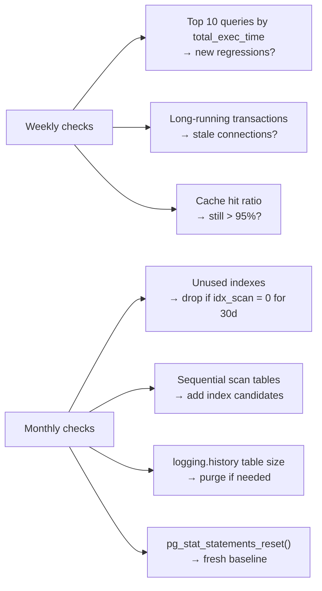

# Database Performance


PostgreSQL's `pg_stat_statements` extension tracks execution statistics for every distinct query the server runs. It is the primary tool for identifying slow queries, high-frequency queries, and overall database load in the DSpace CRIS production environment.

---

## Setup

### Enable the extension

`pg_stat_statements` must be added to `shared_preload_libraries` and then created in the target database. On a managed PostgreSQL instance this is typically pre-enabled; on a self-hosted instance it requires a configuration change and restart.

```sql
-- In postgresql.conf (requires server restart):
-- shared_preload_libraries = 'pg_stat_statements'
-- pg_stat_statements.track = all       -- track all statements including nested
-- pg_stat_statements.max = 10000       -- max number of distinct statements tracked

-- Then in the target database:
CREATE EXTENSION IF NOT EXISTS pg_stat_statements;
```

<div class="callout callout-info">
<span class="callout-title">Docker Compose setup</span>
To enable <code>pg_stat_statements</code> in the local stack, add a custom PostgreSQL config to the <code>dspacedb</code> service. Create a <code>postgresql.conf</code> file with <code>shared_preload_libraries = 'pg_stat_statements'</code> and mount it into the container, then run <code>CREATE EXTENSION IF NOT EXISTS pg_stat_statements;</code> in the <code>dspace</code> database after first start.
</div>

### Find the database OID

`pg_stat_statements` stores a `dbid` column (database OID). To filter by database, look up the OID first:

```sql
SELECT oid AS database_id, datname AS database_name
FROM pg_database
ORDER BY oid;
```

For `dspace` this is `279926`. Use this value in the `WHERE dbid = ...` filter in the queries below.

---

## Core Queries

### Top queries by total execution time

The most important starting point — finds queries that collectively spend the most time running, regardless of how often they run.

```sql
SELECT
  round((total_exec_time / 1000 / 60)::numeric, 2) AS total_min,
  round(mean_exec_time::numeric, 2)                 AS avg_ms,
  calls,
  round((stddev_exec_time)::numeric, 2)             AS stddev_ms,
  query
FROM pg_stat_statements
WHERE dbid = 279926
ORDER BY total_exec_time DESC
LIMIT 25;
```

### Top queries by average execution time (slowest individual queries)

Finds the queries with the highest average execution time — good for catching expensive queries that run infrequently.

```sql
SELECT
  round(mean_exec_time::numeric, 2)  AS avg_ms,
  round(max_exec_time::numeric, 2)   AS max_ms,
  calls,
  round((total_exec_time / 1000)::numeric, 2) AS total_sec,
  query
FROM pg_stat_statements
WHERE dbid = 279926
  AND calls > 10        -- exclude one-offs
ORDER BY mean_exec_time DESC
LIMIT 25;
```

### Top queries by call frequency (most-called)

Finds queries that run most often — candidates for caching or result set reduction.

```sql
SELECT
  calls,
  round(mean_exec_time::numeric, 2) AS avg_ms,
  round((total_exec_time / 1000)::numeric, 2) AS total_sec,
  query
FROM pg_stat_statements
WHERE dbid = 279926
ORDER BY calls DESC
LIMIT 25;
```

### Queries with high I/O (shared buffer misses)

High `shared_blks_read` relative to `shared_blks_hit` indicates queries doing a lot of disk reads — candidates for index creation or memory tuning.

```sql
SELECT
  calls,
  shared_blks_hit,
  shared_blks_read,
  round(
    (shared_blks_read::numeric / nullif(shared_blks_hit + shared_blks_read, 0)) * 100,
    1
  ) AS cache_miss_pct,
  round(mean_exec_time::numeric, 2) AS avg_ms,
  query
FROM pg_stat_statements
WHERE dbid = 279926
  AND (shared_blks_hit + shared_blks_read) > 0
ORDER BY cache_miss_pct DESC, calls DESC
LIMIT 25;
```

### Queries causing the most temporary file usage

Temp files are written when sort or hash operations exceed `work_mem`. High temp file usage means `work_mem` may need increasing for these query patterns.

```sql
SELECT
  calls,
  temp_blks_written,
  round(mean_exec_time::numeric, 2) AS avg_ms,
  query
FROM pg_stat_statements
WHERE dbid = 279926
  AND temp_blks_written > 0
ORDER BY temp_blks_written DESC
LIMIT 20;
```

---

## DSpace-Specific Queries to Watch

DSpace CRIS is metadata-heavy. These are the tables and query patterns most likely to appear at the top of `pg_stat_statements`:

| Table | Typical hotspot | Why |
|---|---|---|
| `metadatavalue` | SELECT with `text_value` filter | Full-text metadata searches, Discovery indexing |
| `item` | SELECT with `in_archive` / `discoverable` | Item lookup, workspace queries |
| `resourcepolicy` | SELECT joining `dspaceobject` | Access control checks on every REST request |
| `handle` | SELECT by `handle` value | Handle resolution on every item page load |
| `epersongroup2eperson` | SELECT joining `epersongroup` | Group membership checks during auth |
| `collection2item` | SELECT by `collection_id` | Collection browse / item count queries |
| `relationship` | SELECT by `left_id` / `right_id` | CRIS relationship resolution |

### Find slow metadatavalue queries

```sql
SELECT
  round(mean_exec_time::numeric, 2) AS avg_ms,
  calls,
  query
FROM pg_stat_statements
WHERE dbid = 279926
  AND query ILIKE '%metadatavalue%'
ORDER BY mean_exec_time DESC
LIMIT 10;
```

### Find queries without index support (seq scans in EXPLAIN)

`pg_stat_statements` doesn't show EXPLAIN plans directly, but you can use `pg_stat_user_tables` to identify tables with high sequential scan counts:

```sql
SELECT
  schemaname,
  relname              AS table_name,
  seq_scan,
  seq_tup_read,
  idx_scan,
  idx_tup_fetch,
  round(
    seq_scan::numeric / nullif(seq_scan + idx_scan, 0) * 100,
    1
  ) AS seq_scan_pct
FROM pg_stat_user_tables
WHERE schemaname = 'public'
ORDER BY seq_scan DESC
LIMIT 20;
```

Tables with `seq_scan_pct` above 80% and high `seq_tup_read` are candidates for index review.

---

## Active Query Monitoring

### See currently running queries

```sql
SELECT
  pid,
  now() - pg_stat_activity.query_start AS duration,
  query,
  state,
  wait_event_type,
  wait_event
FROM pg_stat_activity
WHERE state != 'idle'
  AND query_start < now() - interval '5 seconds'
ORDER BY duration DESC;
```

### Find long-running transactions (potential lock holders)

```sql
SELECT
  pid,
  now() - xact_start AS transaction_age,
  now() - query_start AS query_age,
  state,
  query
FROM pg_stat_activity
WHERE xact_start IS NOT NULL
  AND now() - xact_start > interval '5 minutes'
ORDER BY transaction_age DESC;
```

### Detect lock waits

```sql
SELECT
  blocked.pid        AS blocked_pid,
  blocked.query      AS blocked_query,
  blocking.pid       AS blocking_pid,
  blocking.query     AS blocking_query,
  now() - blocked.query_start AS wait_duration
FROM pg_stat_activity AS blocked
JOIN pg_stat_activity AS blocking
  ON blocking.pid = ANY(pg_blocking_pids(blocked.pid))
WHERE cardinality(pg_blocking_pids(blocked.pid)) > 0;
```

### Connection counts by state

```sql
SELECT
  state,
  count(*) AS connections
FROM pg_stat_activity
WHERE datname = 'dspace'
GROUP BY state
ORDER BY connections DESC;
```

---

## Cache Hit Ratio

A healthy PostgreSQL instance should have a buffer cache hit ratio above 95%. Below 90% typically means the `shared_buffers` setting is too low for the working dataset.

```sql
-- Overall cache hit ratio for the database
SELECT
  sum(heap_blks_read)  AS heap_read,
  sum(heap_blks_hit)   AS heap_hit,
  round(
    sum(heap_blks_hit)::numeric
    / nullif(sum(heap_blks_hit) + sum(heap_blks_read), 0) * 100,
    2
  ) AS cache_hit_pct
FROM pg_statio_user_tables
WHERE schemaname = 'public';

-- Per-table cache hit ratio (worst performers first)
SELECT
  relname AS table_name,
  heap_blks_hit,
  heap_blks_read,
  round(
    heap_blks_hit::numeric / nullif(heap_blks_hit + heap_blks_read, 0) * 100,
    1
  ) AS cache_hit_pct
FROM pg_statio_user_tables
WHERE schemaname = 'public'
  AND (heap_blks_hit + heap_blks_read) > 0
ORDER BY cache_hit_pct ASC
LIMIT 20;
```

---

## Index Usage

### Unused indexes (candidates for removal)

Unused indexes consume disk space and slow down writes without helping reads:

```sql
SELECT
  schemaname,
  relname      AS table_name,
  indexrelname AS index_name,
  idx_scan     AS times_used,
  pg_size_pretty(pg_relation_size(indexrelid)) AS index_size
FROM pg_stat_user_indexes
WHERE schemaname = 'public'
  AND idx_scan = 0
ORDER BY pg_relation_size(indexrelid) DESC;
```

### Most-used indexes

```sql
SELECT
  relname      AS table_name,
  indexrelname AS index_name,
  idx_scan     AS times_used,
  idx_tup_read,
  idx_tup_fetch
FROM pg_stat_user_indexes
WHERE schemaname = 'public'
ORDER BY idx_scan DESC
LIMIT 20;
```

### Missing indexes (tables with many sequential scans but few index scans)

```sql
SELECT
  relname AS table_name,
  seq_scan,
  idx_scan,
  n_live_tup AS row_count,
  pg_size_pretty(pg_total_relation_size('public.' || relname)) AS size
FROM pg_stat_user_tables
WHERE schemaname = 'public'
  AND seq_scan > idx_scan
  AND n_live_tup > 10000
ORDER BY seq_scan DESC
LIMIT 20;
```

---

## Resetting Statistics

Statistics accumulate from the last reset. Reset them after a major configuration change or after a bulk operation to get a clean baseline:

```sql
-- Reset pg_stat_statements (query statistics)
SELECT pg_stat_statements_reset();

-- Reset pg_stat_user_tables / pg_stat_user_indexes (table and index stats)
SELECT pg_stat_reset();
```

<div class="callout callout-warn">
<span class="callout-title">Reset loses all historical data</span>
<code>pg_stat_statements_reset()</code> deletes all accumulated query statistics. Only reset when starting a fresh measurement period — for example, after applying new indexes or changing <code>work_mem</code>.
</div>

---

## Routine Performance Checks

For production monitoring, run these checks on a weekly or monthly schedule:



---

## Reference

| Resource | Link |
|---|---|
| `pg_stat_statements` docs | [postgresql.org/docs/current/pgstatstatements](https://www.postgresql.org/docs/current/pgstatstatements.html) |
| `pg_stat_activity` docs | [postgresql.org/docs/current/monitoring-stats](https://www.postgresql.org/docs/current/monitoring-stats.html#MONITORING-PG-STAT-ACTIVITY-VIEW) |
| `pg_stat_user_tables` docs | [postgresql.org/docs/current/monitoring-stats](https://www.postgresql.org/docs/current/monitoring-stats.html#MONITORING-PG-STAT-ALL-TABLES-VIEW) |
| `pg_statio_user_tables` docs | [postgresql.org/docs/current/monitoring-stats](https://www.postgresql.org/docs/current/monitoring-stats.html#MONITORING-PG-STATIO-ALL-TABLES-VIEW) |
| Lock monitoring | [postgresql.org/docs/current/view-pg-locks](https://www.postgresql.org/docs/current/view-pg-locks.html) |
| Index maintenance | [postgresql.org/docs/current/routine-reindex](https://www.postgresql.org/docs/current/routine-reindex.html) |
| Tuning `shared_buffers` | [postgresql.org/docs/current/runtime-config-resource](https://www.postgresql.org/docs/current/runtime-config-resource.html#GUC-SHARED-BUFFERS) |
| `EXPLAIN ANALYZE` | [postgresql.org/docs/current/sql-explain](https://www.postgresql.org/docs/current/sql-explain.html) |
| pgBadger log analyzer | [github.com/darold/pgbadger](https://github.com/darold/pgbadger) |
| auto_explain extension | [postgresql.org/docs/current/auto-explain](https://www.postgresql.org/docs/current/auto-explain.html) |

<div class="page-nav">
  <a href="{{ '/ops/database-export-views/' | relative_url }}">← Database Export Views</a>
  <a href="{{ '/ops/solr-queries/' | relative_url }}">Solr Query Reference →</a>
</div>
