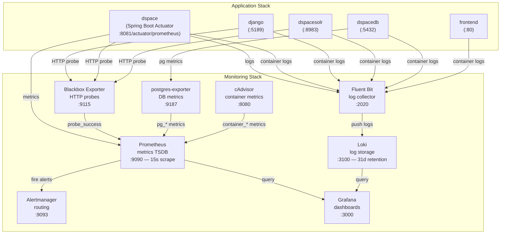

# Monitoring Stack — docker-compose_2024-monitoring.yml


The monitoring stack adds observability to the core application stack with metrics, logs, and alerting — all pre-wired together.

## Architecture



## Quick Start

```bash
# 1. Generate all companion config files
chmod +x init-monitoring-configs.sh
./init-monitoring-configs.sh

# 2. Start monitoring stack (alongside or instead of base stack)
docker compose -f docker-compose_2024-monitoring.yml up -d --build

# 3. Open Grafana
open http://localhost:3000   # admin / admin
```

<div class="callout callout-success">
<span class="callout-title">Verify immediately</span>
In Grafana, go to <strong>Explore → Loki</strong> and query <code>{service="dspace"}</code> to see DSpace logs. Go to <strong>Explore → Prometheus</strong> and query <code>probe_success</code> to see health check results for all services.
</div>

---

## Monitoring Services

<div class="service-grid">
  <div class="service-card">
    <h4>Grafana</h4>
    <p>Dashboards, log exploration, metric queries. Pre-wired to Prometheus + Loki.</p>
    <span class="port">:3000</span>
  </div>
  <div class="service-card">
    <h4>Prometheus</h4>
    <p>Time-series metrics database. Scrapes all services every 15s.</p>
    <span class="port">:9090</span>
  </div>
  <div class="service-card">
    <h4>Loki</h4>
    <p>Log aggregation. 31-day retention. Receives logs from Fluent Bit.</p>
    <span class="port">:3100</span>
  </div>
  <div class="service-card">
    <h4>Fluent Bit</h4>
    <p>Collects Docker container logs and ships them to Loki.</p>
    <span class="port">:2020</span>
  </div>
  <div class="service-card">
    <h4>Blackbox Exporter</h4>
    <p>HTTP probes — reports <code>probe_success</code> for all health endpoints.</p>
    <span class="port">:9115</span>
  </div>
  <div class="service-card">
    <h4>postgres-exporter</h4>
    <p>PostgreSQL metrics — connections, query times, replication lag.</p>
    <span class="port">:9187</span>
  </div>
  <div class="service-card">
    <h4>cAdvisor</h4>
    <p>Per-container CPU, memory, network, and disk usage.</p>
    <span class="port">:8080</span>
  </div>
  <div class="service-card">
    <h4>Alertmanager</h4>
    <p>Alert routing and deduplication. Forwards to Slack/email/webhook.</p>
    <span class="port">:9093</span>
  </div>
</div>

---

## Config Files (generated by init-monitoring-configs.sh)

```bash
./init-monitoring-configs.sh
```

Creates the following structure:

```
monitoring/
├── fluent-bit/
│   ├── fluent-bit.conf      # Docker log collector config
│   └── parsers.conf         # JSON + syslog parsers
├── loki/
│   └── loki.yml             # Log storage (31d retention, TSDB schema v13)
├── prometheus/
│   ├── prometheus.yml       # Scrape configs for all services
│   └── alerts.yml           # Down / CPU / Memory / Disk alert rules
├── alertmanager/
│   └── alertmanager.yml     # Alert routing (add webhook/email)
└── grafana/
    └── provisioning/
        ├── datasources/     # Auto-wires Prometheus + Loki
        └── dashboards/      # Dashboard folder config
```

---

## Prometheus Scrape Targets

| Job | Target | What it collects |
|---|---|---|
| `dspace_actuator` | `dspace:8081/actuator/prometheus` | Spring Boot JVM, thread pool, HTTP metrics |
| `dspace_health` | Blackbox → `dspace:8080/server/api` | HTTP probe — `probe_success` |
| `django_health` | Blackbox → `django:5189/api/dspace-config/debug/auth/` | HTTP probe — `probe_success` |
| `solr_health` | Blackbox → 4 Solr core ping URLs | `probe_success` per core |
| `postgres` | `postgres-exporter:9187` | `pg_up`, connections, query stats |
| `cadvisor` | `cadvisor:8080` | Per-container resource usage |
| `prometheus` | `localhost:9090` | Self-monitoring |

---

## Grafana — Getting Started

### Credentials
Default: **admin / admin** — change on first login.

### Pre-wired Data Sources

Both data sources are auto-provisioned:

| Source | URL | Use for |
|---|---|---|
| Prometheus (default) | `http://prometheus:9090` | Metrics, health probes, alerts |
| Loki | `http://loki:3100` | Log exploration |

### Essential Log Queries (Loki)

```logql
# All DSpace logs
{service="dspace"}

# DSpace errors only
{service="dspace"} |= "ERROR"

# Django logs
{service="django"}

# All services — filter by severity
{job="docker"} | json | level="ERROR"

# DSpace auth failures
{service="dspace"} |~ "authentication failed|403|401"

# Solr query times > 1s
{service="dspacesolr"} |~ "QTime=[0-9]{4,}"

# PostgreSQL slow queries
{service="dspacedb"} |~ "duration: [0-9]{3,}"
```

### Essential Metric Queries (Prometheus / PromQL)

```promql
# Service availability — 1 = up, 0 = down
probe_success

# DSpace REST API availability
probe_success{job="dspace_health"}

# All Solr core availability
probe_success{job="solr_health"}

# Container memory usage (%) — dspace, django, solr
(
  container_memory_usage_bytes{name=~"dspace|django|dspacesolr"}
  / container_spec_memory_limit_bytes{name=~"dspace|django|dspacesolr"}
) * 100

# Container CPU usage rate (5m average)
rate(container_cpu_usage_seconds_total{name=~"dspace|django|dspacesolr"}[5m]) * 100

# PostgreSQL active connections
pg_stat_activity_count{state="active"}

# DSpace HTTP request rate (from Spring Actuator)
rate(http_server_requests_seconds_count[5m])

# DSpace HTTP error rate (5xx)
rate(http_server_requests_seconds_count{status=~"5.."}[5m])

# DSpace JVM heap used
jvm_memory_used_bytes{area="heap"}

# Solr search query throughput
rate(solr_requests_total{handler="/select"}[5m])
```

---

## Fluent Bit — Log Collection

Fluent Bit tails all Docker container log files from `/var/lib/docker/containers/*/*.log`, parses them as JSON, and ships them to Loki with these labels:

| Label | Value |
|---|---|
| `job` | `docker` |
| `container` | Container name (e.g. `dspace`) |
| `service` | Docker Compose service name |
| `host` | Hostname |
| `stack` | `dspace-cris` |

<div class="callout callout-info">
<span class="callout-title">Docker socket access required</span>
Fluent Bit mounts <code>/var/lib/docker/containers</code> and <code>/var/run/docker.sock</code> read-only. On Linux this works out of the box. On macOS with Docker Desktop, the socket path may differ — check Docker Desktop settings.
</div>

---

## Loki — Log Retention

Configured with:

```yaml
limits_config:
  retention_period: 744h   # 31 days
  ingestion_rate_mb: 16
  ingestion_burst_size_mb: 32
```

To adjust, edit `monitoring/loki/loki.yml` and restart the loki container.

---

## Grafana Dashboard — Importing Community Dashboards

Recommended dashboards from [grafana.com/dashboards](https://grafana.com/dashboards):

| Dashboard | ID | Use for |
|---|---|---|
| Node Exporter Full | `1860` | Host OS metrics |
| cAdvisor Docker | `14282` | Per-container resource usage |
| PostgreSQL Database | `9628` | Database metrics |
| Blackbox Exporter | `7587` | HTTP endpoint availability |
| Loki Logs Overview | `15141` | Log volume and error rate |

Import via **Grafana → Dashboards → Import → Enter dashboard ID**.

<div class="page-nav">
  <a href="{{ '/ops/stack/' | relative_url }}">← Base Stack</a>
  <a href="{{ '/ops/alerting/' | relative_url }}">Alerting →</a>
</div>
