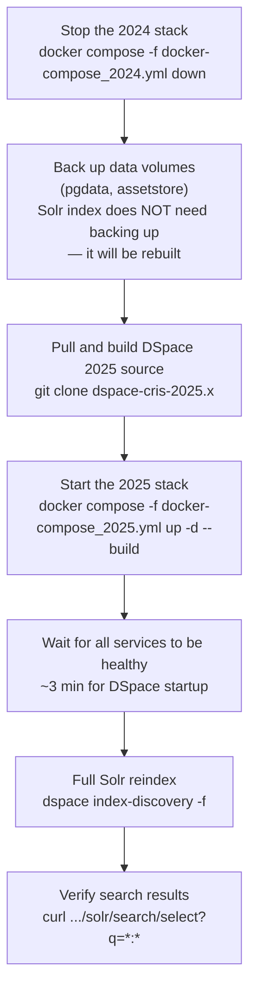

# Solr 9 — DSpace CRIS 2025 Search Core


DSpace CRIS 2025 requires **Apache Solr 9**. Solr 8 reached end-of-life and should no longer be used in production. This page documents the Solr 9 search core configuration, the complete diff against the Solr 8 core, and the mandatory startup requirements that differ from Solr 8.

<div class="callout callout-warn">
<span class="callout-title">Solr 8 is end-of-life</span>
Solr 8.x no longer receives security patches or bug fixes. If you cannot immediately upgrade to Solr 9, it is possible to run DSpace with Solr 8 by reverting the <code>solrconfig.xml</code> changes introduced in <a href="https://github.com/DSpace/DSpace/pull/10627/commits/150d8f435718e57ef964e8b4929d697318a07784" target="_blank">this commit</a> — but this is not recommended for production.
</div>

---

## Solr 9 Mandatory Requirements

### `solr.config.lib.enabled=true` (Solr ≥ 9.8)

Starting with Solr 9.8, the `<lib>` tag in `solrconfig.xml` is disabled by default as a security measure. DSpace uses `<lib>` tags to load the ICU analysis plugins required for Unicode normalisation and diacritic folding. You must explicitly re-enable library loading:

```bash
# Set in your shell before starting Solr
export SOLR_OPTS="-Dsolr.config.lib.enabled=true"

# Or in Docker Compose (see docker-compose_2025.yml):
environment:
  SOLR_OPTS: "-Dsolr.config.lib.enabled=true"

# Or pass directly on the command line:
solr start -Dsolr.config.lib.enabled=true
```

Without this flag, Solr 9.8+ will silently ignore the `<lib>` tags and the ICU analysis plugins will not load, causing `ClassNotFoundException` errors when the `text` field type is used.

### `java.security.manager=allow` (macOS only)

On macOS, Solr 9 may throw an `IllegalStateException` wrapping a `java.security.AccessControlException` on startup:

```
java.lang.IllegalStateException: java.security.AccessControlException:
  access denied ("java.io.FilePermission" "/private/var/folders/[some-path]")
```

Fix by adding the flag to `SOLR_OPTS`:

```bash
export SOLR_OPTS="-Dsolr.config.lib.enabled=true -Djava.security.manager=allow"
```

### Authentication must remain disabled

DSpace does not yet support Solr authentication ([GitHub #3169](https://github.com/DSpace/DSpace/issues/3169)). Install Solr with the default (no authentication) configuration. Protect Solr by ensuring port `8983` is **not** publicly accessible — place it behind a firewall or network policy, and restrict access to the DSpace backend only.

---

## What Changed: Solr 8 → Solr 9

This section documents every difference between the `dspace-src-2024` (Solr 8) and `dspace-src-2025` (Solr 9) search core configuration files.

### `solrconfig.xml` — changes

#### 1. `luceneMatchVersion`

```xml
<!-- Solr 8 (2024) -->
<luceneMatchVersion>8.8.1</luceneMatchVersion>

<!-- Solr 9 (2025) -->
<luceneMatchVersion>9.8.0</luceneMatchVersion>
```

Controls the Lucene compatibility version for index format and analysis behaviour. Changing this version requires a full reindex — the on-disk segment format is incompatible between major versions.

#### 2. `<lib>` paths — `contrib/` → `modules/`

The Lucene/Solr module system was restructured in Solr 9. Contributed libraries moved from `contrib/` to `modules/`, and the JAR names changed:

```xml
<!-- Solr 8 (2024) — contrib directory, old JAR name -->
<lib dir='${solr.install.dir}/contrib/analysis-extras/lib/'
     regex='icu4j-.*\.jar'/>
<lib dir='${solr.install.dir}/contrib/analysis-extras/lucene-libs/'
     regex='lucene-analyzers-icu-.*\.jar'/>

<!-- Solr 9 (2025) — modules directory, new JAR name -->
<lib dir='${solr.install.dir}/modules/analysis-extras/lib/'
     regex='icu4j-.*\.jar' />
<lib dir='${solr.install.dir}/modules/analysis-extras/lib/'
     regex='lucene-analysis-icu-.*\.jar' />
```

Note two sub-changes:
- The second `<lib>` tag now points to `.../lib/` (not `.../lucene-libs/`)
- The JAR regex changed from `lucene-analyzers-icu-.*` to `lucene-analysis-icu-.*` (module rename in Lucene 9)

The comment added in the Solr 9 version:

```xml
<!-- NOTE: When using Solr >=9.8, you MUST start Solr with
     `-Dsolr.config.lib.enabled=true` for this to work -->
```

#### 3. New `HighlightComponent` declaration

Solr 9 requires an explicit `HighlightComponent` declaration in `solrconfig.xml`. This was implicit in Solr 8.

```xml
<!-- NEW in Solr 9 — not present in Solr 8 -->
<searchComponent class="solr.HighlightComponent" name="highlight">
    <highlighting>
        <encoder name="html" class="solr.highlight.HtmlEncoder"/>
    </highlighting>
</searchComponent>
```

This enables HTML-safe hit highlighting in search responses (special characters in highlighted snippets are escaped). Without this declaration in Solr 9, `hl=true` queries will fail with a component-not-found error.

#### Summary table — `solrconfig.xml`

| Setting | Solr 8 (2024) | Solr 9 (2025) |
|---|---|---|
| `luceneMatchVersion` | `8.8.1` | `9.8.0` |
| ICU lib directory | `contrib/analysis-extras/lib/` | `modules/analysis-extras/lib/` |
| ICU Lucene lib directory | `contrib/analysis-extras/lucene-libs/` | `modules/analysis-extras/lib/` (merged) |
| ICU JAR regex | `lucene-analyzers-icu-.*\.jar` | `lucene-analysis-icu-.*\.jar` |
| `HighlightComponent` | ❌ implicit | ✅ explicit declaration required |
| `solr.config.lib.enabled` | Not required | **Required** for Solr ≥ 9.8 |
| All other settings | — | Unchanged |

---

### `schema.xml` — changes

The schema changes between Solr 8 and Solr 9 are minimal. The field type definitions and all dynamic field patterns are identical except for two changes.

#### 1. New static field: `has_geospatial_metadata`

```xml
<!-- NEW in Solr 9 / DSpace 2025 — not present in 2024 schema -->
<field name="has_geospatial_metadata"
       type="string"
       indexed="true"
       stored="true"
       omitNorms="true"
       multiValued="true"
       docValues="true" />
```

Tracks whether an item has geospatial metadata (coordinates, bounding boxes, place names). This supports geospatial Discovery facets and map-based browse features in DSpace CRIS 2025. The field follows the same pattern as `has_content_in_original_bundle`.

#### 2. Date year dynamic field: `*.year` → `*_year`

```xml
<!-- Solr 8 (2024) — dot separator -->
<dynamicField name="*.year" type="sint" indexed="true" stored="true"
              multiValued="true" omitNorms="true" />

<!-- Solr 9 (2025) — underscore separator (consistent with all other dynamic fields) -->
<dynamicField name="*_year" type="sint" indexed="true" stored="true"
              multiValued="true" omitNorms="true" />
```

This normalises the year dynamic field pattern to be consistent with all other `*_suffix` dynamic fields. In practice the field is populated by DSpace as `dc.date.issued_year`, `dc.date.accessioned_year`, etc. — the `_year` suffix was already the convention used by the DSpace indexer, so this aligns the schema with actual usage.

<div class="callout callout-warn">
<span class="callout-title">Migration note: *.year → *_year requires full reindex</span>
If you have existing Solr 8 data with fields indexed under the old <code>*.year</code> pattern, those fields will not match the new <code>*_year</code> dynamic field after upgrading. Run a full reindex after upgrading to repopulate all year fields under the new pattern:
<pre><code>docker compose -f docker-compose_2025.yml exec dspace \
  /dspace/bin/dspace index-discovery -f</code></pre>
</div>

#### Summary table — `schema.xml`

| Element | Solr 8 (2024) | Solr 9 (2025) |
|---|---|---|
| `has_geospatial_metadata` field | ❌ absent | ✅ new string field (multiValued, docValues) |
| Year dynamic field pattern | `*.year` | `*_year` |
| All field types | — | Unchanged |
| All other static fields | — | Unchanged |
| All other dynamic fields | — | Unchanged |
| `uniqueKey` | `search.uniqueid` | Unchanged |
| All copyField rules | — | Unchanged |

---

### Text analysis configuration files — no changes

`stopwords.txt`, `synonyms.txt`, and `protwords.txt` are identical between the 2024 and 2025 releases. See the [Solr 8 Search Core Schema]({{ '/ops/solr-search-core/' | relative_url }}#text-analysis-configuration-files) documentation for their full content and implications.

---

## Docker Compose — 2025 Stack

Two new compose files are provided for the DSpace 2025 / Solr 9 stack:

| File | Purpose |
|---|---|
| `docker-compose_2025.yml` | Core application stack — DSpace 9, Solr 9, Django, Frontend |
| `docker-compose_2025-monitoring.yml` | Full stack + Prometheus, Loki, Grafana monitoring |

Key differences from the 2024 compose files:

| Setting | 2024 | 2025 |
|---|---|---|
| DSpace source branch | `dspace-cris-2024.02.04` | `dspace-cris-2025.x` |
| DSpace source directory | `./dspace-src-2024` | `./dspace-src-2025` |
| Solr version arg | `8.11.4` | `9.8.0` |
| `SOLR_OPTS` | ❌ not set | ✅ `-Dsolr.config.lib.enabled=true` |

### Quick start (2025 stack)

```bash
# 1. Clone DSpace 2025 source (one-time — 10–20 min first build)
git clone --branch dspace-cris-2025.x --depth 1 \
    https://github.com/4Science/DSpace.git dspace-src-2025

# 2. Start the full stack
docker compose -f docker-compose_2025.yml up -d --build

# 3. Watch DSpace startup
docker compose -f docker-compose_2025.yml logs -f dspace
# ✓ Ready when you see: "Started Application in ... seconds"

# 4. Open the Cockpit
open http://localhost:4000
# Login: admin@localhost / admin

# 5. Open the Config Cockpit (after createsuperuser)
open http://localhost:5174
```

### Starting with monitoring

```bash
# Generate monitoring config files (one-time)
chmod +x init-monitoring-configs.sh && ./init-monitoring-configs.sh

# Start full stack + monitoring
docker compose -f docker-compose_2025-monitoring.yml up -d --build

# Open Grafana
open http://localhost:3000   # admin / admin
```

---

## Migrating from Solr 8 to Solr 9

<div class="callout callout-warn">
<span class="callout-title">Solr 8 and Solr 9 index formats are incompatible</span>
You cannot point a Solr 9 instance at a Solr 8 index directory. A full reindex is required after the upgrade.
</div>



### Step-by-step migration

```bash
# 1. Stop the 2024 stack (preserves pgdata and assetstore volumes)
docker compose -f docker-compose_2024.yml down

# 2. Back up critical data (Solr index will be rebuilt — no backup needed)
docker run --rm -v pgdata:/data -v $(pwd)/backup:/backup \
  alpine tar czf /backup/pgdata_$(date +%Y%m%d).tar.gz /data

# 3. Clone DSpace 2025 source
git clone --branch dspace-cris-2025.x --depth 1 \
    https://github.com/4Science/DSpace.git dspace-src-2025

# 4. Remove the old Solr data volume (incompatible index format)
docker volume rm <project>_solr_data

# 5. Start the 2025 stack
docker compose -f docker-compose_2025.yml up -d --build

# 6. Wait for services to be healthy
docker compose -f docker-compose_2025.yml ps

# 7. Run full reindex (repopulates Solr 9 from PostgreSQL)
docker compose -f docker-compose_2025.yml exec dspace \
  /dspace/bin/dspace index-discovery -f

# 8. Verify
curl -s "http://localhost:8983/solr/search/select?q=*:*&rows=0&wt=json" | \
  jq '.response.numFound'
```

<div class="callout callout-info">
<span class="callout-title">PostgreSQL data is fully preserved</span>
The <code>pgdata</code> and <code>assetstore</code> Docker volumes are independent of the Solr upgrade. All items, metadata, bitstreams, and user accounts survive the migration unchanged. Only the Solr search index needs to be rebuilt.
</div>

---

## Solr 9 — Full Search Core Reference

For complete documentation of the search core configuration (field types, analyser pipelines, static fields, dynamic fields, copy fields, solrconfig settings), see the [Solr Search Core Schema]({{ '/ops/solr-search-core/' | relative_url }}) page. The field types, field definitions, and analyser pipelines are identical between Solr 8 and Solr 9 except for the two schema changes documented above.

The [Solr Query Reference]({{ '/ops/solr-queries/' | relative_url }}) applies unchanged to both Solr 8 and Solr 9.

---

## Reference

| Resource | Link |
|---|---|
| DSpace 9.x installation notes | [wiki.lyrasis.org/display/DSDOC9x/Installing+DSpace](https://wiki.lyrasis.org/display/DSDOC9x/Installing+DSpace) |
| Solr 8 → 9 migration guide | [solr.apache.org/guide/solr/latest/upgrade-notes/major-changes-in-solr-9](https://solr.apache.org/guide/solr/latest/upgrade-notes/major-changes-in-solr-9.html) |
| `solr.config.lib.enabled` | [solr.apache.org/guide/solr/9_8/configuration-guide/libs](https://solr.apache.org/guide/solr/9_8/configuration-guide/libs.html) |
| DSpace: Solr auth not supported | [github.com/DSpace/DSpace/issues/3169](https://github.com/DSpace/DSpace/issues/3169) |
| Solr 8 EOL announcement | [solr.apache.org/news](https://solr.apache.org/news.html) |
| PR introducing Solr 9 `solrconfig.xml` changes | [github.com/DSpace/DSpace/pull/10627](https://github.com/DSpace/DSpace/pull/10627) |

<div class="page-nav">
  <a href="{{ '/ops/solr-search-core/' | relative_url }}">← Solr Search Core Schema (Solr 8)</a>
  <a href="{{ '/ops/solr9-features/' | relative_url }}">Solr 9 New Features →</a>
</div>
