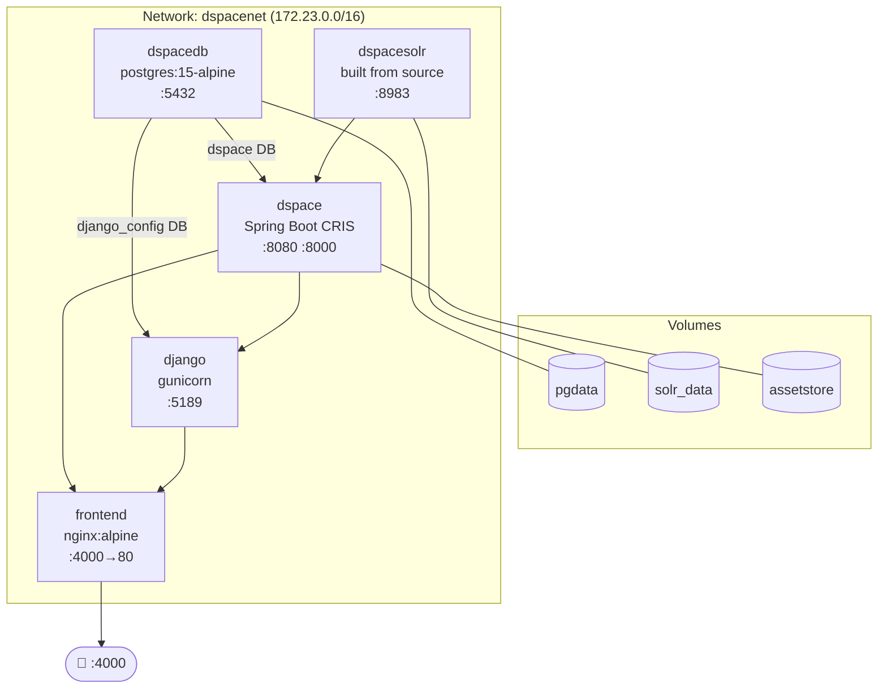
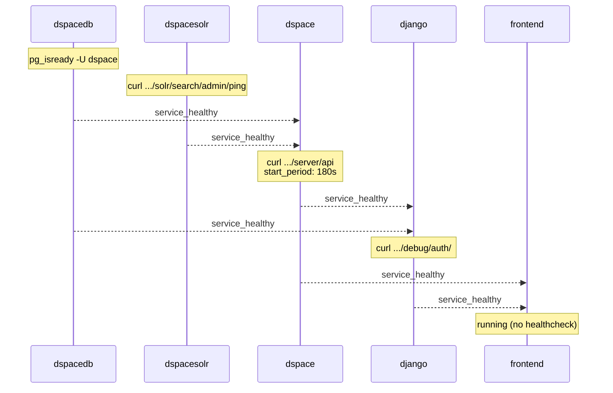

# Base Stack — docker-compose_2024.yml


## Service Map



## Startup Order & Healthchecks



| Service | Healthcheck command | Interval | Retries | Start period |
|---|---|---|---|---|
| dspacedb | `pg_isready -U dspace -d dspace` | 10s | 10 | — |
| dspacesolr | `curl .../solr/search/admin/ping` | 15s | 10 | — |
| dspace | `curl .../server/api` grep `dspaceVersion` | 20s | 20 | **180s** |
| django | `curl .../debug/auth/` | 15s | 10 | 30s |

<div class="callout callout-warn">
<span class="callout-title">DSpace build time</span>
DSpace builds from source. The first <code>docker compose build</code> takes <strong>10–20 minutes</strong>. Subsequent starts are fast because Docker caches the image layer.
</div>

## Network

All services share the `dspacenet` network with subnet `172.23.0.0/16`. This subnet must be configured in `local.cfg` as a trusted proxy range so DSpace correctly identifies the real client IP from the nginx `X-Forwarded-For` header.

---

## Key Volumes

| Volume | Mounted to | Contains |
|---|---|---|
| `pgdata` | `/var/lib/postgresql/data` | All database data (dspace + django_config) |
| `solr_data` | `/var/solr/data` | All Solr index data (8 cores) |
| `assetstore` | `/dspace/assetstore` | All uploaded bitstreams (files) |

<div class="callout callout-danger">
<span class="callout-title">Back up these volumes</span>
<code>pgdata</code> and <code>assetstore</code> contain all repository data. Back them up regularly in production. A database dump + assetstore copy is the minimum backup strategy.
</div>

---

## Solr Cores

DSpace initialises 8 Solr cores on first start:

| Core | Purpose |
|---|---|
| `search` | Main full-text search index (Discovery) |
| `authority` | Authority control values |
| `statistics` | Usage statistics |
| `oai` | OAI-PMH harvesting |
| `qaevent` | Quality assurance events |
| `suggestion` | Submission suggestions |
| `dedup` | Deduplication index |
| `audit` | Audit log index |

---

## Maintenance Commands

### DSpace

```bash
# View DSpace logs
docker compose -f docker-compose_2024.yml logs -f dspace

# Reindex Solr from the database
docker compose -f docker-compose_2024.yml exec dspace \
  /dspace/bin/dspace index-discovery -f

# Database migration (after DSpace upgrades)
docker compose -f docker-compose_2024.yml exec dspace \
  /dspace/bin/dspace database migrate

# Create an administrator account
docker compose -f docker-compose_2024.yml exec dspace \
  /dspace/bin/dspace create-administrator \
    -e admin@example.com -p password -f First -l Last -c en
```

### Django

```bash
# Run Django migrations
docker compose -f docker-compose_2024.yml exec django \
  python manage.py migrate

# Re-import submission forms after DSpace config changes
docker compose -f docker-compose_2024.yml exec django \
  python manage.py import_plain_config /app/frontend-config/input-forms.xml

# Open Django shell
docker compose -f docker-compose_2024.yml exec django \
  python manage.py shell

# Django admin UI (after creating superuser)
# → http://localhost:5189/admin/
```

### Database

```bash
# Connect to PostgreSQL
docker compose -f docker-compose_2024.yml exec dspacedb \
  psql -U dspace -d dspace

# Dump dspace database
docker compose -f docker-compose_2024.yml exec dspacedb \
  pg_dump -U dspace dspace > dspace_backup_$(date +%Y%m%d).sql

# Dump django_config database
docker compose -f docker-compose_2024.yml exec dspacedb \
  pg_dump -U dspace django_config > django_config_backup_$(date +%Y%m%d).sql
```

---

## Frontend Build — Memory Configuration

The Vite build may exhaust Node.js memory on machines with limited RAM. Add this to the frontend `Dockerfile` before the build step:

```dockerfile
ENV NODE_OPTIONS="--max-old-space-size=4096"
```

This allocates 4 GB to the Node.js heap. Adjust based on available system memory. Minimum recommended: 2 GB (`--max-old-space-size=2048`).

<div class="page-nav">
  <a href="{{ '/ops/' | relative_url }}">← Operations Guide</a>
  <a href="{{ '/ops/monitoring/' | relative_url }}">Monitoring →</a>
</div>

---

<div class="callout callout-tip">
<span class="callout-title">Quick command reference</span>
The <a href="{{ '/quick-launch/#cheatsheet' | relative_url }}">Quick Launch cheatsheet</a> has one-liner shortcuts for all common stack operations — logs, exec, dumps, healthchecks, and resets.
</div>
