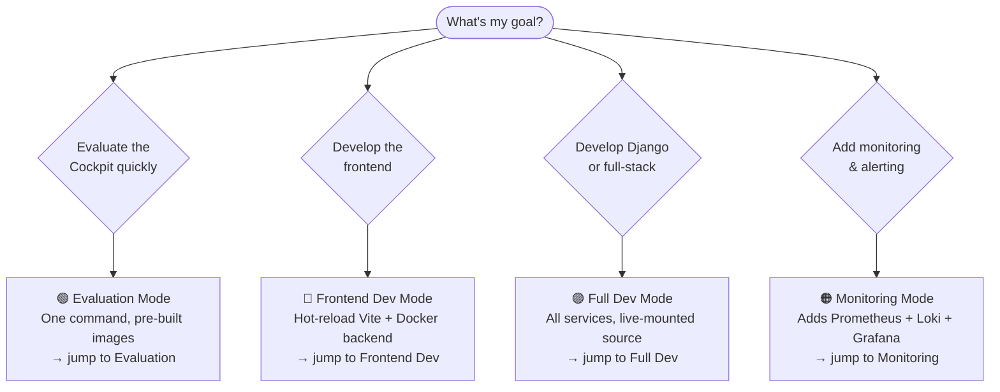

# Quick Launch

Everything you need to get the Cockpit running — from a 5-minute evaluation to a full hot-reload dev setup. Pick the mode that matches your goal.

---

## Which mode do I want?



| Mode | Start time | Rebuild needed? | Best for |
|---|---|---|---|
| [Evaluation](#evaluation-mode) | ~15 min first run | Never | Demo, stakeholder review, UAT |
| [Frontend Dev](#frontend-dev-mode) | ~15 min first run | On Docker changes only | UI development, CSS, components |
| [Full Dev](#full-dev-mode) | ~15 min first run | Rarely | Django API work, debugging all layers |
| [Monitoring](#monitoring-mode) | +2 min on top of any mode | No | Production-readiness testing, alerting |

**Default credentials for all modes:** `admin@localhost` / `admin`

---

## Prerequisites

```bash
# Check everything is installed
docker --version        # 24+
docker compose version  # 2.20+
git --version
node --version          # 18+ (frontend dev modes only)
python3 --version       # 3.11+ (full dev mode only)
```

**One-time: clone DSpace source** (required by all modes — 10–20 min first build)

```bash
git clone --branch dspace-cris-2024.02.04 --depth 1 \
    https://github.com/4Science/DSpace.git dspace-src-2024
```

<div class="callout callout-warn">
<span class="callout-title">First build takes 10–20 minutes</span>
DSpace compiles from source (Java + Maven). After the first build, Docker caches the image and subsequent starts take under a minute. Go make a coffee.
</div>

---

## Evaluation Mode

**Goal:** See the Cockpit running with one command. No dev tooling required.

```bash
# 1. Start everything
docker compose -f docker-compose_2024.yml up -d --build

# 2. Wait for DSpace to finish starting (~3 min after images build)
docker compose -f docker-compose_2024.yml logs -f dspace
# ✓ Ready when you see: "Started Application in ... seconds"

# 3. Open the Cockpit
open http://localhost:4000
# Login: admin@localhost / admin
```

### What's running

| URL | Service |
|---|---|
| `http://localhost:4000` | ✅ Cockpit frontend (main UI) |
| `http://localhost:8080/server/api` | DSpace REST API |
| `http://localhost:5189/api/dspace-config/debug/auth/` | Django config API |
| `http://localhost:8983/solr/#/` | Solr admin UI |
| `http://localhost:5432` | PostgreSQL (dspace + django_config) |

### Verify health

```bash
docker compose -f docker-compose_2024.yml ps
# All containers should show "healthy"

# Quick smoke test
curl -s http://localhost:8080/server/api | python3 -m json.tool | grep dspaceVersion
curl -s http://localhost:5189/api/dspace-config/debug/auth/ | python3 -m json.tool
curl -s http://localhost:8983/solr/search/admin/ping | grep '"status":"OK"'
```

### Stop

```bash
docker compose -f docker-compose_2024.yml down
# Add -v to also delete all data volumes (full reset):
docker compose -f docker-compose_2024.yml down -v
```

---

## Frontend Dev Mode

**Goal:** Edit React/TypeScript/CSS with instant hot-reload. Docker handles the backend.

```bash
# 1. Start backend services only (DSpace + Django + DB + Solr)
docker compose -f docker-compose_2024.yml up -d dspacedb dspacesolr dspace django

# 2. Wait for DSpace to be healthy
docker compose -f docker-compose_2024.yml logs -f dspace
# ✓ Look for "Started Application"

# 3. Create frontend .env (once)
cat > frontend/.env << 'EOF'
VITE_API_BASE_URL=http://localhost:8080/server
VITE_CLUSTER_CONFIG_SOURCE=ts
VITE_QUICKLINKS_CONFIG_SOURCE=ts
VITE_QUICKLINKS_ENABLED=true
VITE_QUICKLINKS_ADMIN_ONLY=true
EOF

# 4. Install dependencies (once)
cd frontend && npm install

# 5. Start the Vite dev server
npm run dev
# → http://localhost:5173  (hot-reload on every file save)
```

### With Django config API (optional)

To develop with the Django-backed cluster/quicklinks config:

```bash
cat > frontend/.env << 'EOF'
VITE_API_BASE_URL=http://localhost:8080/server
VITE_DJANGO_CONFIG_API_BASE_URL=http://localhost:5189/api/dspace-config
VITE_CLUSTER_CONFIG_SOURCE=django
VITE_QUICKLINKS_CONFIG_SOURCE=django
VITE_QUICKLINKS_ENABLED=true
VITE_QUICKLINKS_ADMIN_ONLY=false
EOF
```

### URLs in this mode

| URL | Service |
|---|---|
| `http://localhost:5173` | ✅ Vite dev server (hot-reload) |
| `http://localhost:4000` | Pre-built nginx (if you also started `frontend` container) |
| `http://localhost:8080/server/api` | DSpace REST API |
| `http://localhost:5189` | Django config API |

### Rebuild the Docker frontend image (when Dockerfile changes)

```bash
docker compose -f docker-compose_2024.yml build frontend
docker compose -f docker-compose_2024.yml up -d frontend
```

<div class="callout callout-info">
<span class="callout-title">Memory for large builds</span>
If the Vite build crashes with "JavaScript heap out of memory", add this before running <code>npm run build</code>:

```bash
export NODE_OPTIONS="--max-old-space-size=4096"
npm run build
```

Or add permanently to the frontend <code>Dockerfile</code>: <code>ENV NODE_OPTIONS="--max-old-space-size=4096"</code>
</div>

---

## Full Dev Mode

**Goal:** Edit any layer — Django API, frontend, or both — with live source mounting.

```bash
# 1. Start the full stack
docker compose -f docker-compose_2024.yml up -d --build

# 2. Wait for healthy
docker compose -f docker-compose_2024.yml ps

# 3. Initialize Django (first time only)
docker compose -f docker-compose_2024.yml exec django \
  python manage.py migrate

docker compose -f docker-compose_2024.yml exec django \
  python manage.py loaddata initial_data.json

# 4. (Optional) Create Django superuser for admin UI
docker compose -f docker-compose_2024.yml exec django \
  python manage.py createsuperuser

# 5. (Optional) Import DSpace forms into Django
docker compose -f docker-compose_2024.yml exec django \
  python manage.py import_plain_config \
  /app/frontend-config/input-forms.xml
```

### Django live reload

The `./django` directory is mounted into the container — **Django picks up Python file changes automatically** (Gunicorn workers reload on code change). No rebuild needed for `.py` edits.

```bash
# Tail Django logs
docker compose -f docker-compose_2024.yml logs -f django

# Run a management command
docker compose -f docker-compose_2024.yml exec django \
  python manage.py shell

# Open Django admin
open http://localhost:5189/admin/
```

### Frontend + Django together

```bash
# Terminal 1: backend stack
docker compose -f docker-compose_2024.yml up -d dspacedb dspacesolr dspace django

# Terminal 2: Vite dev server
cd frontend
npm run dev
# → http://localhost:5173
```

### Useful dev shortcuts

```bash
# Reset just the Django database (keeps DSpace data)
docker compose -f docker-compose_2024.yml exec dspacedb \
  psql -U dspace -c "DROP DATABASE django_config; CREATE DATABASE django_config OWNER dspace;"
docker compose -f docker-compose_2024.yml exec django \
  python manage.py migrate
docker compose -f docker-compose_2024.yml exec django \
  python manage.py loaddata initial_data.json

# Restart one service without touching others
docker compose -f docker-compose_2024.yml restart django

# Rebuild only the frontend image (fast — no Java compile)
docker compose -f docker-compose_2024.yml build frontend

# Force-rebuild everything from scratch (slow)
docker compose -f docker-compose_2024.yml build --no-cache

# Follow logs for multiple services at once
docker compose -f docker-compose_2024.yml logs -f dspace django frontend

# Check which port each service is bound to
docker compose -f docker-compose_2024.yml ps --format "table {{.Name}}\t{{.Status}}\t{{.Ports}}"
```

### Complete reset (nuclear option)

```bash
docker compose -f docker-compose_2024.yml down -v --remove-orphans
docker system prune -f
# Then start again from scratch
docker compose -f docker-compose_2024.yml up -d --build
```

---

## Monitoring Mode

**Goal:** Add Prometheus metrics, Loki logs, and Grafana dashboards on top of any running mode.

```bash
# 1. Generate monitoring config files (one-time)
chmod +x init-monitoring-configs.sh
./init-monitoring-configs.sh

# 2. Start monitoring stack alongside the app stack
docker compose -f docker-compose_2024-monitoring.yml up -d --build

# 3. Open Grafana
open http://localhost:3000
# Login: admin / admin  (change on first login)
```

### Monitoring URLs

| URL | Service |
|---|---|
| `http://localhost:3000` | ✅ Grafana (dashboards + log exploration) |
| `http://localhost:9090` | Prometheus (metrics + alert rules) |
| `http://localhost:9093` | Alertmanager (alert routing) |
| `http://localhost:3100` | Loki (log aggregation API) |

### First things to try in Grafana

```
# In Grafana → Explore → select "Loki" data source:
{service="dspace"}                    # All DSpace logs
{service="dspace"} |= "ERROR"        # DSpace errors only
{service="django"}                    # Django logs
{job="docker"} | json | level="error" # All containers, errors only

# In Grafana → Explore → select "Prometheus" data source:
probe_success                         # 1=up, 0=down for all health endpoints
probe_success{job="dspace_health"}    # DSpace API availability
container_memory_usage_bytes{name="dspace"}  # DSpace memory
```

### Stop monitoring only (keep app running)

```bash
docker compose -f docker-compose_2024-monitoring.yml down
```

### Stop everything

```bash
docker compose -f docker-compose_2024.yml down
docker compose -f docker-compose_2024-monitoring.yml down
```

---

## Cheatsheet

### Stack control

```bash
DC="docker compose -f docker-compose_2024.yml"

$DC up -d --build          # Start everything (build if needed)
$DC up -d                  # Start without rebuilding
$DC down                   # Stop (keep volumes)
$DC down -v                # Stop + delete all data
$DC ps                     # Status of all containers
$DC restart <service>      # Restart one service
$DC build <service>        # Rebuild one service image
$DC pull                   # Pull latest base images
```

### Logs

```bash
DC="docker compose -f docker-compose_2024.yml"

$DC logs -f                # All services
$DC logs -f dspace         # DSpace only
$DC logs -f django         # Django only
$DC logs -f dspace django  # Multiple services
$DC logs --tail=100 dspace # Last 100 lines
```

### Exec into containers

```bash
DC="docker compose -f docker-compose_2024.yml"

$DC exec dspace  bash                          # DSpace shell
$DC exec django  python manage.py shell        # Django shell
$DC exec dspacedb psql -U dspace -d dspace    # PostgreSQL REPL
$DC exec dspacesolr bash                       # Solr shell
```

### DSpace commands

```bash
DC="docker compose -f docker-compose_2024.yml"

$DC exec dspace /dspace/bin/dspace index-discovery -f    # Reindex Solr
$DC exec dspace /dspace/bin/dspace database migrate      # Run DB migrations
$DC exec dspace /dspace/bin/dspace curate -t checklinks -i all  # Check links
$DC exec dspace /dspace/bin/dspace create-administrator \
    -e admin@example.com -p secret -f Admin -l User -c en
```

### Django commands

```bash
DC="docker compose -f docker-compose_2024.yml"

$DC exec django python manage.py migrate
$DC exec django python manage.py makemigrations
$DC exec django python manage.py loaddata initial_data.json
$DC exec django python manage.py import_plain_config \
    /app/frontend-config/input-forms.xml
$DC exec django python manage.py createsuperuser
$DC exec django python manage.py collectstatic --noinput
```

### Database shortcuts

```bash
DC="docker compose -f docker-compose_2024.yml"

# Dump
$DC exec dspacedb pg_dump -U dspace dspace \
    > backup_dspace_$(date +%Y%m%d_%H%M).sql
$DC exec dspacedb pg_dump -U dspace django_config \
    > backup_django_$(date +%Y%m%d_%H%M).sql

# Restore
$DC exec -T dspacedb psql -U dspace dspace \
    < backup_dspace_20240415.sql

# Connect
$DC exec dspacedb psql -U dspace dspace
$DC exec dspacedb psql -U dspace django_config
```

### Health checks

```bash
# Full stack status
docker compose -f docker-compose_2024.yml ps

# Individual endpoint checks
curl -s http://localhost:4000 | grep -o '<title>[^<]*'
curl -s http://localhost:8080/server/api | python3 -m json.tool | grep dspaceVersion
curl -s http://localhost:5189/api/dspace-config/debug/auth/ | python3 -m json.tool
curl -s http://localhost:8983/solr/search/admin/ping

# Check all Solr cores
for core in search authority statistics oai qaevent suggestion dedup audit; do
  status=$(curl -s "http://localhost:8983/solr/$core/admin/ping" | grep -o '"status":"[^"]*"')
  echo "$core: $status"
done
```

---

## Common Problems

### DSpace takes too long to start

```bash
# Check startup progress
docker compose -f docker-compose_2024.yml logs --tail=30 dspace

# If stuck on "Database migrate" — wait, it runs migration on every start
# If stuck on "Building index" — this is normal on first run (Solr warmup)
# Force-recreate if truly stuck:
docker compose -f docker-compose_2024.yml up -d --force-recreate dspace
```

### Port already in use

```bash
# Find what's using the port
lsof -i :4000    # or :8080, :5189, :8983, :5432

# Kill it or change the host port in docker-compose_2024.yml:
# ports:
#   - "4001:80"   ← change left side only
```

### Frontend build out of memory

```bash
# Set before running npm run build or docker compose build frontend
export NODE_OPTIONS="--max-old-space-size=4096"

# Or in docker-compose_2024.yml under the frontend service:
# build:
#   args:
#     NODE_OPTIONS: "--max-old-space-size=4096"
```

### Django shows "jwt_received: false"

```bash
# Check debug endpoint
curl -s http://localhost:5189/api/dspace-config/debug/auth/ | python3 -m json.tool

# This means nginx isn't forwarding the Authorization header.
# Ensure your nginx config has:
# proxy_set_header Authorization $http_authorization;

# In dev (direct Vite → Django), set the header manually in your .env:
VITE_DJANGO_CONFIG_API_BASE_URL=http://localhost:5189/api/dspace-config
```

### Solr core not responding

```bash
# Check Solr health
curl http://localhost:8983/solr/search/admin/ping

# Reindex everything (fix stale index)
docker compose -f docker-compose_2024.yml exec dspace \
  /dspace/bin/dspace index-discovery -f

# Restart Solr only
docker compose -f docker-compose_2024.yml restart dspacesolr
```

### Reset a single service without losing other data

```bash
# Example: reset Django only
docker compose -f docker-compose_2024.yml stop django
docker compose -f docker-compose_2024.yml rm -f django
docker compose -f docker-compose_2024.yml up -d django
```

<div class="callout callout-success">
<span class="callout-title">All working?</span>
Once you have the stack running, head to the <a href="{{ '/user/getting-started/' | relative_url }}">User Guide</a> to explore the Cockpit as a regular user, or the <a href="{{ '/admin/' | relative_url }}">Admin Guide</a> to configure clusters, quicklinks, and feature flags.
</div>
